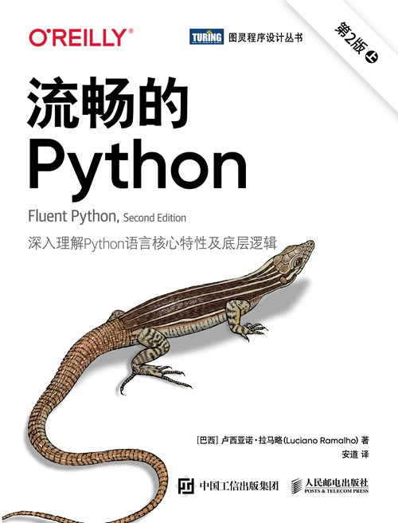

## 深入Python的核心——《CPython设计与实现》


在编程的世界里，Python以其简洁优雅而广受青睐。我们都知道for循环的使用，知道列表的翻转的技能。但是聪明的你有没有想过在Python这门语言中，它是怎么优雅的实现列表呢？

说到这些常见的Python知识点我们可能是非常的熟悉，那CPython呢？  对于很多人来说CPython是一个比较陌生而又熟悉的话题，在某平台上这个话题有着不少的浏览量，但是相关的讨论却不是很高。


对Cpython讨论度不高的的主要原因还是因为Cpython是Python的底层，学起来苦涩难懂，很多小伙伴对这些知识并不是很熟悉也不是很感兴趣。另外一个原因也是因为市场上介绍Cpython相关的图书太过缺乏，使得很多读者想学习Python的底层知识又没有一个合适的入门资料。


## 一、什么是CPython

CPython是Python编程语言的一个主要实现版本，它是用C语言编写的，并且是Python官方的标准实现。大家可能还听过Pypy、Jpython等Python的实现。CPython这个名字来源于它的实现语言（C语言）和它所实现的语言（Python），故此得名。官方实现的CPython具有以下的特点：

1. **官方实现**：CPython是Python语言的官方实现，由Python软件基金会维护。
2. **广泛使用**：它是最广泛使用的Python实现，大多数Python库和框架都是基于CPython开发的。
3. **性能强劲**：CPython通常比其他Python实现（如Jython或IronPython）具有更好的性能，毕竟它是使用C语言来实现的。
4. **兼容性**：CPython定义了Python语言的标准，因此其他实现通常都会尽力与CPython保持兼容。
5. **开源性**：CPython是开源软件，它的源代码可以在GitHub上找到，任何人都可以贡献代码或提出改进。
6. **扩展性**：CPython允许使用C语言编写扩展模块，这使得Python可以调用C语言写的库，提高了Python与系统资源的交互能力。
7. **全局解释器锁：**CPython的一个特点是全局解释器锁（GIL），这是一个互斥锁，确保在任何时刻只有一个线程执行Python字节码。虽然这限制了多线程程序的性能，但简化了CPython的实现。

说了这么多，小伙伴们记住一个标准答案：**CPython 是 Python 语言对应的解释器，由C来实现。**


## 二、为什么要学习CPython

CPython的特点是如此的多，如果非要给出几个不得不学习CPython的原因，以下几个原因或许可以说服你：

- **深入理解Python**：通过学习CPython，我们可以了解Python语言的工作原理，包括它的内存管理、垃圾回收机制、解释器如何执行代码等等，可以深入理解Python，了解最为核心的部分。
- **性能优化**：Python的性能一直被很多的Python使用者吐槽，因此了解CPython可以帮助你编写更高效的代码，理解哪些操作可能导致性能瓶颈，找到代码优化的方向。
- **解决复杂问题**：深入学习CPython可以帮助我们更好地解决复杂的编程问题，比如我们开发过程中遇到的内存泄漏、多线程编程等等。
- **提升技术能力**：CPython作为Python的底层，因此学习CPython可以显著提升我们的编程技术能力，使你在技术讨论和面试中更加自信。

以上几点我觉得是我作为一个python技术开发者必须要去学习CPython的主要原因，大家觉得呢？。


## 三、CPython最强工具书

除了Python的源码解析相关的图书可以了解CPython的相关的内容，目前正好有一本十分合适的用于零基础掌握CPython，深入立即CPython设计和实现的图书，它就是《CPython设计与实现》


这本书目录如下：


从上面的目录中可以看出，本书在非常注重基础的同时，又对一些非常热门的知识点进行了讨论，比如内存管理、并行和并发等等。因此这本书适合所有对Python语言有深入兴趣的读者。当然了如果想读懂这本书，还是需要一定的Python基础知识的。


## 四、内容分享

本人有幸在第一时间拿到了这本书，看了其中的一些章节，目前来说最喜欢的章节要属第九章的内存管理，也涉及到一些垃圾回收机制的内容。比如说一个类引用一个“自身类”的例子：

```python
__all__ = ["User"]
class User(BaseUser):
 	name: 'str' = ""
 	login: 'str' = ""
 	def __init__(self, name, login):
 		self.name = name
 		self.login = login
 		super(User).__init__()
 	def __repr__(self):
 		return ""

class BaseUser:
 	def __repr__(self):
 		# 这段代码创建了一个循环引用
 		return User.__repr__(self)
```

稍微分解看看上述代码：

（1）上述代码定义了一个名为User的类，它继承自BaseUser类。

（2）super(User).__init__ 这行代码调用了父类BaseUser的构造函数。super()函数用于调用父类的方法，确保父类的初始化代码也被执行。

（3）return User.__repr__(self): 这行代码尝试调用User类的__repr__方法来获取BaseUser实例的字符串。这里User类的__repr__方法返回空字符串，如果User类的__repr__方法没有返回空字符串，而是调用了BaseUser.__repr__，那么就会形成一个无限循环，因为BaseUser的__repr__方法调用了User.__repr__，而User.__repr__又调用了BaseUser.__repr__，如此往复。


那么对于上述这种“循环”的现象，垃圾回收器的目标该是什么呢？本书给出的解答是：**找到不可达对象，不可达的对象即可标注为垃圾。**

对于上述这种循环的引用的情况，使用引用计数的机制并不足以保证在不需要此类对象时释放它们，因此需要另外一个垃圾回收机制去

保证找到所有需要释放内存的方法。


基于上述的问题，CPython 垃圾回收器利用现有的引用计数算法和自定义的垃圾回收器算法来查找所有不可达的对象。由于引用计数在某个角度上来说已经覆盖了大部分场景，因此 CPython 垃圾回收器的工作就是查找容器类型中的循环引用。


学完本书第九章内存管理的一些内容，基本上就可以在实际的项目过程中使用技术手段来控制和调整自己的代码，以更好地提升代码效率及其内存占用空间。


## 五、适用读者

这本书的适用读者还是比较清晰的，从个人的角度出发，我觉得有以下几个群体较为合适学习：

（1）所有对Python语言有深入兴趣的读者，对于初学者，它是一扇窗口，可以让他们一窥编程语言Python的内部世界。

（2）Python进阶开发者：从底层了解Python，不断提开发者的技术能力。

（3）Python解释器原理爱好者。


## 六、与《流畅的Python》的区别

之前我还看过一本非常强大的Python进阶书籍-《流畅的Python》,那其与CPython这本书之间有什么区别呢？

**主题不一样：**

《CPython设计与实现》专注于CPython解释器的内部工作原理，包括它的实现细节、内存管理等底层相关。

《流畅的Python》则侧重于Python语言的最佳实践和高效使用，涵盖了语言特性、库的使用以及编写高效Python代码的技巧知识。


**内容侧重点**：

《CPython设计与实现》深入探讨了CPython的底层实现，包括编译器、解释器和运行时环境，主要是对底层实现进行剖析。

《流畅的Python》则深入探讨了Python的高级特性，如装饰器、生成器、迭代器和并发编程等编程进阶的知识。


**语言层面**：

- 《CPython设计与实现》关注的是Python语言的实现层面，即CPython是如何被构建和运行的，相当于回答这一问题。
- 《流畅的Python》关注的是语言的使用层面，即如何使用Python语言的特性来编写清晰、高效的代码。特别是使用Python进行高效能作业方面。



## 七、学习建议

从一定的角度上来说本书看还是比较进阶的，毕竟要深度Python的底层，从底层的实现来了解Python的运行机制，这里有一丢丢的学习建议和大家分享一下：

（1）本书是一本属于实战类型的Python书籍，因此在学习的时候需要进行“动手学”操作，不可走马观花。

（2）本书内容十分的精彩，因此不建议快速阅读此书，要在阅读的时候同时思考，思考代码这样写为什么能提高效率增强性能。

（3）不放过每一个问题，CPython的设计与实现存在很多的细节，因此在学习的时候我们不免会发现很多的问题，但是我们应该认真的对待每一个问题，在弄清每一个问题的过程中Python技能就不断精进了。


