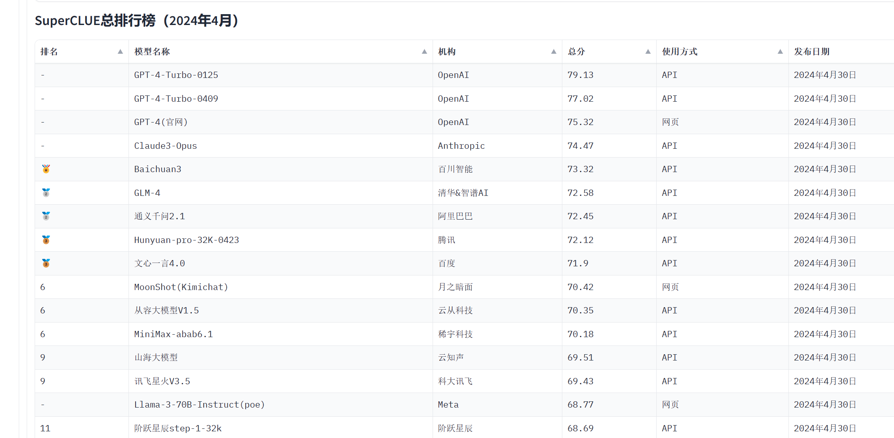
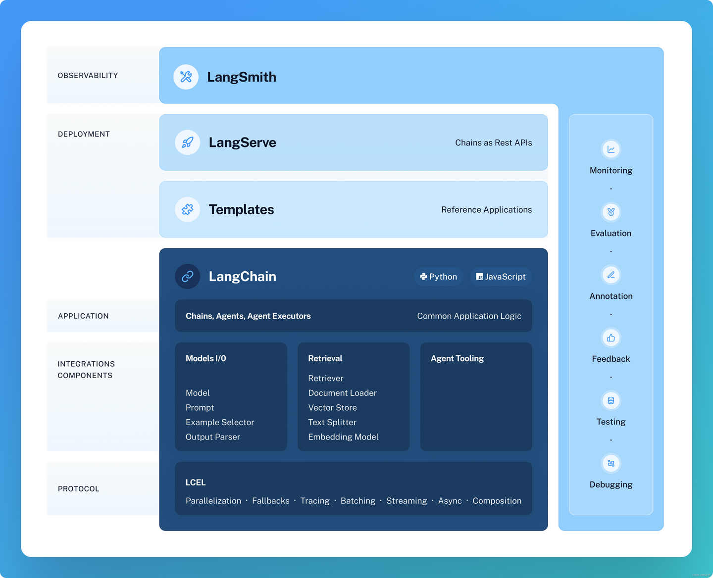
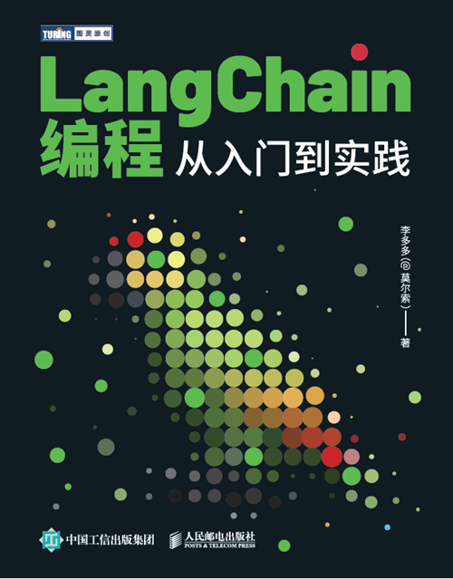
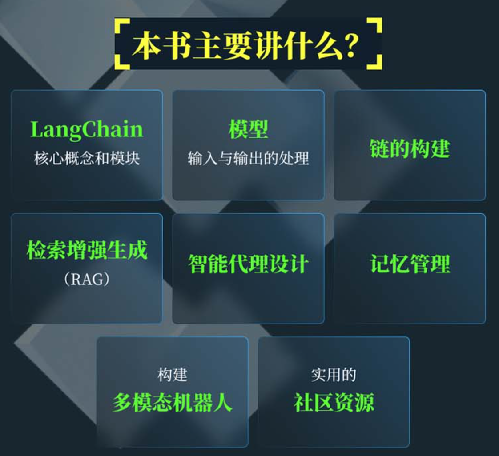

# LangChain 编程从入门到实践

### 深入探索大模型应用开发-LangChain 编程从入门到实践

[TOC]

大模型已经火热了很长的时间了，学会使用大模型来提升工作效率已经成为了一种新的技能，那什么是大模型呢？这里简单的阐述一下：

大语言模型 (large language model，LLM)是一种语言模型，由具有许多参数（通常数十亿个权重或更多）的人工神经网络组成，使用自监督学习或半监督学习对大量未标记文本进行训练。大型语言模型在2018年左右出现，并在各种任务中表现出色。这个术语没有正式的定义，但它通常指的是参数数量在数十亿或更多数量级的深度学习模型。大型语言模型是通用的模型，在广泛的任务中表现出色，而不是针对一项特定任务（例如情感分析、命名实体识别或数学推理）进行训练。也就是说大模型是具有很多很多参数的一种人工智能模型。

那目前来说有哪些常用的大模型呢，这里和大家分享一些Top常用模型：

### 一、为什么需要LangChain

大模型一般有两种形态“呈现”在我们的眼前，一种是训练好的那种二进制的文件，另一种是将大模型的二进制文件进行部署之后暴露出一些相应的接口。当实际的一个新项目交接道你手上的时候，你可能会设计很多的API来完成整个项目。也有可能会遇到许多API接口设计、数据模型的构建等问题等等。那么此时就存在一个问题，对于一个大模型的应用发者来说，要去研究每一个接口都将会非常的耗时。

那么此时LangChain就出现了，LangChain是一个集成框架，它为开发者提供了一系列的工具和组件，以便于创建由大型语言模型（LLM）和聊天模型支持的应用程序，使得基于这个框架我们可以快速创建我们的应用。

### 二、什么是LangChain

上文提到我们为什么需要LangChain，那这里我们总结一下到底什么是LangChain，LangChain 是一个用于开发由语言模型驱动的应用程序的框架。它被创造出来的旨在简化构建高级语言模型应用程序的过程，提供一套工具、组件和接口，以便于创建由大型语言模型（LLM）和聊天模型支持的应用程序。

LangChain 的结构如上所示，可以看出其核心的模块有：

（1）LangChain库：这是一个Python和JavaScript库。包含一些常见的组件的接口和集成。
（2）LangChain Templates：提示模板，是指生成提示的可重复的方式，适用于各种任务。
（3）LangServe：一个用于将LangChain链部署为REST API的库，便于我们在部署的时候进行使用。
（4）LangSmith：一个用于构建生产级 LLM 应用程序的平台。 它允许您调试、测试、评估和监控基于任何 LLM 框架构建的链和智能代理，并无缝集成 LangChain（用于构建 LLM 的首选开源框架）。

### 三、LangChain的六大核心组件

观察上述的结构图我们发现LangChain有六大核心组件：

（1）模型 I/O (Model I/O)：这这个组件是与语言模型进行交互的接口，LangChain 提供了与多种语言模型（如LLMs）交互的标准接口，允许开发者将文本格式化为模型输入。

（2）数据连接 (Data Connection)：该组件提供了文档加载器和文档转换器等工具，用于将非结构化文本转换为可处理的数据，从而让语言模型更容易与它们交互。也就是说LangChain提供了加载、转换、存储和查询数据的构建块。

（3）链 (Chains)：基础链（LLMChain）是一个简单的链，它围绕语言模型添加了一些功能，并在整个 LangChain 中广泛使用。比如说我们需要将多个LLM模型进行连接的时候，此时Chains将发挥巨大的作用。

（4）记忆 (Memory)：这个好理解，该组件在链之间存储和传递信息，实现对话的上下文感知能力。也就是基于该组件能让大模型了解到“之前想的话，做的事”，这对于构建能够记住先前交互场景的应用将变得十分得重要。

（5）代理 (Agents)：代理使用语言模型来自动决策和执行动作，完成任务。比如确定执行哪些操作，以及它们的执行顺序等。

（6）回调 (Callbacks)：提供了连接到 LLM 申请的各个阶段的功能，用于日志记录、监控和流传输等任务等等。

基于上述的一些LangChain的核心组件，应用开发者可以非常方便的构建LLM应用，这些组件覆盖了从模型I/O到数据增强，从链到记忆，以及从Agent到回调处理器的全方位功能。LangChain作者考虑得很到位。

### 四、快速掌握LangChain

LangChain设计非常巧妙使得他非常强大，那么我们如何快速系统学习LangChain，并掌握它快速搭建我们自己的LLM应用呢？这里就不得不提最近阅读的一本书了-人民邮电出版社旗下的《LangChain 编程从入门到实践》。

这本书首先在一定程度上算一本入门图书同时也是一本实践图书，书籍封面设计得很有科技感：

这本的主要讲了一些什么内容呢？

作为读者的我仔仔细细研究这本书，把本书的每一章节的内容总结一下与大家分享：

**第一章：LangChain简介**： 作者首先介绍了LangChain的产生背景，包括大模型技术的发展浪潮和大模型时代的开发范式。随后，详细阐述了LangChain框架的核心概念和模块。

**第二章：LangChain初体验**：作者介绍了LangChain的开发环境搭建相关的知识点，以及本书的开始的快速指南。通过语言模型、提示模板、输出解析器等基础组件的介绍，读者可以快速了解如何使用LangChain进行基本的开发工作。

**第三章：模型输入与输出**：本章节作者大模型的原理，解释了模型输出不可控的原因以及输入对输出的影响。同时，详细介绍了提示模板组件和大模型接口的使用。

**第四章：链的构建**： 本章深入讲解了链的基本概念和Runnable对象接口，探讨了LCEL高级特性和Chain接口的使用。通过对话场景、基于文档问答场景等专用Chain的介绍，展示了如何在不同场景下构建链。

**第五章：RAG技术**：作者在本章节详细介绍了RAG（Retrieval-Augmented Generation）技术的概述和在LangChain中的实现。通过文档预处理、文档检索等实践过程的介绍，展示了如何利用RAG技术增强生成的效果。

**第六章：智能代理设计**：作者介绍了智能代理的概念，并详细讲解了LangChain中的代理设计。

**第七章：记忆组件**：较大篇幅讲解了记忆系统的重要性，并介绍了LangChain中的记忆组件类型。通过记忆组件的应用和实战案例，展示了如何将记忆组件接入代理并实现不同记忆组件的结合。

**第八章：回调机制**：作者介绍了回调处理器的概念和使用回调的两种方式。通过实现可观测性插件的介绍，指导读者如何在LangChain中实现回调机制。

**第九章：构建多模态机器人**： 作者通过一个完整的实战案例，指导读者如何从需求分析到应用设计，再到应用监控和调优，构建一个多模态智能机器人。本章的内容不仅提供了技术指导，还涉及了应用部署和模型效果评估等实际问题。

想必在这些章节的详细介绍之下，你对LLM以及LangChain应该有一个非常清晰的认识了，对学习LangChain该学习哪些知识也非常熟悉了。拥有了这本书就有了快速掌握LangChain技能的能力。

那这本书有什么特点呢？

（1）内容丰富：内容涵盖了LangChain的产生背景、核心概念和模块、开发环境准备、模型输入与输出、链的构建、RAG技术、智能代理设计、记忆组件、回调机制，以及构建多模态机器人等多个方面。

（2）可操作性强：每一章节都配有详细的示例代码和操作指导，使理论与实践相结合，易于读者理解和掌握。

（3）讲解细致：通俗易懂的语言，配合大量的图表和代码示例，使得复杂的技术概念变得生动和易于理解。

### 五、适用读者

大模型LLM算人工智能方向的技术，LangChain自然而然也属于AI技术，那么图灵的这本好书适合哪些读者呢？我觉得还是适合以下读者的：

1. **大模型初学者**：对于那些刚步入编程世界，对人工智能和大模型技术充满好奇的新手来说，本书提供了一个结构化的入门路径。通过作者细致的讲解和丰富的示例，初学者可以逐步建立起对大模型应用开发的基础知识和理解。
2. **软件工程师**：对于在软件工程领域工作，特别是对机器学习和人工智能应用开发感兴趣的工程师，本书提供了实际的开发指南和最佳实践，有助于他们快速掌握LangChain框架并在项目中得以应用。
3. **数据科学家**：本书深入讲解了大模型的原理和应用，能够帮助数据科学家更好地理解和运用这些模型来解决复杂的数据分析问题。
4. **机器学习工程师**：对于专注于机器学习的专业人员，帮助他们优化模型性能，提升算法的准确性和效率。书中的高级特性和实战案例对于希望在大模型技术上进一步深入的读者尤其有价值。
5. **技术爱好者和自学者**：对于那些对最新技术充满热情，喜欢自学新知识的技术爱好者，本书不仅易于理解，而且提供了足够的深度，可以满足他们探索和实验的需求。
6. **项目经理和技术决策者**：对于负责技术项目的管理人或者需要做出技术决策的高层人员，理解大模型技术的应用和潜力对于项目的成败至关重要，帮助做出更好的产品。

