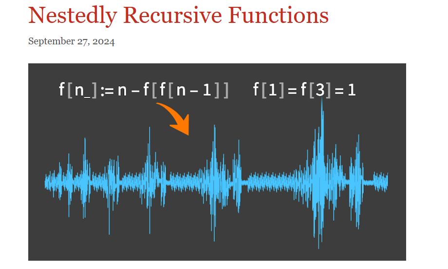
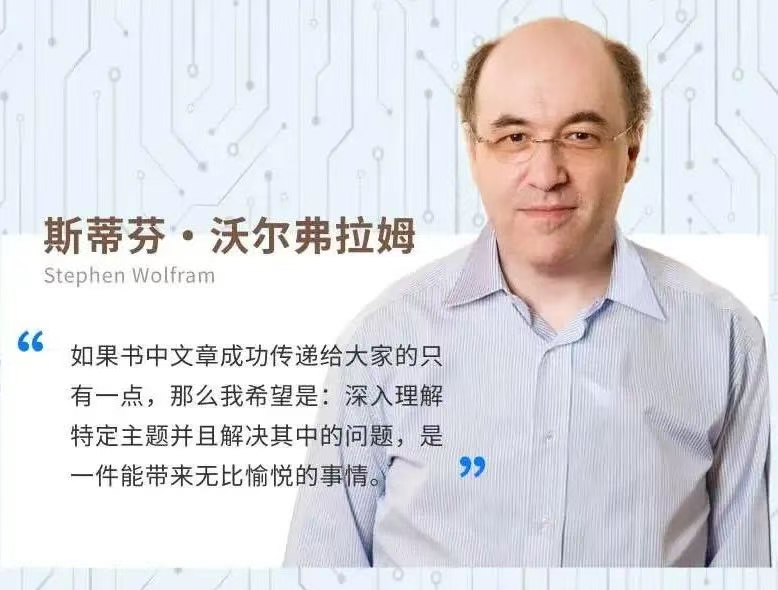
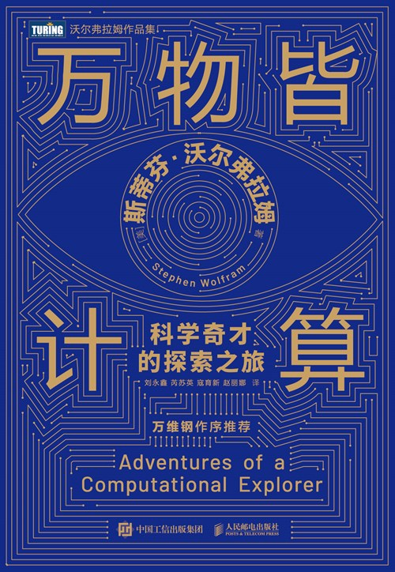
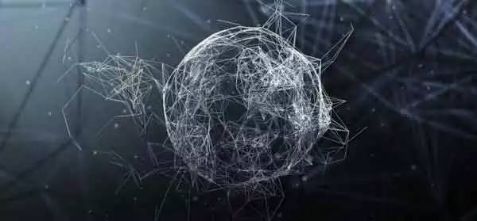
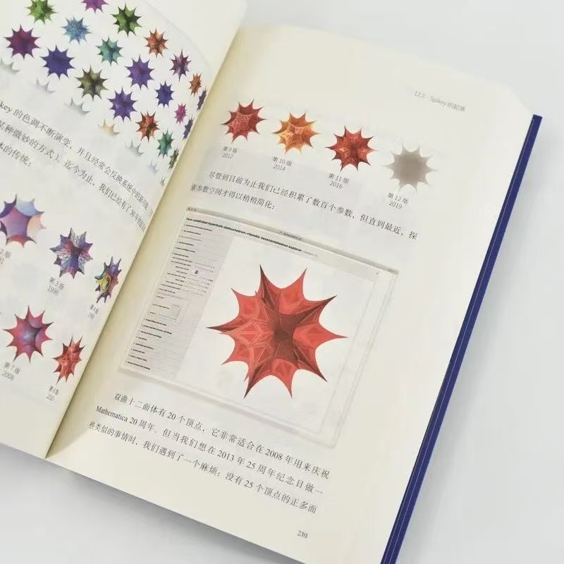
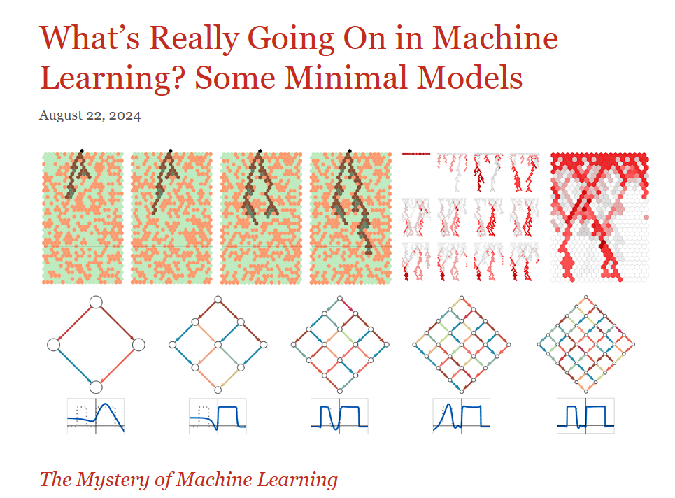

## 《万物皆计算的思想正影响你我》

**你也许思考过生命的意义是什么，你或许也思考过星辰大海的奥秘。不知什么时候，你开始对周边的事物有深入的洞察和研究，开始观察更为复杂的事物和它的过程，发现其规律和背后的模式，你欣喜若狂。面对自然你有了更多的奇思妙想，也有了挑战这个世界的勇气，而这些都是建立在认知方式的突破的基础上，理解宇宙、艺术以及生活**。

如果你曾经思考过万物的基础是什么，Stephen Wolfram大牛从计算角度给出了一个答案：万物皆计算。这位大牛的名字很多人可能没有听闻，但听说过甚至使用过他的杰作：Mathematica。有人说他是天才，有人觉得他是一个讨厌的自大狂，这里我们不做过多的人物评价。简单的介绍这位聪明的人：斯蒂芬·沃尔弗拉姆（Stephen Wolfram）   计算机科学、数学和理论物理学家，当今科学和技术领域重要的革新者之一。他创造了在全世界备受推崇的软件系统——Mathematica、Wolfram|Alpha和Wolfram语言。35年来，他一直担任科技公司Wolfram Research的首席执行官，并负责基础科学领域的一系列突破性进展，包括最近的Wolfram物理项目（Physics Project）。著有畅销书《一种新科学》《这就是ChatGPT》《科技群星闪耀时》等。

这里我们不对他的经历进行反复地“炒作”，要聊的就是最近出版的《万物皆计算：科学奇人的探索之旅》这本书。从我这个爱好数学以及计算的读者来说，这本书就像是一颗智慧的核桃，外壳坚硬，里面却藏着一些值得反复咀嚼的知识精髓，也有一些experience让你敬佩不已。倘若现在你对计算世界充满了好奇，觉得“计算”这个词听起来既神秘又有深度，或者你曾经被某某学术大牛们口气十足的论调吓得不敢涉足计算领域，那么这本书可能会是你走进计算思维的大门——而这扇门，打开之后，世界竟然比你想象的还要大，还要奇妙。

### 计算思维：“万物皆计算”

这本书的一个宏大的命题是：万物皆计算。

通过使用计算，我们可以在一定程度上来解释科学的奥秘，甚至我们可以开始对艺术、对哲学开始“品头论足”。这些都是源于计算的计算，探究美学、重视自然乃至宇宙。

初看“万物皆计算”这句话的时候，你的大脑可能在飞速运转，极力设想一个不能计算的场景，好打破这句话给人的第一印象。或者你忍不住想：“这不就是计算机科学家们对自己的领域的过度自信吗？” 但实际上，这个看似夸张的说法，却承载着一种令人耳目一新的视角：你所看到、所经历，感受的几乎都可以通过某种形式的计算或规律（规律也可计算）来表达和理解。

本书中作者没有直接从计算机或者数学的的角度去阐述这一点，而是通过各种跨学科的科学发现与思想碰撞，逐渐将这个观点展开。书中的核心思想是：科学的每一个领域，无论是物理学、化学、生命科学还是社会学，都不可避免地与“计算”有所关联。计算不仅仅是计算机的专利，甚至更深入地，计算作为一种思维方式，已经渗透到了人类对宇宙和生命的理解之中。

那计算的目的是什么呢？应该是为了理解和发现。你想象一下，当你把万象从计算的角度重新审视时，原本错综复杂的物理世界、生命的奥秘、甚至社会中的种种现象，似乎都变得可通过“算法”来解答了。是的，“万物皆计算”，这不仅是对计算机领域的推崇，也是对整个世界运作方式的一种独特洞察。

### 计算思维：技术工具到思维框架

在阅读这本书的时候，你会发现，计算不仅是“做计算”的工具，它实际上已经演化成了一种可以跨越学科的思维框架。作者对数学、计算机的感悟相比于对于物理学的感悟是不一样的，最起码在深度上具有重大的差异，  通过计算，我们不仅能够精确地预测天气，模仿物理现象，模拟生物进化，甚至预测社会群体的行为。就好像《计算之魂》中的一些概念，计算不仅是“硬件”或者“软件”，它逐渐成为一种具有“哲学性”的存在，推动着我们去思考智能、意识、自由意志等那些曾经认为不可能被量化的问题。

或许你会问，万物皆计算这种思维模型，到底是怎样改变了我们对世界的认知呢我想，这就像是给了我们一副全新的眼镜，这副眼镜我们通过对宇宙现象的计算模型，将它们从抽象的公式和方程式中解放出来，映射出来，把那些深奥的理论转化为可以操作、可以模拟的实际工具。

对于普通读者来说，这可能听起来有点儿过于“抽象”和“科幻”。不过，细细品味，你会发现，书中的每一个科学家的思维旅程，其实都是在告诉我们：计算是现代科学的核心，它不仅仅推动了技术的发展，更深刻地影响了我们如何认识世界。

### 计算思维：沃尔弗拉姆的独特视角

从全书来看，作者的写书风格无非是随性的，所以你在很大程度上觉得这本书优点“随笔“的感觉，这有点意思。作者没有通过很多的数学推论或者一些方程式的发现来解开我们所在宇宙的万物遵循的规律，但是阐述的计算思维”仍然是是本书的核心主题之一，也是沃尔弗拉姆近年来探讨的一个重要命题。这种思维的出现，打破了传统学科界限的束缚，它不仅仅是计算机科学的专属领域，而是渗透到每一个学科领域，成为解决复杂问题的关键思维工具，这也是作者为什么可以在电影《降临》中解决与外星人交流的问题，也就是如何通过计算模型来解决语言学中的难题，以及如何在人工智能伦理问题中找到平衡点，这很多的证明了计算思维可以广泛应用于艺术创作、哲学思辨甚至商业实践。

### 计算思维：挑战与启发

《计算思维的探索：斯蒂芬·沃尔弗拉姆的随笔集》是一本既充满思想深度，又极具启发性的作品。通过这本书，沃尔弗拉姆向我们展示了计算思维的无限可能性，以及它如何跨越学科界限，影响科学、哲学、艺术等各个领域。书中不仅包含了沃尔弗拉姆在科研和技术上的诸多突破，也涵盖了他在人工智能、道德、物理学等领域的深刻思考。

最后，如果你仍然觉得“万物皆计算”听起来有些不切实际，那么我想告诉你——世界的确复杂，生活中的问题也许永远解不完，但用计算去思考，至少让你看到了从未见过的“星空”。你说是不是呢？

