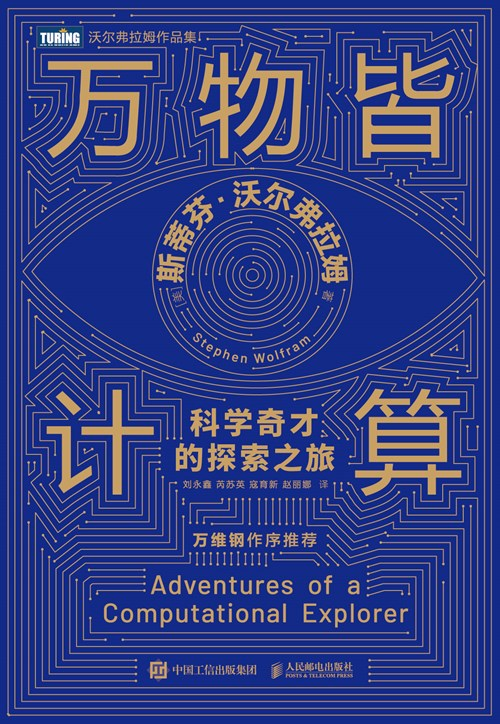

《万物皆计算：科学奇人的探索之旅》是一本深刻探讨计算思维及其在科学探索中的核心作用的书。作者通过对计算科学家与思想家的访谈、论述与反思，展示了“计算”这一概念如何从一项纯粹的技术工作演变为一种跨越各学科的思维框架，进而改变了我们对自然、生命、社会乃至宇宙的理解。这本书不仅仅是对计算科学本身的简单介绍，它更是对计算思维的深度探索与哲学反思。

### 计算与万物的关系

书中的核心命题“万物皆计算”一方面揭示了计算方法在现代科学中的普遍性，另一方面也促使读者思考计算是否真的是理解宇宙和生命的唯一钥匙。从物理学的最基本法则到生命的起源、从社会行为的模拟到艺术创作的创新，计算似乎无所不在。计算不再只是计算机科学的专利，它已渗透到数学、物理、经济学、心理学甚至哲学的每个角落。

这本书给读者提供了一个全新的视角：如果把宇宙视为一个庞大的计算系统，那么人类本身也不过是这一系统中的一部分。我们通过数学模型和算法去理解自然界的规律，同时我们自己的思维和决策过程，也可以被看作是对复杂信息的处理和运算。甚至在面对生命与意识的深层问题时，计算思维的框架提供了一种全新的解答路径——“生命是信息处理的结果，意识不过是信息的高度组织与加工。”这一思路与一些现代物理学家、哲学家的观点不谋而合，开启了人类对“自我”认知的新篇章。

### 计算思维的演变与扩展

计算思维（Computational Thinking）这个概念的提出，已经不再局限于计算机科学的范畴，而是成为了解决问题的一种基本思维方式。从最初的“算法思维”到“自动化”与“可编程性”的探讨，计算思维经历了一个从“技术工具”到“哲学框架”的演变过程。书中通过多位科学家的观点呈现了计算思维如何渗透到多个领域中。

例如，诺贝尔物理学奖得主理查德·费曼提出过“模拟自然”的思想，他认为，物理学家不需要事先知道宇宙的所有规律，只需要通过模拟与计算来逐步推导出这些规律。费曼的这一思想，虽然最早是针对量子力学中的复杂问题提出的，但它的内涵早已超出了物理学的范畴。它实际上启发了计算科学家们思考如何用算法来模拟几乎所有的自然现象。类似的思想延续到今天，我们看到越来越多的领域开始通过数字模拟来解决传统理论无法处理的问题。

不仅如此，计算思维还在诸如社会科学、经济学甚至艺术创作等领域得到了应用。经济学家们开始用计算模型来模拟市场行为、预测经济波动；社会学家们用计算分析技术来研究群体行为和社会动态的演变；艺术家们则开始利用人工智能和计算机图形学创造出全新的艺术作品。这些跨学科的融合，展示了计算思维的无限潜力。

### 人类思维与计算的边界

尽管《万物皆计算》向我们展示了计算思维的强大能力，但它同样提醒我们不要将计算思维过度神化。计算思维能够在许多领域取得突破性进展，但它是否能够解决人类最深刻的哲学问题？比如意识的本质、自由意志与宿命论的辩证关系等问题，计算思维能否提供根本性的解决方案？

在面对这些问题时，计算的局限性也变得显而易见。人类思维的复杂性远超任何计算模型。就拿意识这一问题来说，尽管我们可以通过神经科学和人工智能的研究，模拟出一些看似“有意识”的行为，但这并不能真正揭示意识的内在本质。许多哲学家指出，意识的问题不是一个简单的计算问题，它涉及到的是体验、感知以及存在本身的深层次探讨。正如本书所强调的，计算思维并不是万能的，它只是一种工具，而不是解答所有问题的钥匙。

### 人工智能的未来与人类的命运

在《万物皆计算》的结尾部分，作者讨论了人工智能对人类社会的潜在影响，尤其是AI对未来科学与社会的塑造作用。从机器学习到深度学习，人工智能的崛起不仅改变了科技领域的面貌，也深刻影响着社会的各个层面。今天的人工智能已不仅仅是人类的“工具”，它开始展现出自我学习与创新的能力。越来越多的行业开始依赖AI做出决策，从医疗到金融、从教育到娱乐，人工智能正在逐步取代传统的工作方式。

然而，AI的崛起同时也带来了很多伦理和社会问题。机器是否能够真正理解人类的价值与道德观？当AI能够模拟人类的思维与情感时，我们是否还能够区分“人”与“机器”？这些问题值得我们深入思考，而这本书恰恰在这一点上没有回避，提出了许多深刻的反思。

书中的观点并不回避对未来的担忧。它提醒我们，随着计算思维的扩展与人工智能的迅速发展，人类需要重新审视自我在宇宙中的位置，重新定义什么是“智能”，什么是“人类”。计算科学虽然为我们提供了强大的工具，但它同样带来了巨大的挑战。如何在科技的进步与伦理的界限之间找到平衡，如何保持人类独特的智慧与尊严，是我们必须面对的现实问题。

### 总结

《万物皆计算：科学奇人的探索之旅》不仅仅是一本技术性较强的书籍，它更是一部哲学性与未来感并存的著作。通过对计算思维的深入探讨，作者揭示了计算如何成为理解世界的核心工具，并在多个学科中扩展了其应用范围。然而，计算思维并非万能，它也有自己的局限性，尤其在面对意识、自由意志等深层次的哲学问题时，计算似乎力不从心。

这本书所提供的，是一种全新的思维方式和视角，它挑战了我们传统的认知框架，并促使我们思考科技与人类未来之间的关系。它让我们明白，计算不仅仅是冷冰冰的数字和算法，它已经成为了我们理解这个世界、探索未知以及解决复杂问题的重要方式。而在未来的某一天，或许我们真的可以通过“计算”来解答宇宙的终极奥秘——但这条道路的尽头，或许远比我们预想的更加复杂与深刻。

2/2

**你也许思考过生命的意义是什么，你或许也思考过星辰大海的奥秘。不知什么时候，你开始对周边的事物有深入的洞察和研究，开始观察更为复杂的事物和它的过程，发现其规律和背后的模式，你欣喜若狂。面对自然你有了更多的奇思妙想，也有了挑战这个世界的勇气，而这些都是建立在认知方式的突破的基础上，理解宇宙、艺术以及生活**。

如果你曾经思考过万物的基础是什么，Stephen Wolfram大牛从计算角度给出了一个答案：万物皆计算。这位大牛的名字很多人可能没有听闻，但听说过甚至使用过他的杰作：Mathematica。有人说他是天才，有人觉得他是一个讨厌的自大狂，这里我们不做过多的人物评价。简单的介绍这位聪明的人：斯蒂芬·沃尔弗拉姆（Stephen Wolfram）   计算机科学、数学和理论物理学家，当今科学和技术领域重要的革新者之一。他创造了在全世界备受推崇的软件系统——Mathematica、Wolfram|Alpha和Wolfram语言。35年来，他一直担任科技公司Wolfram Research的首席执行官，并负责基础科学领域的一系列突破性进展，包括最近的Wolfram物理项目（Physics Project）。著有畅销书《一种新科学》《这就是ChatGPT》《科技群星闪耀时》等。

这里我们不对他的经历进行反复地“炒作”，要聊的就是最近出版的《万物皆计算：科学奇人的探索之旅》这本书。从我这个爱好数学以及计算的读者来说，这本书就像是一颗智慧的核桃，外壳坚硬，里面却藏着一些值得反复咀嚼的知识精髓，也有一些experience让你敬佩不已。倘若现在你对计算世界充满了好奇，觉得“计算”这个词听起来既神秘又有深度，或者你曾经被某某学术大牛们口气十足的论调吓得不敢涉足计算领域，那么这本书可能会是你走进计算思维的大门——而这扇门，打开之后，世界竟然比你想象的还要大，还要奇妙。

### “万物皆计算”——一句话的启示

这本书的一个宏大的命题是：万物皆计算。

通过使用计算，我们可以在一定程度上来解释科学的奥秘，甚至我们可以开始对艺术、对哲学开始“品头论足”。这些都是源于计算的计算，探究美学、重视自然乃至宇宙。

初看“万物皆计算”这句话的时候，你的大脑可能在飞速运转，极力设想一个不能计算的场景，好打破这句话给人的第一印象。或者你忍不住想：“这不就是计算机科学家们对自己的领域的过度自信吗？” 但实际上，这个看似夸张的说法，却承载着一种令人耳目一新的视角：你所看到、所经历，感受的几乎都可以通过某种形式的计算或规律（规律也可计算）来表达和理解。

本书中作者没有直接从计算机或者数学的的角度去阐述这一点，而是通过各种跨学科的科学发现与思想碰撞，逐渐将这个观点展开。书中的核心思想是：科学的每一个领域，无论是物理学、化学、生命科学还是社会学，都不可避免地与“计算”有所关联。计算不仅仅是计算机的专利，甚至更深入地，计算作为一种思维方式，已经渗透到了人类对宇宙和生命的理解之中。

那计算的目的是什么呢？应该是为了理解和发现。你想象一下，当你把万象从计算的角度重新审视时，原本错综复杂的物理世界、生命的奥秘、甚至社会中的种种现象，似乎都变得可通过“算法”来解答了。是的，“万物皆计算”，这不仅是对计算机领域的推崇，也是对整个世界运作方式的一种独特洞察。

### 计算：从技术工具到思维框架

这本书不仅仅是一场关于计算科学的知识盛宴，它更是一场思想的冒险旅行。你会发现，计算不仅是“做计算”的工具，它实际上已经演化成了一种可以跨越学科的思维框架。通过计算，我们不仅能够精确地预测天气，模仿物理现象，模拟生物进化，甚至预测社会群体的行为。就像是作者从《计算之魂》借来的一些概念，计算不仅是“硬件”或者“软件”，它逐渐成为一种具有“哲学性”的存在，推动着我们去思考智能、意识、自由意志等那些曾经认为不可能被量化的问题。

或许你会问：“计算思维到底是怎样改变了我们对世界的认知呢？”我想，这就像是给了我们一副全新的眼镜。举个简单的例子，当我们谈到生命起源时，过去我们更多地依赖生物学的理论去解释它的复杂性，而今天，我们可以用计算来模拟生命进化的过程，用算法来推测最初的生命是如何从无机物中诞生的。计算，让我们从更加精确、更加多维的角度去看待和研究自然界。我们通过对宇宙现象的计算模型，将它们从抽象的公式和方程式中解放出来，把那些深奥的理论转化为可以操作、可以模拟的实际工具。

对于普通读者来说，这可能听起来有点儿过于“抽象”和“科幻”。不过，细细品味，你会发现，书中的每一个科学家的思维旅程，其实都是在告诉我们：计算是现代科学的核心，它不仅仅推动了技术的发展，更深刻地影响了我们如何认识世界。

### 科学奇人们的探险

读《万物皆计算》时，你会不时地被里面那些“科学奇人”的故事所吸引。书中通过对几位计算领域传奇人物的追溯，展示了计算是如何从一个简单的工具，变成了揭开世界面纱的钥匙。这些人物有着许多令人称奇的成就：像图灵那样用一台“理想计算机”解决了数学无法解决的问题；像冯·诺依曼那样，构建了现代计算机的基础架构，奠定了现代信息时代的根基；甚至像今天的人工智能科学家，他们通过深度学习让机器开始具备了“自我学习”的能力。

每一个人物的背后，都有着一段鲜为人知的探索历程。而正是这些探索，推动了人类对于“计算”这一抽象概念的不断扩展。从图灵机到深度神经网络，计算不仅仅是静态的数字游戏，它背后蕴含的是人类无限探索的精神。你会发现，计算本身也是一种探索的过程，它不仅是解决问题的工具，更是认知世界的一个永无止境的实验场。

### 不过，计算并非万能

尽管《万物皆计算》带我们走进了计算思维的光辉世界，但它同样提醒我们，计算并不是万能的。这本书并不鼓励我们盲目崇拜技术，而是通过科学的眼光来看待计算的价值与局限。

在《计算之魂》中，作者提到过一个非常有趣的观点：“计算是解决问题的最佳工具，但并非所有问题都可以用计算来解答。”你或许可以通过计算模拟出一个宇宙的形成过程，但你能否计算出自己存在的意义？你可以通过算法模拟出一个人的情感波动，但你能否通过计算真正理解‘我’是谁？

这本书并没有忽视这些哲学问题，反而从多个维度提醒我们：计算作为工具，并不意味着它能够包揽所有的答案。它可以帮助我们解答自然界的奥秘，模拟出宇宙的奇妙运行规律，但它无法为我们提供生活中那些难以用数字量化的精神需求，无法为我们带来道德的判断和情感的温度。

正如书中所提到的，计算思维的崛起，可能会使我们更加依赖机器，甚至让人类的思考方式越来越机械化，但这并不意味着我们可以把所有的复杂性都“计算”掉。在计算的背后，我们依然需要人类自己的情感、智慧和判断力。

### 未来，依然充满无限可能

《万物皆计算》最后带给我们的是一种未来感。它让我们意识到，随着计算能力的提升，尤其是人工智能技术的发展，未来的科学探索将进入一个全新的时代。计算不仅仅是为了让生活更加便捷，更是为了帮助我们深入理解世界的每一个层面。无论是通过模拟宇宙的演化，还是通过人工智能的发展，我们似乎离解答“万物为何存在”的问题越来越近。

然而，尽管未来充满无限可能，计算科学同样面临着巨大的挑战。如何处理人工智能带来的伦理问题？如何在科技进步的同时，保持人类的独立性和自主性？这些问题，正是本书对未来科学探索的一种深刻反思。

### 总结

《万物皆计算：科学奇人的探索之旅》无疑是一部充满智慧与趣味的书，它让我们重新审视计算的意义和力量。从单纯的技术工具，到改变我们思维方式的哲学框架，计算不仅仅是推动科技进步的引擎，它更是一种帮助我们理解世界的“通用语言”。

这本书并不复杂，却充满了深刻的启示，它以一种幽默又不失严肃的态度，带领我们走进一个全新的科学世界。对于普通读者来说，它是一本既能拓展视野，又能激发思考的读物；对于科技爱好者而言，它则是一份思想与技术并重的智慧盛宴。在这场探索之旅中，我们或许不只是学会了如何计算，更学会了如何用计算的眼光去理解世界、去感知生命。

最后，如果你仍然觉得“万物皆计算”听起来有些不切实际，那么我想告诉你——世界的确复杂，生活中的问题也许永远解不完，但用计算去思考，至少让你看到了从未见过的“星空”。

##### 您说：

根据以下内容，写一个书评，不少于1000字 简介 本书为斯蒂芬·沃尔弗拉姆的随笔集，汇集了其过去十余年不同场合的文章、讲稿等，以计算思维范式为中心，讲述了沃尔弗拉姆在科学、技术、艺术、哲学、商业等多个领域的思想探索与实践。从为电影《降临》提供科学咨询、解决人工智能道德规范问题、寻找一个不寻常的多面体的来源、与外星人交流，到建立Mathematica 和Wolfram|Alpha，再到寻找物理学的基本理论和探索π，本书捕捉到了计算世界伟大先驱之一的感染力和好奇心，向读者展示了计算思维在当代科技发展中的无限可能。 本书适合所有对科技史、科学哲学感兴趣，对开阔视野、提升认知与思考能力有需求的读者阅读。 本书特色 ●《这就是ChatGPT》作者、“当代可比肩康德的人”沃尔弗拉姆重磅新作 ●以独树一帜的视角观察世界，展现了计算思维在科学探索中的伟大力量 ●万维钢作序推荐，纳西姆·塔勒布、布莱恩·格林、格雷戈里·本福德、大卫·布林、诺瓦·斯皮瓦克、纳森·迈尔沃德联合推荐 作译者介绍 斯蒂芬·沃尔弗拉姆（Stephen Wolfram）   计算机科学、数学和理论物理学家，当今科学和技术领域重要的革新者之一。他创造了在全世界备受推崇的软件系统——Mathematica、Wolfram|Alpha和Wolfram语言。35年来，他一直担任科技公司Wolfram Research的首席执行官，并负责基础科学领域的一系列突破性进展，包括最近的Wolfram物理项目（Physics Project）。著有畅销书《一种新科学》《这就是ChatGPT》《科技群星闪耀时》等。

###### ChatGPT 说：

ChatGPT

**书评：《计算思维的探索：斯蒂芬·沃尔弗拉姆的随笔集》**

斯蒂芬·沃尔弗拉姆，这位计算科学、数学和物理学领域的创新者，凭借其对科学和技术深刻的洞察力以及创造力，在全球科技史上留下了浓厚的笔迹。他是著名软件系统Mathematica和搜索引擎Wolfram|Alpha的创造者，也是广受推崇的《一种新科学》一书的作者。在本书《计算思维的探索：斯蒂芬·沃尔弗拉姆的随笔集》中，沃尔弗拉姆以个人化的随笔形式，带领读者进入他的思维世界，探索计算思维如何深刻地影响科学、技术、哲学，乃至艺术和商业等多个领域。无论你是计算机科学领域的专家，还是对科技史和科学哲学充满兴趣的普通读者，都能从中获得新的启发与思考。

### 计算思维：沃尔弗拉姆的独特视角

“计算思维”是本书的核心主题之一，也是沃尔弗拉姆近年来探讨的一个重要命题。计算思维的出现，打破了传统学科界限的束缚，它不仅仅是计算机科学的专属领域，而是渗透到每一个学科领域，成为解决复杂问题的关键思维工具。从物理学中的基本粒子问题到社会学中的人类行为模拟，沃尔弗拉姆认为，计算不仅仅是处理信息的一种方式，更是一种理解和构建世界的全新思维方式。

沃尔弗拉姆在本书中细致地分享了他对计算思维的独到见解。他认为，计算不仅是程序员的工作，而是每个人都应具备的认知能力。在沃尔弗拉姆看来，科学研究的进展，本质上就是将复杂的世界转化为可以计算的模型，并通过这些模型推演出尚未发现的规律。计算思维的核心在于“抽象”和“形式化”，即通过建立精确的数学模型和算法，提炼出问题的本质。

这种思维方式不仅仅限于自然科学领域。在沃尔弗拉姆的视野里，计算思维可以广泛应用于艺术创作、哲学思辨甚至商业实践。他举了一个很好的例子：电影《降临》中的外星人交流问题，如何通过计算模型来解决语言学中的难题，以及如何在人工智能伦理问题中找到平衡点。这种跨学科的思考方式，展示了计算思维的巨大潜力与灵活性。

### 沃尔弗拉姆的跨界实践与创新

除了理论上的探讨，本书还详细记录了沃尔弗拉姆过去十余年中在多个领域的实践经历和探索。例如，他为电影《降临》提供的科学咨询，涉及到语言学和外星生物的交流方式，这是对计算思维在艺术领域应用的一个有趣体现。他不仅仅局限于传统科学的视野，而是通过计算模型去理解和解释“异世界”的可能性。在这个过程中，沃尔弗拉姆运用计算的工具和思想，提出了一个大胆的观点：如果外星人真的存在，他们的思维方式可能是完全不同于人类的，而我们与他们的交流，可能也必须依赖计算来进行模拟和解释。

此外，沃尔弗拉姆还探讨了人工智能的伦理问题。他提出，随着AI技术的飞速发展，如何确保AI系统的“道德性”和合规性，已成为我们必须认真思考的问题。沃尔弗拉姆认为，计算不仅能为我们提供处理问题的工具，也能帮助我们在伦理和道德的框架下，设计出更为理性和公正的人工智能系统。通过将伦理学与计算模型结合，他提供了一种新的方式来解决当今社会面临的科技伦理问题。

### 物理学的基本理论与计算的结合

本书的另一个重要部分，集中在沃尔弗拉姆对物理学基本理论的探索。他一直致力于通过计算模型寻求物理学的统一理论，这一部分在本书中占据了相当的篇幅。沃尔弗拉姆提出，物理学的许多基本规律，其实可以通过一个简洁的计算规则来解释。与传统的物理学方法不同，沃尔弗拉姆不再依赖复杂的数学公式，而是通过计算机模拟，寻找到一种更为直观和简洁的表达方式。他认为，物理学的基本定律并不是数学公式的产物，而是可以通过计算推导出来的。

他的这一观点为现代物理学提供了全新的视角。沃尔弗拉姆通过一系列计算模型，试图解决物理学中长期存在的难题，尤其是统一场理论和量子引力的难题。他的探索挑战了传统物理学的思维框架，并提出了通过计算模型来描述物理世界的可能性。这一部分内容，展现了沃尔弗拉姆的深厚学术背景以及他在科学研究中的跨界思维。

### 计算思维与现实世界的联系

沃尔弗拉姆不仅是一位杰出的科学家，也是一位具有广泛商业眼光的创新者。他的Mathematica、Wolfram|Alpha等科技工具，已经成为全球科学家和工程师日常工作中的必备工具。这些工具不仅仅是计算机程序，而是沃尔弗拉姆将计算思维转化为实际应用的成果。

通过本书，读者可以了解沃尔弗拉姆如何通过自己的公司，推动计算科学的普及与应用。他不满足于理论上的创新，更希望将计算思维应用到现实世界中，服务于更广泛的社会需求。无论是数学公式的自动计算，还是语义搜索引擎的构建，沃尔弗拉姆的目标都是让计算成为改变世界的一种力量。

### 结语：挑战与启发

《计算思维的探索：斯蒂芬·沃尔弗拉姆的随笔集》是一本既充满思想深度，又极具启发性的作品。通过这本书，沃尔弗拉姆向我们展示了计算思维的无限可能性，以及它如何跨越学科界限，影响科学、哲学、艺术等各个领域。书中不仅包含了沃尔弗拉姆在科研和技术上的诸多突破，也涵盖了他在人工智能、道德、物理学等领域的深刻思考。

对于科技爱好者、哲学爱好者乃至任何对世界运作方式感兴趣的读者来说，这本书无疑是一本不可多得的宝贵读物。它不仅提供了一个全新的思维框架，也激发了我们对于科技未来、人工智能发展以及科学探索的深层次思考。

总之，沃尔弗拉姆的这部随笔集，不仅为我们揭示了计算思维的深度与广度，也启发了我们在面对未来科技和社会变革时，如何以更加开放和创新的视角去理解和应对挑战。