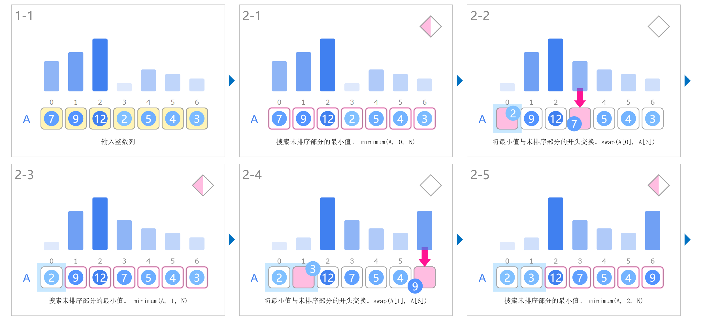
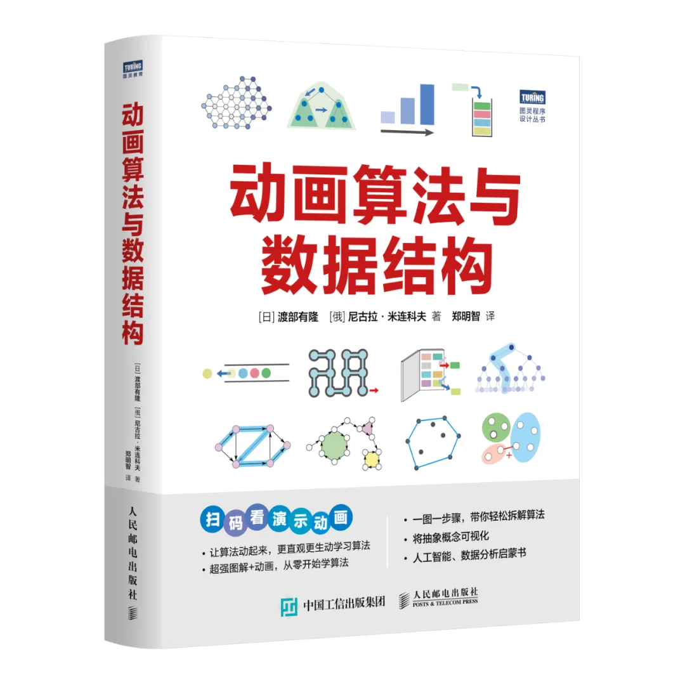
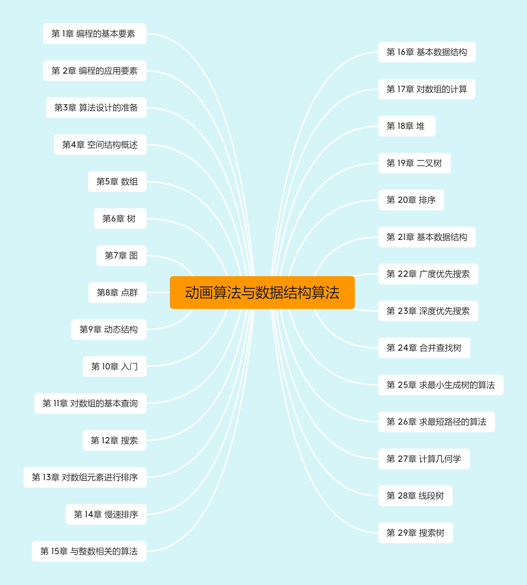
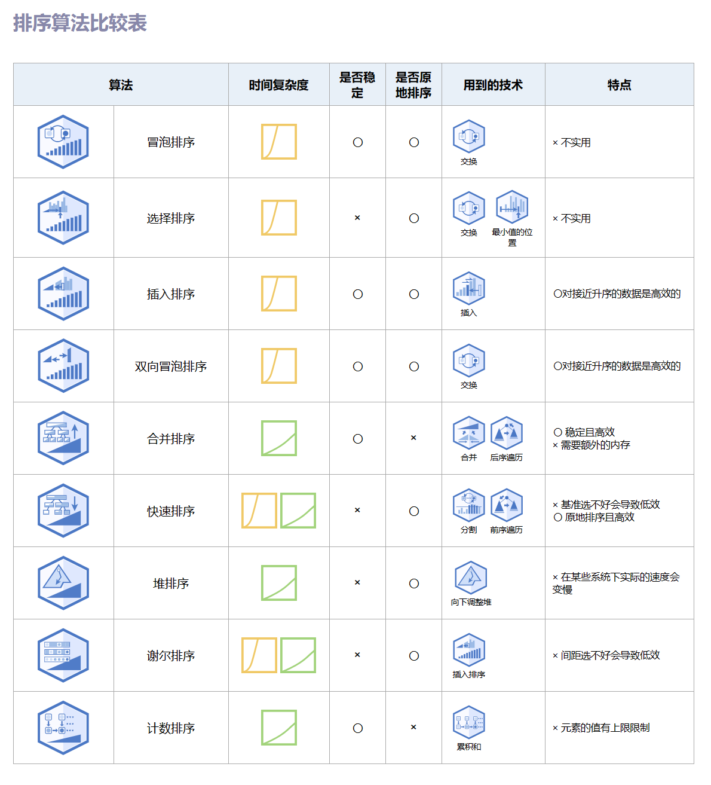
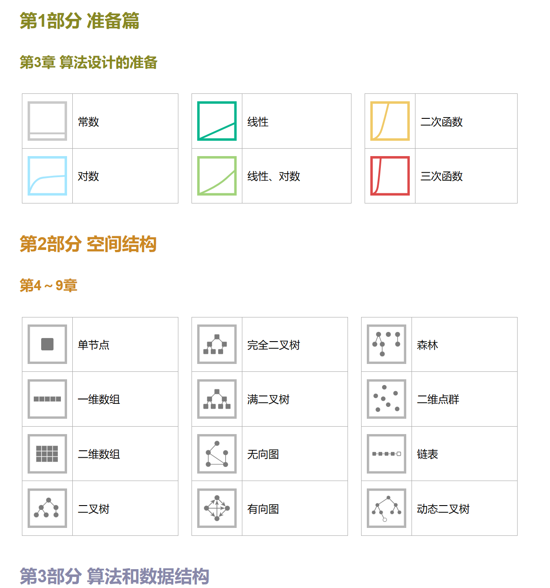

# 《动画算法与数据结构》

**有了可视化动画这个“魔法棒”，算法学会超简单**

4月份正值春招的好时期，想必很多同学都在为进入大厂在努力的奋斗呀，不仅是大厂就连现在很多的小小公司都开始用算法来考验我们的同学们了，学习算法和数据结构真的迫在眉急啊。    

笔者对于学习算法真的是有很多话想说，学数据结构和算法就像是在玩一场没有尽头的迷宫游戏，这种游戏的入场券还不是很好拿，老手们或许已经对每个转角了如指掌，但对于新手来说，这游戏听起来就像是一场没有地图的冒险，还没开始就已经感觉到了难度。真的难吗？哦，我个人觉得那是相当的难！

难点在哪里？想当年，我还是个编程界的小菜鸟，面对数据结构和算法这两座大山，我就像是一只刚学会飞翔的小鸟，面对着一片茫茫的知识海洋。我努力地啃着那些晦涩难懂的定义和原理，就像是在嚼一块没有味道的硬面包，干涩难咽。要是这个时候配上一些"佐料"我觉得肯定就很Nice了，而这个佐料就是动画图解：

这步骤是不是很详细，这是不是很炫酷，是不是觉得自己又能完全跨越算法和数据结构这座大山呢？不着急，宝典《动画算法与数据结构》在下面：

​                                                                                     [日]渡部有隆, [俄]尼古拉·米连科夫 | 著

​                                                                                                             郑明智 | 译

## 本书结构

本书的结构很清晰内容也是相当的丰富：

这本书基本上将数据结构和算法的相关问题都涵盖了，笔者对其中排序相关的算法非常感兴趣，作者动画图解得非常得到位，且作者在章节之后帮助读者进行了总结，比如排序算法的内容：

## 本书特色

1. **一本用动画学习算法的入门图书**  

  这本书在一定程度上可以认为是是一本会动的教科书，它通过动画的形式将算法的每一步展现得栩栩如生。就像小时候看动画片一样，你会被这些有趣的动画所吸引，不知不觉中就学会了算法的基础知识。图文的方式也大大降低了理解算法的难度，初学者怎么可能学不会。

2. **以直观的图文解析深入算法与数据结构**  

  这本书的另一个亮点就是它的图文解析。图文解析的方式就像是给读者一副透视眼镜，让你能够看透算法的每一个细节。无论是复杂的树结构还是难以捉摸的图算法，通过这些直观的图解，都变得清晰易懂。

3. **用通俗易懂的伪代码了解程序运行原理** 
伪代码是一种介于自然语言和编程语言之间的描述方式，它以人类容易理解的方式描述了程序的逻辑。这种方式不仅提高了学习效率，也让算法的学习变得更加亲民。

4. **从实际问题出发拓展相关知识** 
这本书不仅仅是理论上的讲解，更重要的是它将算法和数据结构的知识与实际问题紧密结合。读者可以通过解决实际问题来理解和掌握算法，这种学以致用的方式，让学习变得更加有意义和有动力。

5. **轻松记忆，深入理解，带你从零开始掌握算法** 
  这本书的设计非常注重读者的学习体验。它不仅让学习变得轻松愉快，而且通过各种方法帮助读者深入理解算法。书中的内容安排合理，由浅入深，让读者可以根据自己的节奏逐步学习。无论是通过动画、图文解析还是伪代码，这本书都旨在帮助读者轻松记忆和深入理解算法。

# 学习建议

全书一共三个部分：

（1）**准备篇**：介绍理解本书内容所需的基础知识。这部分将介绍最基础的编程方面的术语和相关知识，为理解伪代码做好准备，同时还将介绍时间复杂度等算法领域的重要概念。

（2）**空间结构**：将系统地介绍各种空间结构，另外，也会对相关术语和实现方法进行介绍。

（3）**算法和数据结构**：是本书的核心内容。本书将算法看作“解决问题的步骤”，将数据结构看作“根据规则进行操作的数据集”，并分为不同主题进行讲解。为了使实现更高效，有时也将数据结构包含在算法中。

笔者觉得，尽管这本书所展示的多种可视化动画极大地简化了对数据结构和算法的理解过程，但是仍然建议大家将这些动画视作学习的辅助手段。在通过动画获得初步理解之后，应当亲自动手实践，通过编写代码和绘制图表来巩固知识。适度地依赖这些工具能够提高学习效率，但过度依赖则可能导致学习上的懈怠。

**我们在享受动画带来的便利的同时，也不忘勤加练习，保持学习的主动性和积极性。**

## 适用对象

掌握算法和数据结构的核心在于理解其原理，而亲自动手实践则更多地锻炼了解决实际问题的能力。针对这本书的目标读者，我认为以下几类读者将会从中受益：

1. **算法和数据结构领域的新手**：对于那些刚刚踏入算法世界的读者，或是那些虽然有过一些解题经历，但对数据结构和算法的认识还不够清晰的初学者，这本书无疑是为他们量身打造的。它能够帮助你在算法的海洋中找到方向，稳固你的知识基础。

2. **有一定基础的算法和数据结构学习者**：对于那些已经积累了一定解题经验，对各种算法和数据机构有所了解的读者，这本书将成为你复习和整合已有知识的得力助手。通过书中的系统梳理，你将能够更加深入地理解算法和数据结构，并构建起自己的知识体系。

3. **对算法和数据结构充满热情的爱好者**：对于那些出于兴趣而学习算法的读者，这本书将满足你们对算法世界的好奇心和探索欲。它不仅提供了丰富的知识，还能够带给你探索算法和数据结构之美的乐趣。

