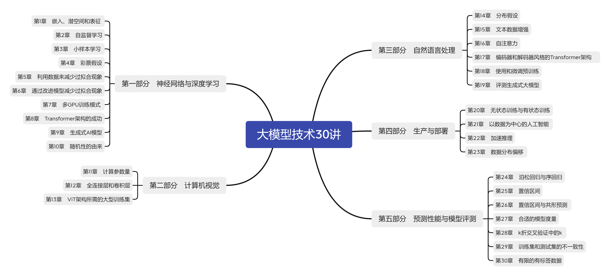
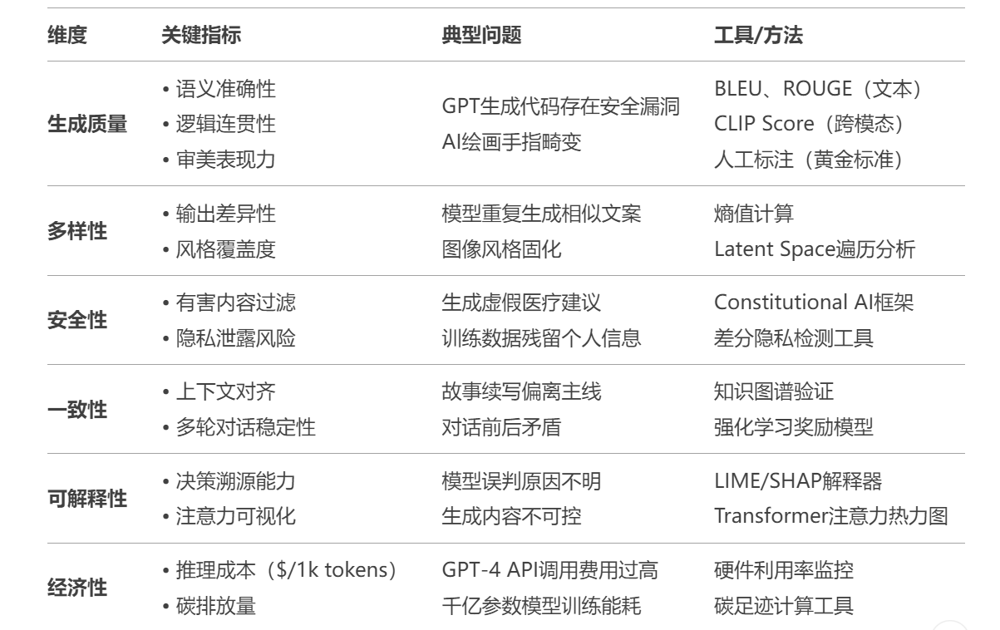
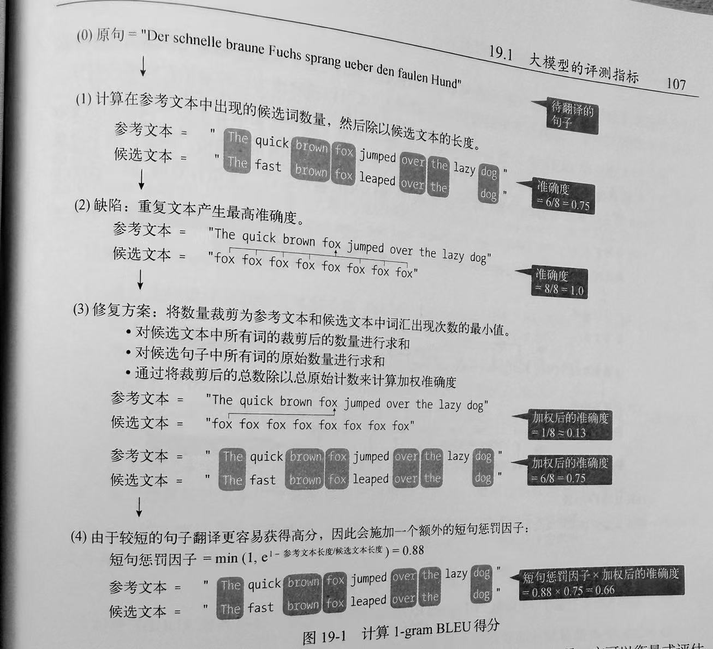

# **大模型技术30讲-带你尽情漫步大模型技术领域**

最近上海人工智能实验室在2025全球开发者先锋大会（GDC）上发布“以人为本”（Human-Centric Eval）评测体系，旨在解决传统大模型评测“高分低能”问题。

该体系通过模拟真实人类需求（如学术研究、决策支持等），结合人类主观反馈评估模型的实际应用价值。实验显示，DeepSeek-R1、GPT-o3-mini和Grok-3在不同领域各有优势，例如DeepSeek-R1在生物和教育领域表现突出。这一评测思路标志着行业从单纯追求技术指标转向关注社会价值。

可以看出，现在人们对于大模型的运用已经在开始关注社会价值了。价值和风险并存，很多学者对于大模型的“欺骗性价值对齐”问题引发担忧，例如生成误导性内容或泄露隐私数据。周鸿祎提出“以模制模”方案，构建覆盖基座模型、知识库和智能体的全链路安全体系。

而对于我们小白或者刚刚入门大模型的读者来说，我们现在重要的就是理清大模型的基础知识，包括大模型相关的基础知识，底层的神经网络以及自然语言处理相关技术的关键实践。

最近刚阅读完了塞巴斯蒂安·拉施卡（Sebastian Raschka）的《大模型技术30讲》，这位作者是真的厉害，记得当年入门机器学习的时候，就是使用他的一本关于机器学习的图书。这本关于大模型的一些基本的技术和知识点介绍得也很不错。这里就跟大家一起分享一下。

# **本书目录**

首先我们来看看这本书的内容，这本书使用探讨了当今机器学习和人工智能领域中最重要的30 个问题，问题涉及神经网络、计算机视觉和自然语言处理等相关的领域，书籍结构和详细目录如下：

可以看出本书以“大模型技术”为核心脉络，构建了一套从基础理论到产业落地的完整知识体系。通过五大模块、30个专题的立体化架构，系统性地展现了人工智能领域的前沿技术、工程实践与评估体系。

当然了还有一个特点，就是在每一章节的最后部分，作者都留下了一下值得思考额问题，比如说基于MINST数据集如何进行小样本数据集的划分和小样本的学习。章节后的每一个问题都值得我们去研究，毕竟作者在书的附录部分做了非常详细的解答。

# **理论与实践的螺旋式演进**

既然我看了这本书，我就谈一下个人对这本书的感觉吧：这本书有基础、有深入、有工程也有相应的闭环容：

（1）基础夯实（第1-13章）：嵌入表示与潜空间理论为深度学习奠定数学基础，结合小样本学习**、**多源模型等章节，解析模型如何从数据中提炼知识；数据优化与模型改进体现的辩证思维让人叹为观止，而Transformer架构与生成式AI的深度拆解，揭示了当前技术革命的底层逻辑，你现在明白Attention是多么的伟大了吧！

（2）领域深化（计算机视觉与NLP）：通过图像过拟合优化（第5-6章）、自然语言数据增强（第15章）等专题，渗透CV与NLP的核心挑战揭示深入理解的重要性。编码器-解码器架构（第17章）和文本生成评测，直击大模型在语言任务中的关键技术瓶颈，毕竟自然语言相关的技术基本上就是大模型的基础啊。

（3）工程落地（第20-23章）：好的大模型的工程落地肯定也是非常优秀的，这些章节讲述了从无状态训练到推理加速，构建了从实验室到生产环境的技术通路。数据分布偏移的专题分析，为工业级模型部署提供了风险预警框架。

（4）评估闭环（第24-30章）：置信区间将统计学严谨性注入AI评估，直指当前大模型验证体系的盲区。大模型的评估的工作越来越多，让我们重新审视大模型给生产生活带来的优势和弊端了，如何平衡两者之间的关系才是科技为民啊。

这些章节的内容技术共同对大模型相关的前沿知识进行了梳理，还提供了最佳的实践指南，可以说不管哪个大模型火，你都绕不开这 30 个核心问题！一个章节一个技术，不管在理论还是实践都非常详细，理论与实践的螺旋式演进。

# **章节赏析**

评测大模型已从单一质量评估发展为覆盖技术、伦理、经济价值的综合体系，一般的评测维度有：

有生成质量、多样性、安全性等角度的评测，我们来看一下本书中的关于生成质量的评测，该方法是BLEU：

可以看出，作者非常详细的解释了BLEU的计算步骤，通过使用简短的例子非常好的说明了如何对一个大模型的生成质量进行细致的评测，作者也提成了BLEU方法的缺陷的改进方法。这对于不了解大模型评测方法的我来说，一下子就能掌握多种评测方法以及改进的方向，所以这本书在一定程度上面对层出不穷的新模型、新概念，其提供了稳定的技术锚点。这也是我们对这本书的期待的一面。

# **适用读者**

掌握大模型已经不是非常陌生的一个话题了，不管是高校学生作为能力提升还是提升我们的办公效率都是非常必要的，那这本书面向哪些读者呢？

1.计算机科学或工程专业的学生：无论是计算机专业的学生、软件开发者，学习这本书它不需要读者有深厚的数学或编程背景，因此非常适合作为了解大模型的底层的相关的技术实现是很有帮助的。

2.对大模型技术有浓厚兴趣的自学者：大模型所蕴含的知识好比是一个浩瀚的宇宙，对于那些有强烈自学动力，想要深入了解LLM或生成式的AI相关的学习领域的爱好者。

3.大模型工程师：正在从事LLM和大模型相关的工作的工程师，对于进一步理解大模型如温故知新。