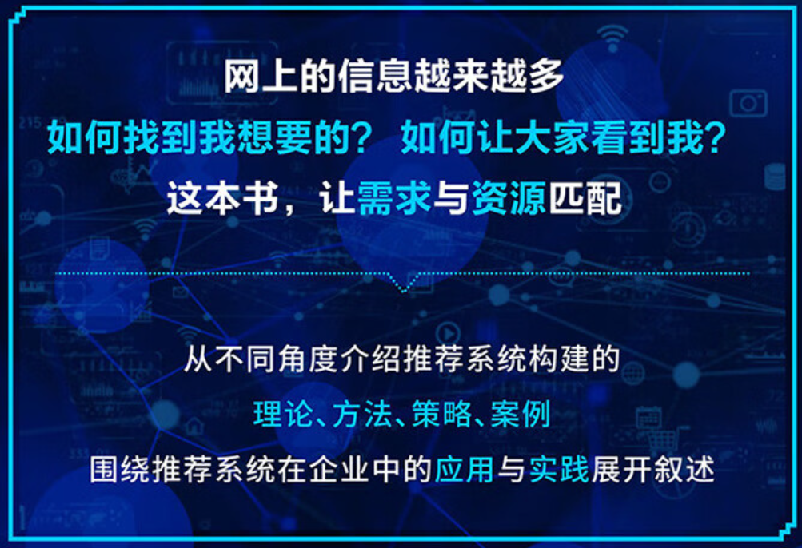

# 《推荐系统-算法、案例与大模型》

## 简简单单的推荐系统知识，你还不会吗

自2022年底，OpenAI的ChatGPT就像一位突然闯入派对的超级巨星，以其在对话、文本摘要、内容生成等众多领域的卓越表现，迅速成为了AI界的宠儿。这位算法界的“全能选手”不仅在问题解答、甚至代码编写上都展现出了令人惊叹的才华，而且在对话交流中还透露出一丝难得的“人情味”。这不禁让人怀疑，是不是通用人工智能的大门已经被悄悄推开了一条缝，而我们正站在新时代的门槛上，满怀期待地准备迎接这位未来的“全能管家”。

我想是的！

"全能管家"会的东西太多了，而如今推荐算法领域相关的知识已经被这位管家“拿下”！

目前很多测评大模型能力的机构或组织，包括大模型的计算、逻辑推理、代码等各个方面的能力：

因为大模型的能力范围十分得广泛，且各个方面的能力也非常的强大，因此如果推荐系统与大模型相结合是不是也能碰撞出一些什么火花呢。

## 一、推荐系统中如何运用大模型

在推荐系统中运用大模型的一个核心问题是：推荐模型如何从大模型中取长补短，从而提升推荐性能，优化用户的体验。

那么如何在推荐系统中运用大模型的呢？我们可以看下面这张图：

上面这张图是一个关于大型语言模型在推荐系统（Recommender Systems，简称RS）中应用的流程图。图中展示了两种不同的应用路径，每种路径都有其特定的步骤和组件：

1. **WHERE** 和 **HOW**：这两个指的是在推荐系统中应用LLM时需要考虑的关键问题，即“在哪里应用LLM”和“如何应用LLM”。

2. **Feature Engineering**：特征工程，在调整LLM的路径中，特征工程是第一步，涉及数据的预处理和特征的构建。
3. **Feature Encoder**：特征编码器，将特征工程中得到的特征转换为模型可以处理的格式。
4. **Scoring/Ranking Function**，评分/排名函数）：在推荐系统中，根据模型的输出为项目打分或进行排名。
5. **Pipeline Controller**：管道控制器，指控制整个推荐系统流程的组件，确保数据在不同阶段之间正确流动。
6. **大型语言模型（LLM）**：位于图的顶部，是整个流程的核心，分为两个分支：Tune LLM调整LLM;Not Tune LLM不调整LLM。

整体来看，这张图展示了在推荐系统中应用大型语言模型的不同方法和步骤，包括是否对模型进行调整、如何进行特征工程、以及在推理阶段是否利用CRM系统等关键决策点。

所以说，基于大模型来增强我们的推荐系统是一个非常好的想法。

## 二、《推荐系统：算法、案例与大模型》

大模型在推荐系统中创新应用使得很多感兴趣的小伙伴都尝试进行应用结合，并运用到自己的项目中，那么如何系统的掌握这些技能呢？那就读书吧，大模型和推荐系统相结合的图书目前市面上还不多，除了目前的图灵的这本--《推荐系统：算法、案例与大模型》。

这本书的内容十分丰富，我来和大家分享一下各个章节的内容：

1. **推荐系统基础**：介绍了推荐系统的定义、解决的问题、应用领域，以及常用的推荐算法，包括基于内容的推荐和协同过滤算法。

2. **推荐系统的产品与运营**：讨论了推荐系统的产品形态，如热门推荐、个性化推荐等，以及推荐系统的运营策略。

3. **推荐系统的业务流程与架构**：详细阐述了推荐算法的业务流程，包括数据收集、ETL（提取、转换、加载）、模型构建、预测、Web服务以及离线与在线评估。

4. **推荐系统的数据源与数据预处理**：主要分析了数据源的分类和重要性，以及数据预处理的关键步骤，如抽取、转换和加载。

5. **推荐系统的特征工程**：深入讨论了推荐系统中特征工程的重要性，包括用户画像、物品画像、用户行为、场景和交叉特征。

6. **推荐系统的召回算法**：解释了召回算法的作用，包括基于算法复杂度、数据维度和个性化程度的分类。

7. **基于规则和策略的召回算法**：介绍了基于热门、物品标签、用户画像和地域等多种规则和策略的召回算法。

8. **基础召回算法**：介绍 了关联规则、聚类、朴素贝叶斯和协同过滤等基础召回算法。

9. **高阶召回算法**：讨论了嵌入方法和深度学习召回算法，如word2vec、item2vec以及YouTube的深度学习召回算法。

10. **推荐系统的排序算法**：介绍了排序算法的概念，包括基于规则和策略、基础和高阶排序算法。

11. **基于规则和策略的排序算法**：讨论了多种排序策略，如随机打散、归一化排序和代理算法排序。

12. **基础排序算法**：介绍了logistic回归、FM（因子分解机）和GBDT（梯度提升决策树）等基础排序算法。

13. **高阶排序算法**：探讨了Wide & Deep和YouTube深度学习排序算法。

14. **推荐系统的冷启动**：讨论了冷启动问题，分析了其挑战，并提出了解决策略。

15. **推荐系统的效果评估**：讨论了评估的目的、方法分类和常用评估手段，包括离线和在线评估。

16. **推荐系统的A/B测试**：解释了A/B测试的概念、价值和实现方案。

17. **推荐系统的Web服务**：讨论了推荐系统Web服务的构成，包括API服务和推断服务。

18. **Netflix Prize推荐算法代码实战案例**：通过Netflix Prize竞赛案例，展示了推荐系统算法的实现。

19. **H&M推荐算法代码实战案例**：介绍了H&M数据集和基于该数据集的推荐算法实现。

20. **推荐系统在金融行业的应用**：探讨了推荐系统在金融行业中的应用，包括技术实现和核心功能模块。

21. **推荐系统在零售行业的应用**：分析了零售电商推荐需求背景，以及推荐系统在零售行业的应用案例。

22. **ChatGPT与大模型**：介绍了语言模型的发展，全球大模型的简介，以及大模型的核心技术。

23. **ChatGPT、大模型在推荐系统中的应用**：详细讨论了大模型在推荐系统中的应用方法、问题和挑战，以及发展趋势。

24. **推荐系统的未来发展**：预测了推荐系统的未来发展方向，包括政策、技术、行业就业环境、应用场景和工程架构的演变。

从各个章节的内容上可以看出，这本书是十分强大的。

总结一下就是：这本书从推荐系统的定义和需要解决的问题入手，逐步展开对推荐系统在产品形态、业务流程、数据源、特征工程、召回算法等方面进行了深入的讨论。另外作者对大模型技术的介绍，不仅涵盖了其在推荐系统中的应用，还深入地讨论了面临的挑战和未来的发展方向。

## 三、推荐理由

作为读者的我，基本上看完这本书，接下来从我个人的角度分享几个推荐这本书的理由：

1. **全面覆盖推荐系统知识**：这本书从推荐系统的基础知识讲起，深入到算法原理、实现思路，再到行业应用案例，为读者提供了一个全面的学习路径。无论是初学者还是有经验的专业人士，都能从中获得宝贵的知识。

2. **紧跟技术前沿**：读者可以通过这本书了解最新的技术动态，把握推荐系统的发展趋势。尤其是大模型在推荐系统中的应用，这是当前人工智能领域的热点之一。

3. **实战案例丰富**：书中包含了H&M等真实案例的实战分析，这些案例不仅增加了书籍的实用性，还帮助读者理解推荐系统在实际工作中的应用，增强了理论与实践的结合。

4. **作者专业背景**：刘强作为杭州数卓信息技术有限公司的CEO和达观数据的高级技术顾问，拥有丰富的大数据与AI实践经验。他的专业背景和实践经验保证了书籍内容的专业性和实用性。

5. **深入浅出的讲解**：这本书在讲解复杂的算法和模型时，注重逻辑性和条理性，用浅显易懂的语言解释复杂概念，使得读者即使没有深厚的数学或编程背景，也能够理解和掌握推荐系统的核心技术。

## 四、适用读者

从《推荐系统：算法、案例与大模型》这本书的内容可以知道，这是一本综合性的专业书籍，它不仅涵盖了推荐系统的理论知识，还包含了丰富的实战案例和前沿技术探讨，特别适合以下几类读者：

（1）AI领域的学生：对于正在攻读数据科学、机器学习、人工智能或相关领域的学生来说，这本书是一份宝贵的学习资源。书中不仅提供了推荐系统的基础知识，还深入探讨了算法的原理和实现，有助于学生建立起扎实的理论基础。

（2）推荐系统领域的研究人员：对于从事推荐系统研究的学者和研究人员，这本书提供了最新的研究成果和技术动态。书中对大模型技术在推荐系统中的应用进行了深入讨论，可以帮助研究人员掌握当前推荐系统的前沿技。

（3）AI与大数据行业的工程师与开发者：书中详细介绍了推荐系统的构建流程、算法实现和优化技巧，对于工程师在实际工作中解决问题、提高系统性能具有直接的指导意义。

（4）技术爱好者与终身学习者：对于对人工智能和推荐算法领域有浓厚兴趣的技术爱好者和终身学习者，本书的强大内容使读者能够在学习过程中获得启发和灵感。

（5）产品经理和咨询顾问：产品经理和咨询顾问需要对不同行业的技术应用有深入的了解，以便为客户提供专业的产品和咨询服务。

## 五、大咖推荐语

这么优秀的图书自然得到了很多大咖的推荐：

### 六、总结

《推荐系统：算法、案例与大模型》是一本适合多层次、多领域读者的专业书籍。无论是学生、研究人员、工程师还是产品经理等人士都都可以从这本书中获得有价值的信息和知识。尤其是大模型和推荐系统的结合的理论和实践。书中的理论知识、实战案例和前沿技术探讨，为选择这本书的读者提供了一个清晰的技术路线和从业方向。最后希望选择了这本书的读者能够在推荐系统和大模型等领域学有所成。
