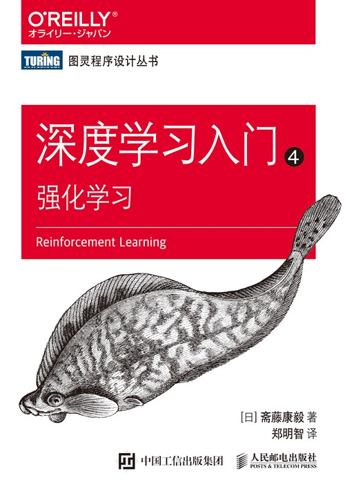
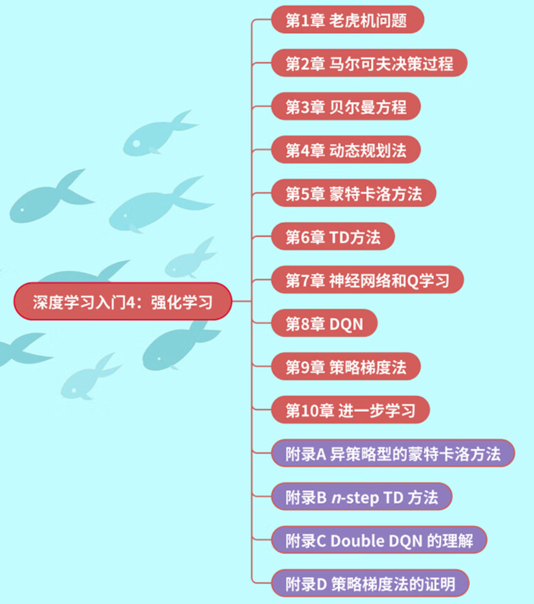
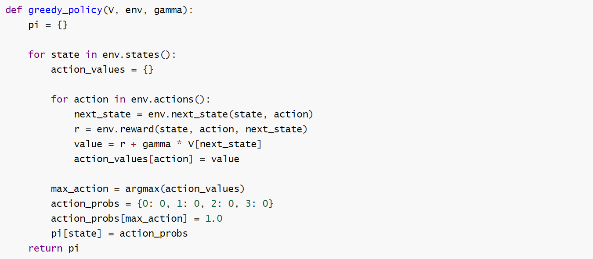
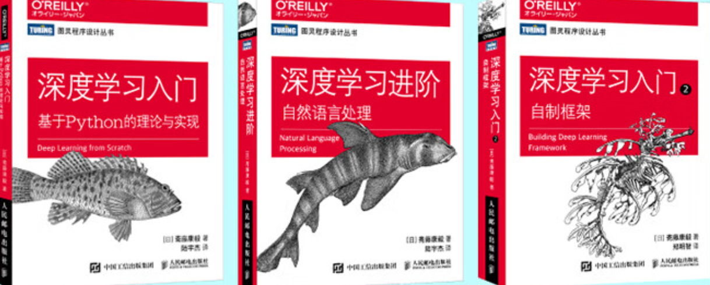

# 深度学习入门4-强化学习

### 强化学习知识的精彩呈现

[TOC]

最近的《黑神话-悟空》非常火，很多人都惊讶其游戏的精美度，不管是人物建模还是打斗特效，都让人为之惊叹。这时候小伙伴们可能就要问了，大型游戏中一般会使用哪些火热的技术呢？其实不同的游戏会使用特定场景的技术，其实都是为了满足业务需求。

正好现在AI等技术也很火，那么在游戏中会使用一些AI技术吗？答案是显然了的，强化学习就是其中一门“应用者”，特别是在需要智能体学习如何在复杂环境中做出决策的场景中。

## 一、什么强化学习

首先看看什么是强化学习。强化学习一直也是一个火热的研究领域，从一定角度上来说强化学习是一种机器学习方法，它主要关注如何在环境中采取行动以最大化某种累积奖励。这种方法通常涉及一个智能体（agent）与一个环境（environment）的交互。智能体通过执行动作（actions）来改变环境状态，并从环境中接收反馈，即奖励（rewards）或惩罚（penalties）。

强化学习的关键特点包括：

1. **试错学习（Learning by doing）**：智能体通过尝试不同的动作并观察结果来学习最佳策略。

2. **延迟奖励（Delayed rewards）**：智能体的目标是最大化长期累积奖励，而不仅仅是立即奖励。

3. **策略（Policy）**：策略是从当前状态到动作的映射，智能体通过学习改善其策略。

4. **价值函数（Value function）**：它预测采取某个策略后获得的累积奖励。

5. **探索与利用（Exploration and exploitation）**：智能体需要在探索未知动作以发现更好的策略和利用已知信息以获得奖励之间找到平衡。

   

   

   

上图是强化学习的一个示意。强化学习的广泛应用是十分广泛的，包括游戏领域、机器人领域、金融领域、医疗等领域，它使得机器能够在没有明确指示的情况下，通过与环境的交互自我学习并作出决策。

强化学习的好处这么多，怎么入门呢？不着急，可以看一下这本书：

看这本书的封面就知道，本书也是经典图书”鱼书“的其中一本，主要介绍的是强化学习方面的知识。

## 二、掌握强化学习

掌握强化学习的理论知识并不难，毕竟我们将会有鱼书的buff加成，那么这本的内容有哪些呢？

可以看出，全书分为10个章节。作者从强化学习中的常见问题-老虎机出发，逐渐解开强化学习的神秘面纱。有了这本书你就可以在马尔科夫链、贝尔曼方程、动态规划和蒙特卡洛方法等知识组成的海洋里遨游。真正从零掌握强化学习的基础知识，快速成为强化学习领域的大牛。

## 三、章节赏析：

这本有一个重要的特点，就是相关的代码实现是非常清晰的，作为一名读者在跟学的时候觉得再一次验证了这本书是很适合初学者来使用的，这里我们来赏析其中的一段代码。比如在第4章节使用argmax函数实现将价值函数实现贪婪化的函数：

作者在这段代码定义了一个贪婪策略（greedy_policy）生成函数，用于强化学习中。

贪婪策略意味着智能体总是选择当前看起来最优的动作，以期望获得最大的即时奖励。下面是作为一名读者的拙见：

1. def greedy_policy(V, env, gamma)函数，它接收三个参数：

   V：一个字典或类似数据结构，表示每个状态的价值函数，即从该状态开始并遵循某个策略所能获得的期望回报。

   env：环境对象，它提供了与环境交互的方法，比如获取状态、动作和奖励。

   gamma：折扣因子，用于计算未来奖励的当前价值，0 < gamma <= 1。

2. pi = {}初始化一个空字典 `pi`，用于存储最终的策略，其中键是状态，值是该状态下的动作概率分布。

3. action_values = {}对于每个状态，初始化一个空字典 action_values，用于存储每个可能动作的值。

4. 对于 env.actions()的循环:遍历在当前状态下所有可能的动作。

5. next_state = env.next_state(state, action)通过执行当前动作在当前状态下，获取下一个状态。

6. r = env.reward(state, action, next_state)获取执行当前动作从当前状态转移到下一个状态的即时奖励。

7. value = r + gamma * V[next_state]计算动作值，即即时奖励加上折扣后下一个状态的价值。

8. action_values[action] = value将计算出的动作值存储在 action_values`字典中。

9. max_action = argmax(action_values)使用 argmax 函数找到 action_values 中最大值对应的动作，即选择可以获得最大期望回报的动作。

10. action_probs = {0: 0, 1: 0, 2: 0, 3: 0}初始化一个动作概率分布字典，假设有四个可能的动作。

11. action_probs[max_action] = 1.0将选中的最优动作的概率设置为1.0，表示在该状态下智能体将选择这个动作。

整个代码的思路是非常清晰的，几乎没有多余的动作，作者的代码功底还是非常深厚的，通过巧妙使用argmax 函数就实现了最大期回报的动作。

## 四、本书特点

你是不是很想知道这本书有什么特点的，那我就不卖关子了：

（1）内容十分丰富：首先这本书是全彩印刷，这样大大保证了广大读者的阅读体验，另外这本讲述了强化学习了的基础概念、核心理念和实操代码。包括：马尔科夫的决策过程、Q-learning算法，策略梯度算法（DDPG）等等核心知识点点。

（2）可操作性强：在每一核心知识点的讲解过程中，作者都很用心的配备了精选的案例代码，代码实现不借用算法包来实现，通过详细的示例代码和编程指导，使得强化学习的理论与实践完美结合，帮助读者快速掌握，深入理解，灵活运用。 

（3）讲解独特细致：本书继承“鱼书”的写作风格，作者使用通俗易懂的语言，配合大量的图表和代码示例，使得复杂的理论基础知识变得生动和易于理解。对了，图书附录部分演示了核心知识点的公式推导，尽显”数学之美“。

## 五、适用读者

强化学习技术已经不是非常陌生的一个话题的，其也一直是一个火热的论文方向。另外其作为机器学习领域中一个高度专业化的分支，个人觉得适合以下的读者。

1. **计算机科学或工程专业的学生**：这些学生通常有扎实的数学和编程基础，强化学习作为人工智能的一个重要方向，对他们的专业发展和学术研究具有重要意义，计算机科学方向的学生应该要了解它。。
2. **数据科学家和机器学习工程师**：对于那些已经在工作中使用机器学习技术，并且希望扩展其技能集以包含更高级的算法，如强化学习的人来说，这类书籍是宝贵的资源。
3. **游戏开发者**：强化学习在游戏AI开发中有着广泛的应用。游戏开发者可以通过阅读相关书籍来了解如何创建能够学习和适应的智能游戏角色。
4. **对人工智能有浓厚兴趣的自学者**：人工智能是一个浩瀚的宇宙，对于那些有强烈自学动力，想要深入了解人工智能特别是强化学习领域的爱好者，相关书籍是获取知识的重要途径。更何况它是一本强大的“鱼书”

最后“鱼书”其他三本的真容如下，你值得拥有它们：

