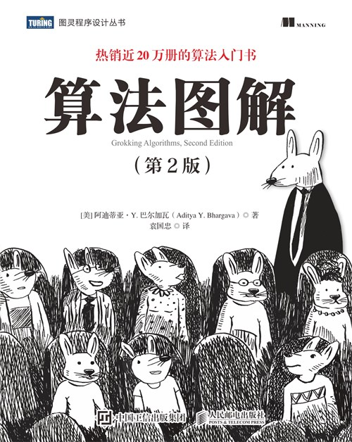
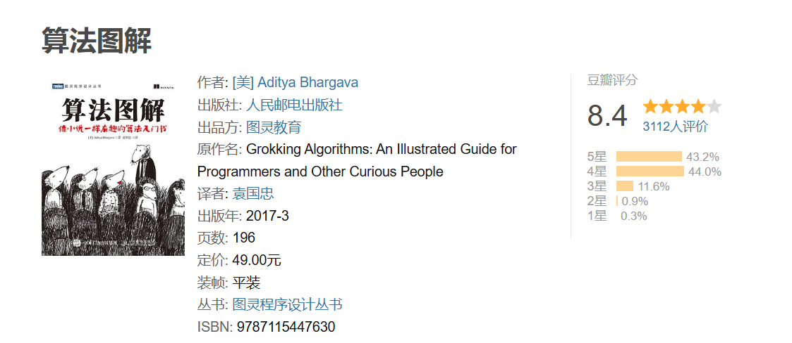
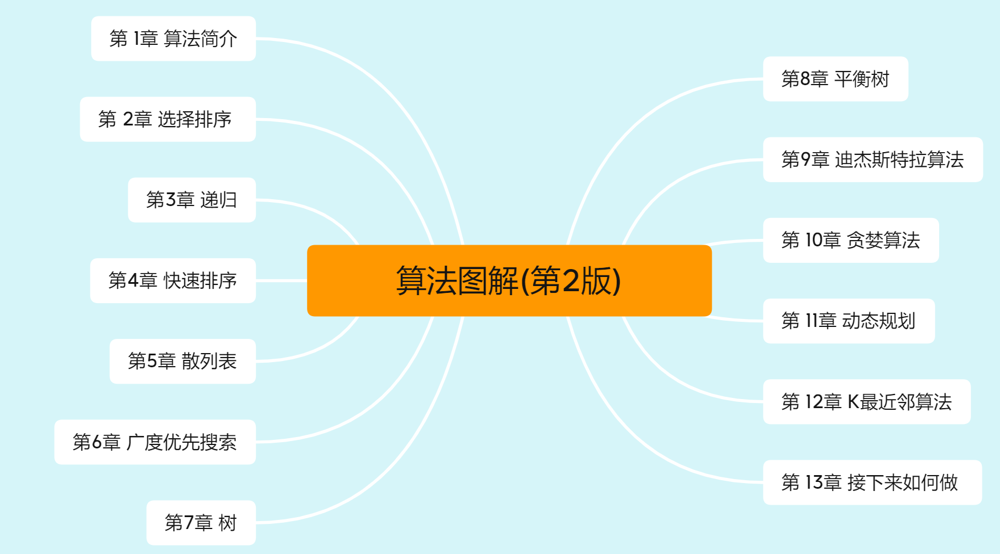
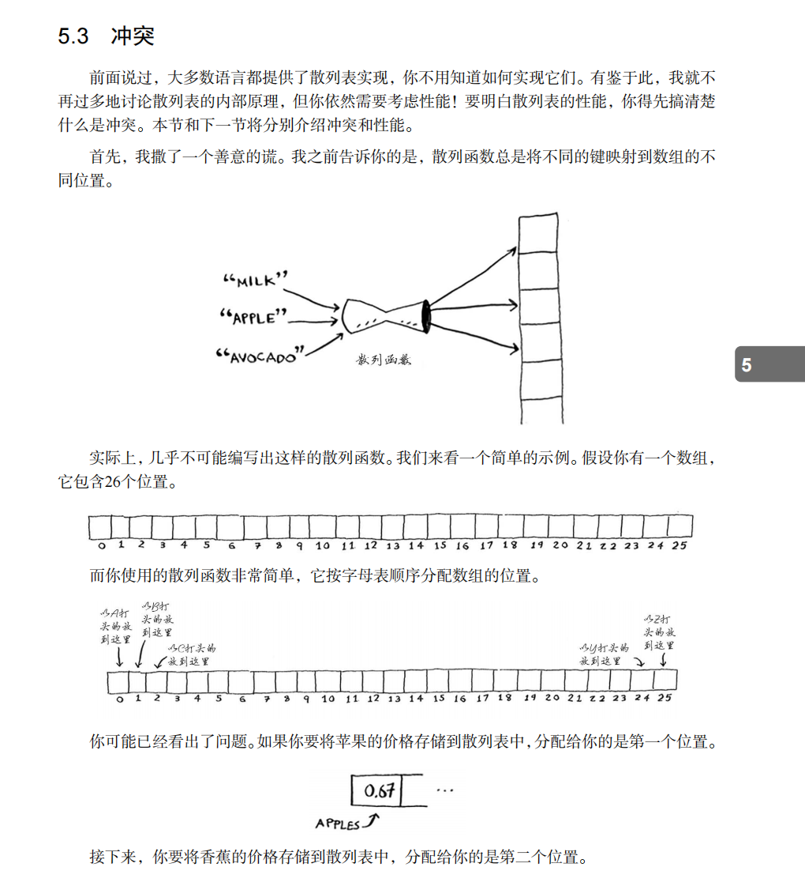

# 图解系列再添新作-算法图解

### 从根儿上理解算法

[TOC]

## 一、什么算法

很多时候我们都在使用算法，也对什么是算法这个问题进行了探讨，那算法到底是什么呢？

在我看来算法是解决特定问题的一系列定义明确的计算步骤，通常用计算机程序来实现。它是一种逻辑流程，用于执行计算、数据处理和自动化任务。算法的核心目的是在有限的步骤内，以确定的方式解决问题或达到特定的目标。算法也有自己的一些特点：

### 算法的特点：

1. **确定性**：算法的每一步都必须有明确的定义，没有歧义。
2. **有限性**：算法必须在有限的步骤之后结束，不能无限循环。
3. **输入**：算法可以接收零个或多个输入值。
4. **输出**：算法至少产生一个输出值。
5. **有效性**：算法的每一步都必须足够基本，以至于可以准确地执行。

### 算法的应用场景：

算法的实际应用的场景也是非常多的，几乎涵盖了我们日常生活和工业生产的各个方面。比如：

1.**搜索引擎**

2.**电子商务**

3.**金融科技**

4.**游戏开发**

这也就是为什么现在很多的互联网企业或者是国企中与IT相关的岗位都要求有一定的算法掌握度。那算法入门也是很多新手头疼的问题，那这不得不说人邮的这本热销17万册的《图解算法第2版》了。

该书的第1版也获得了广大读者的好评，口碑非常不错：

## 二、掌握算法

掌握一些基础的算法知识并不难，毕竟我们有《算法图解》buff加成，那么这本书在升级以后有哪些具体的内容呢？

可以看出，全书分为13个章节。作者通过图解的方式，将算法的概念和实现过程变得生动有趣。它涵盖了排序、搜索、图算法、递归等基础算法，以及数据结构如链表、栈、队列、树和散列表等。作者巧妙地将复杂的概念简化，使得即使是初学者也能轻松理解。

## 三、章节赏析：

这本有一个重要的特点就是算法的讲解不是仅仅依靠代码的编写和运行来进行的，而是通过不断地剖析各个算法的最本质的部分，辅以图解的方式来进行的，比如在讲解散列函数的冲突的知识点的时候，作者很细心的画图诠释了发生冲突的原因，让读者一下明白冲突是怎么造成的，也能想到如何怎么在第一时间想到解决冲突的办法：

这样循序带着“步骤”的讲解方式能在最大程度上保证读者对算法本质的理解，在看书学习的过程中不断加深对算法执行步骤的理解。这也是作为一位读者最想看到的，

## 四、本书特点

本书除了使用图解的方式来讲解算法的本质的最大特点之外，还有很多特点也是本书的看点：

（1）**内容十分丰富**：本书除了介绍算法基础，包括二分查找、大O表示法、两种基本的数据结构以及递归等。余下的篇幅还介绍了分而治之、贪婪算法或动态规划，哈希表的应用，图和树算法，K最近邻算法等，算法知识点非常多，简直是学习的“饕餮盛宴”。

（2）**图解详细**：作者通过使用600+幅图示巧妙地将复杂的概念简化，使得即使是初学者也能轻松理解。大量的图表和流程图，将算法的逻辑流程直观地展现出来，帮助读者在脑海中构建算法的执行过程，这也是大家都推荐这本书的主要原因。

（3）**可操作性强**：在每一核心知识点的讲解过程中，作者都很用心的配备了精选的案例代码（基于Python3实现），通过详细的示例代码和注释，使得算法的理论与实践完美结合，帮助读者快速掌握，深入理解，灵活运用。 

（4）**讲解独特细致**：本书除了对基础的的算法理论进行讲解之外，每一章节的最后都精心设计了很多的练习题，这些练习题的设计可以帮我们对算法进行深入的理解，算法的逻辑特点读者可以再练习的时候进一步加强。

## 五、适用读者

掌握算法已经不是非常陌生的一个话题了，不管是高校学生作为能力提升还是互联网中生产活动，都离不开算法及其实践。

1. **计算机科学或工程专业的学生**：无论是计算机专业的学生、软件开发者，学习这本书它不需要读者有深厚的数学或编程背景，因此非常适合作为算法学习的入门书籍。
2. **游戏开发者**：算法在游戏开发中有着广泛的应用。游戏开发者可以通过阅读相关书籍来提升程序的运行效率，提升玩家体验。。
4. **对算法有浓厚兴趣的自学者**：算法理论知识好比是一个浩瀚的宇宙，对于那些有强烈自学动力，想要深入了解算法特别是强化学习领域的爱好者，相关书籍是获取知识的重要途径。更何况它是一本强大的图解系列。

