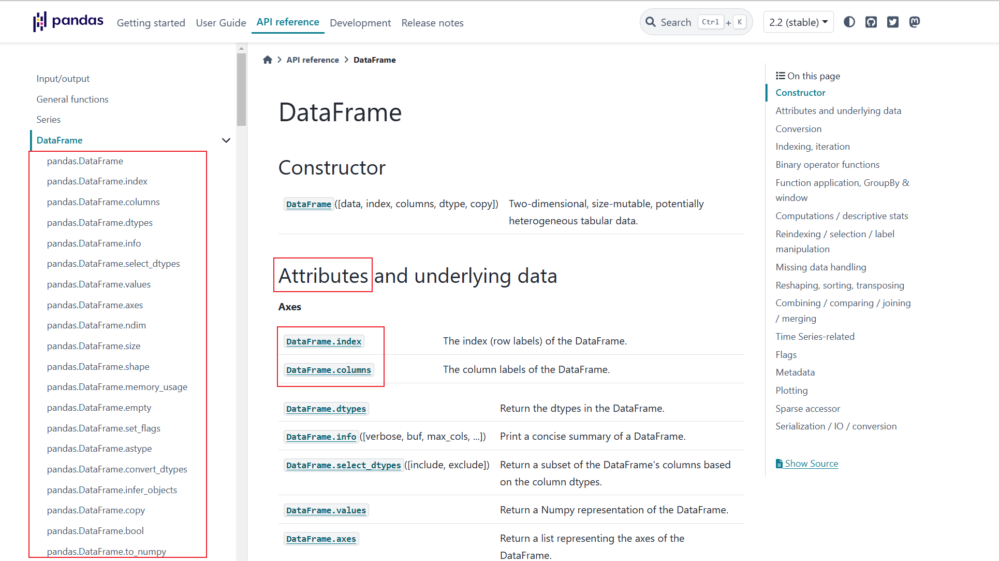
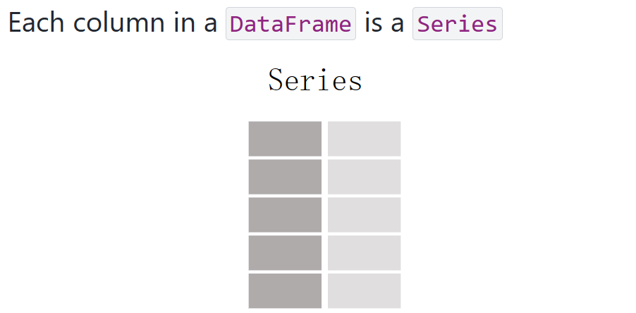

# Pandas基础教程三_DataFrame数据结构

大家好，这里是**【Python机器学习算法实践】**，在之前的基础知识中有提及到Pandas中有两个重要的数据结构，Series和DataFrame。也使用一些篇幅着重介绍了Series的基础知识，希望跟着学习的小伙伴好好复习一下知识点，本次推文我们一起来学习一下DataFrame的相关知识。

跟Series不同DataFrame表示的一种矩阵的数据结构(数据表)，在DataFrame中不同列的数据类型(数值，字符串，布尔值等等)。另外从DataFrame的数据形式可以看出。DataFrame既有行索引，也有列索引，这种形式的存在使得DataFrame的取数变得更加的灵活。

**注意：虽然DataFrame是一个二维数据，但是使用分层索引方式可以展现更高维度的数据，后期将以实例的形式说明分层索引方法的使用。**

## 一、DataFrame简介
DataFrame 是 Pandas 中最强大的工具之一，它的灵活性和功能丰富性使其成为数据科学家和分析师的首选工具。通过掌握 DataFrame 的使用，可以大大提高数据处理的效率和质量。

DataFrame 是一个二维标签化数据结构，可以将其想象为一个 Excel 电子表格或 SQL 数据库表，其中有行和列。

DataFrame 可以容纳不同类型的数据，包括整数、浮点数、字符串、布尔值等。

**（1）基本特性:**

（1）大小可变：DataFrame 的每一列可以是不同的数据类型。

（2）自动对齐：DataFrame 在索引上自动对齐，即每一列的索引都是对齐的。

（3）可以包含缺失数据：Pandas 可以处理缺失或缺失的数据，使用 NaN（Not a Number）表示。

**（2）样式：**

DataFrame长这样：


大家有一个直观的认识。

其每一列就是一个Series:


## 二、DataFrame中的索引和值
与Series一样，Dataframe中也有相应的索引和值的概念：

**1.索引（Index）**

索引是 DataFrame 中用于唯一标识每一行或每一列的标签。Pandas 允许用户自定义索引，也可以使用默认的整数索引。

**（1）行索引（Row Index)**

行索引用于标识 DataFrame 中的每一行。如果不指定行索引，Pandas 会使用从 0 开始的整数序列作为默认索引。行索引可以是数字、字符串或日期等任何可哈希的对象。

**（2）列索引（Column Index）**

列索引用于标识 DataFrame 中的每一列。列索引通常是字符串。
列索引在创建 DataFrame 时通过列的名称定义。

那么如何去设置索引呢，我们一起来看一下：

**（3）设置索引**

用户可以通过多种方式设置 DataFrame 的索引：
```python
import pandas as pd

# 使用字典创建 DataFrame 并指定列名作为索引
mydata = {'Column1': [1, 2, 3], 'Column2': ['a', 'b', 'c']}
df = pd.DataFrame(mydata)
df
# 输出
Column1	Column2
0	1	a
1	2	b
2	3	c
```
指定行索引:
```python
# 指定行索引
df.index = ['row1', 'row2', 'row3']
df
# 输出
Column1	Column2
row1	1	a
row2	2	b
row3	3	c
```
使用另一个 Series 或数组作为索引:
```python
# 使用另一个 Series 或数组作为索引
index_series = pd.Series(['row_index_1', 'row_index_2', 'row_index_3'])
df.index = index_series
df
# 输出
	Column1	Column2
row_index_1	1	a
row_index_2	2	b
row_index_3	3	c
```
上述代码中，我们使用了两种方式来改变Dataframe的行索引。

**2.值（Values）**

值是 DataFrame 中存储的数据，它们可以是数字、字符串、布尔值或其他任何数据类型。

一般我们对值的操作有访问和修改，比如说：

**（1）访问值**

（a）可以通过索引和列名来访问 DataFrame 中的值。

（b）可以使用 .loc、.iloc 或 at 和 iat 方法来访问值。

**（2）修改值**

可以通过索引和赋值操作来修改 DataFrame 中的值。比如：
```python
# 创建 DataFrame
df = pd.DataFrame({
    'A': [1, 2, 3],
    'B': ['a', 'b', 'c']
}, index=['row1', 'row2', 'row3'])

# 访问特定行和列的值
# 访问 'row1' 行 'A' 列的值
value = df.loc['row1', 'A']  
value

# 输出
1
```
通过loc我们可以进行值的修改：
```python
# 修改特定行和列的值
df.loc['row1', 'A'] = 100
df
# 输出
A	B
row1	100	a
row2	2	b
row3	3	c
```
通过values可以访问所有的值：
```python
# 访问 DataFrame 中的所有值
all_values = df.values
all_values
# 输出
array([[100, 'a'],
       [2, 'b'],
       [3, 'c']], dtype=object)
```
通过列名可以访问列值：
```python
# 访问 DataFrame 中的特定列的值
column_values = df['A']
column_values
# 输出
row1    100
row2      2
row3      3
Name: A, dtype: int64
```
说了这么多，我们总结一下值和索引的关系：

**3.索引和值的关系**

- 索引和值是 DataFrame 的两个基本组成部分，它们共同定义了数据的存储和访问方式。
- 索引提供了一种快速访问和定位数据的方法，而值则包含了实际的数据内容。
- 在进行数据分析和处理时，合理地使用索引可以提高数据操作的效率。

接下来我们来学习一下如何创建DataFrame.


## 三、DataFrame的创建

DataFrame的创建有很多种方式。
在工程项目中，我们如果直接使用Pandas的方法pd.read_csv('file.csv')和pd.read_excel('file.xlsx')方法，这两个方法返回的数据就是DataFrame类型的数据，接下来我们来看看使用其他的方法如何进行DataFrame数据的创建。

**1. 使用字典创建DataFrame**

使用字典创建DataFrame是非常方便的，使用的方式如下：
```python
import pandas as pd  
weather_data = {  
'date':['2021-03-21','2021-03-22','2021-03-23'],  
'temperature':[25,26,27],  
'humidity':[81, 50, 56]  
}  
weather_df = pd.DataFrame(weather_data)  
weather_df

# 输出结果如下：
date temperature humidity
0 2021-03-21 25 81
1 2021-03-22 26 50
2 2021-03-23 27 56
```
可以看出，使用字典的话是很方便创建DataFrame的，我们只需要给相应的方法传入一个字典就就可以，字典的数据我们使用列表。

**2. 使用元组列表创建DataFrame**

使用元组列表的方式很很方便，我们只需要传入一个列表，列表内使用元组。我们来看一下代码：
```python
import pandas as pd  
weather_data = [  
('2021-03-21',25,81),  
('2021-03-22',26,50),  
('2021-03-23',27,56)  
]  
weather_df = pd.DataFrame(data = weather_data, columns=['date', 'temperature', 'humidity'])  
weather_df
```
本次输出与使用字典创建的DataFrame一样，与上述不同的是: 
使用元组列表的时候，我们在使用pd.DataFrame()方法的时候需要传入参数columns以指定列名，columns列表的顺序也直接决定了生成的DataFrame列的顺序。

**3. 使用字典列表DataFrame**

跟使用元组列表一样，我们还可以使用字典列表进行DataFrame的创建：
```python
import pandas as pd  
weather_data = [  
{'date':'2021-03-21','temperature':'25','humidity':'81'},  
{'date':'2021-03-22','temperature':'26','humidity':'50'},  
{'date':'2021-03-23','temperature':'27','humidity':'56'}  
]  
weather_df = pd.DataFrame(data = weather_data,  
columns=['date', 'temperature', 'humidity'])  
weather_df
```
注意上述我们没有指定行索引，所以他们只有默认的所以0,1,和2.如果需要指定行索引的话，我们可以在加入index参数，如：

```python
weather_df = pd.DataFrame(data = weather_data,  
columns=['date', 'temperature', 'humidity'],  
index = ['row_index_1','row_index_2','row_index_3']  
)
weather_df
# 输出
	date	temperature	humidity
row_index_1	2021-03-21	25	81
row_index_2	2021-03-22	26	50
row_index_3	2021-03-23	27	56
```
还有一个要注意的就是，如果我们传入的列不在字典中，那么panda会默认加上一个缺失值(NaN的值)：
```python

import pandas as pd  
weather_data = {  
'date':['2021-03-21','2021-03-22','2021-03-23'],  
'temperature':[25,26,27],  
'humidity':[81, 50, 56],  
}  
weather_df = pd.DataFrame(weather_data,columns=['date','temperature','humidity','event'])  
weather_df
# 输出
date temperature humidity event
0 2021-03-21 25 81 NaN
1 2021-03-22 26 50 NaN
2 2021-03-23 27 56 NaN
```

当然了，也可以使用列表列表的方式进行创建DataFrame。这里就不在进行演示了，其实还有很多关于如何进行DataFrame的创建的方式。接下来看一下DataFrame操作。

## 四、DataFrame操作

在进行数据分析的时候，我们经常要对DataFrame的数据中每一列或者某一行进行一些诸如归一化等的操作，这个时候就要进行取数的操作，那么常见的一些子集的操作是怎样的呢？这里列举了一些方法：

| 子集操作方法 | 方法说明 |
|---------------|----------|
| `df.head()`   | 获取前5行数据 |
| `df.tail()`   | 获取最后5行数据 |
| `df[start:stop:end]` | 使用切片方式获取数据 |
| `df[column_name]` | 获取单列数据 |
| `df[[column1,column2…]]` | 获取多列数据 |
| `df.loc[row_label]` | 使用行标签获取数据 |
| `df.loc[[label1,label2,…]]` | 使用行标签获取多行数据 |
| `df.iloc[row]` | 使用行号获取数据 |
| `df.iloc[[row_1,row_2,…]]` | 使用行号获取多行数据 |
| `df.loc[[bool1,bool2,…]]` | 使用bool值获取数据 |

我们使用实例的方式来说明这些操作实际的用法，假设我们的构建的DataFrame数据如下：
```python
import pandas as pd  
data = [  
[1,2,3,4,5],  
[6,7,8,9,10],  
[11,11,12,13,14],  
[15,16,17,18,19],  
[20,21,22,23,24],  
[25,26,27,28,29],  
[30,31,32,33,34],  
[35,36,37,38,39],  
[40,41,42,43,44],  
[45,46,47,48,49]  
]  
index = ['01', '02', '03', '04', '05','06', '07', '08', '09', '10']  
column=['C001', 'C002', 'C003','C004','C005']
df_example = pd.DataFrame(data= data,index=index,columns=column)
df_example
# 输出
C001	C002	C003	C004	C005
01	1	2	3	4	5
02	6	7	8	9	10
03	11	11	12	13	14
04	15	16	17	18	19
05	20	21	22	23	24
06	25	26	27	28	29
07	30	31	32	33	34
08	35	36	37	38	39
09	40	41	42	43	44
10	45	46	47	48	49
```
我们先看head()和tail()方法：
```python
print(df_example.head())  
print(df_example.tail())

# 将输出：
C001 C002 C003 C004 C005
01 1 2 3 4 5
02 6 7 8 9 10
03 11 11 12 13 14
04 15 16 17 18 19
05 20 21 22 23 24

C001 C002 C003 C004 C005
06 25 26 27 28 29
07 30 31 32 33 34
08 35 36 37 38 39
09 40 41 42 43 44
10 45 46 47 48 49
```
这里head()和tail()均可以传一个参数如：head(3)和tail(3)表示获取前三行和尾三行数据。切片方式获取数据跟列表的切片是一样的如：
```python
print(df_example[1:5:2])  
print(df_example[1:5])
# 输出为
C001 C002 C003 C004 C005
02 6 7 8 9 10
04 15 16 17 18 19

C001 C002 C003 C004 C005
02 6 7 8 9 10
03 11 11 12 13 14
04 15 16 17 18 19
05 20 21 22 23 24
```

我们在来看一下获取单列数据和多列数据该怎样进行操作：  
```
print(df_example['C001'])  
print(df_example[['C001','C002']])  
print(type(df_example['C001']))  
print(type(df_example[['C001']]))
# 输出
01 1
02 6
03 11
04 15
05 20
06 25
07 30
08 35
09 40
10 45
Name: C001, dtype: int64


C001 C002
01 1 2
02 6 7
03 11 11
04 15 16
05 20 21
06 25 26
07 30 31
08 35 36
09 40 41
10 45 46

<class 'pandas.core.series.Series'>

<class 'pandas.core.frame.DataFrame'>
```

这里我打印了df_example['C001']**和**df_example[['C001']]这两个数据的类型，发现一个是Series和DataFrame，大家注意这两个的不同，细细回味。

方法loc取数和iloc取数有一点相似性，在上篇关于Series的推文中也详细的介绍了这个方法，这里我就直接举例这两个方法的使用：
```python
print(df_example.loc['01'])  
print(df_example.loc[['01','02','03']])

输出：
C001 1
C002 2
C003 3
C004 4
C005 5
Name: 01, dtype: int64

C001 C002 C003 C004 C005
01 1 2 3 4 5
02 6 7 8 9 10
03 11 11 12 13 14
```
达到上述的输出形式我们也可以使用iloc方法：
```python
print(df_example.iloc[0])  
print(df_example.iloc[[0,1,2]])
```
这两个输出的结果跟上述一样。

最后，我们来看一下bool值的使用：
```python
print(df_example.loc[[False,True,False,True,False,True,False,True,False,True]])

# 输出如下：
C001 C002 C003 C004 C005
02 6 7 8 9 10
04 15 16 17 18 19
06 25 26 27 28 29
08 35 36 37 38 39
10 45 46 47 48 49
```

除了一写子集的操作，在平时数据分析的时候，我们还可以对DataFrame进行转置的操作，即：
```python
print(df_example.T)
```
另外，我们可以使用Values属性里获取DataFrame中的数据：
```python
print(df_example.values)  
print(type(df_example.values))

# 第一个输出
[[ 1 2 3 4 5]
[ 6 7 8 9 10]
[11 11 12 13 14]
[15 16 17 18 19]
[20 21 22 23 24]
[25 26 27 28 29]
[30 31 32 33 34]
[35 36 37 38 39]
[40 41 42 43 44]
[45 46 47 48 49]]
```
对于这样的输出我们可以使用列表取数的方式进行子集数据的提取。
第二个输出为ndarray类型的数据，大家要做注意。

## 五、DataFrame的描述性统计
跟Series数据结构一样，Pandas中也有一些适用于DataFrame的适用于统计分析的属性和方法，我们来看一下，我们使用的DataFrame如下：
```python
import pandas as np
import numpy as np
df = pd.DataFrame([[1.2,-2.5,0.3],[-4.2,1.5,np.nan],  
[np.nan,np.nan,np.nan],[-0.5,2.3,0.6]],  
index = ['A','B','C','D'],  
columns= ['num_1','num_2','num_3'])
df
# 输出
num_1	num_2	num_3
A	1.2	-2.5	0.3
B	-4.2	1.5	NaN
C	NaN	NaN	NaN
D	-0.5	2.3	0.6
```
在构建这个DataFrame的时候要导入numpy,即import numpy as np。

**接下来我们列举几个常见的描述性统计方法：**

| 描述性统计方法 | 方法说明 |
|-----------------|----------|
| Describe()      | Series或DataFrame各列汇总统计集合 |
| sum(), mean(), median() | 求和、均值、中位数 |
| min(), max()    | 最小值、最大值 |
| argmin(), argmax() | 最小值、最大值数据所在索引位置 |
| idxmin(), idxmax() | 最小值、最大值数据所在索引标签 |
| cummin(), cummax() | 累计值的最小值、最大值 |
| count           | 统计非NaN值的数量 |
| cumsum          | 累计值 |
| prod            | 所有值的积 |
| var, std, skew, kurt | 方差、标准差、偏度、峰度 |

那么：
```python
print(df.describe())
# 输出：
num_1 num_2 num_3
count 3.000000 3.000000 2.000000
mean -1.166667 0.433333 0.450000
std 2.761038 2.571640 0.212132
min -4.200000 -2.500000 0.300000
25% -2.350000 -0.500000 0.375000
50% -0.500000 1.500000 0.450000
75% 0.350000 1.900000 0.525000
max 1.200000 2.300000 0.600000
```
```python
print(df.sum())
# 输出
num_1 -3.5
num_2 1.3
num_3 0.9
dtype: float64
```

如果想取出其中一个索引标签的值，可以这样：
```python
df.sum()['num_1']
```
sum()有一个参数axix，可取值1或0:
```python
print(df.sum(axis=1))  
print(df.sum(axis=0))

# 输出为：
A -1.0
B -2.7
C 0.0
D 2.4
dtype: float64

num_1 -3.5
num_2 1.3
num_3 0.9
dtype: float64
```
可以看出，**sum()默认的axis=0的：**

- 默认为0则求和的逻辑为每列的各个行的值相加，

- 如果为1则求和的逻辑为每行的各个列的值相加。

**sum(),mean(),median(),min(),max(),cummin(),cummax()** 这些方法均可以传入参数axis来获取不同方向上的描述统计量。

**argmin()** 和 **argmax()** 方法是对Series而言的，实际上我们遇到的就是：获取某一列数据和某一行数据最小\最大值所在索引位置，我们来看两个实例：
```python
print(df.num_1)  
print(df.num_1.argmin())  
  
print(df.loc['A'])  
print(df.loc['A'].argmax())

# 输出为：
A 1.2
B -4.2
C NaN
D -0.5
Name: num_1, dtype: float64

1

num_1 1.2
num_2 -2.5
num_3 0.3
Name: A, dtype: float64

0
```
对于idxmin()和idxmax()使用方法和argmin()和argmax()类似：
```python
print(df.num_1.idxmin())  
print(df.loc['A'].idxmax())
```
cumin()和cummax()也是类似的用法:
```python
print(df.cummin(axis = 0))  
print(df.cummin(axis = 1))  
print(df.num_1.cummin(axis = 0))
```
其他的方法我这里就不先举例了，一般来说这些方法可以传入其他的参数，我这里就不再进行延伸了，大家在使用到的时候可以查询pandas的手册即可。

**还有很多的DataFrame的方法，大家可以参考官网的文档进行一个个学习**。比如：


## 六、总结
DataFrame是Pandas中重要的数据结构，很多时候我们基于数据的操作就是在操作DataFrame，因此掌握好Pandas必须要掌握好DataFrame的用法和一些常用的函数。

我是一名金融科技从业者。感谢你花时间阅读我的文章，我希望我们能成为朋友。

**不为盛名而来，不为低谷而去。**

**文章就到这里，既然看到这里了，如果觉得不错，随手点个**赞**和**在看**吧。**