# Pandas数据分析(五)_多重索引 


## 一、什么是多级索引对象

分层/多级索引(MultiIndex)也即多级索引，可以理解为堆叠的一种索引结构，官方文档提及到它为一些相当复杂的数据分析和操作打开了大门，尤其是在处理高维数据的时候显得十分便利。从本质上讲,有了多级索引就可以在Series和DataFrame等低数据结构中存储和处理任意维数的数据。

也就是说在 pandas 中，多重索引（MultiIndex）是一种允许你在 Series 或 DataFrame 上设置两个或更多级别索引的方法，这样就可以更灵活地组织和访问数据。重点就是多重索引可以让你的数据结构有更深的层次，每个级别都有自己的标签。

首先在pandas中其多级索引方法的定义如下所示：

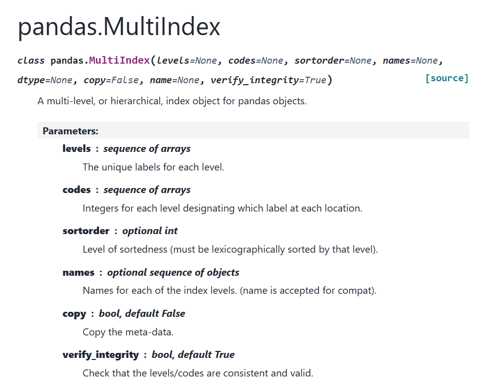

这里的参数我就先不解释了，这里我们来看看怎么创建多级索引。


## 二、多级索引的创建

多级索引的创建有多种方式，常见的有几种方式，我们分别进行介绍：

- pd.MultiIndex.from_arrays

- pd.MultiIndex.from_frame 

- pd.MultiIndex.from_tuples

- pd.MultiIndex.from_product

上述四种方法的详细描述为：

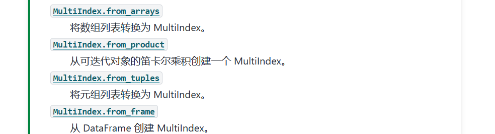

也就是说我们可以从列表、可迭代对象元组和DataFrame中来创建我们的多级索引（MultiIndex），我们一个个来学习一下。


## 2.1 pd.MultiIndex.from_arrays

这个方法允许你从一组数组中创建多级索引。每个数组代表了索引的一个级别。例如，如果你有两个列表levels0和levels1，可以将它们转换为多级索引：

```python
array_index = [[1, 1, 2, 2], ['red', 'blue', 'red', 'blue']]
array_column = [['Class_1', 'Class_2','Class_3'], ['java_code', 'html5_code', 'python_code']]

# 生成多级索引
multi_indexs=pd.MultiIndex.from_arrays(array_index,names=('number', 'color'))
multi_columns = pd.MultiIndex.from_arrays(array_column,names=('Indicator', 'Language'))


pd_test1 = pd.DataFrame(
           np.random.randint(0, 150, size=(4, 3)),
           index=multi_indexs,
           columns=multi_columns   
)
pd_test1
```

输出如下：

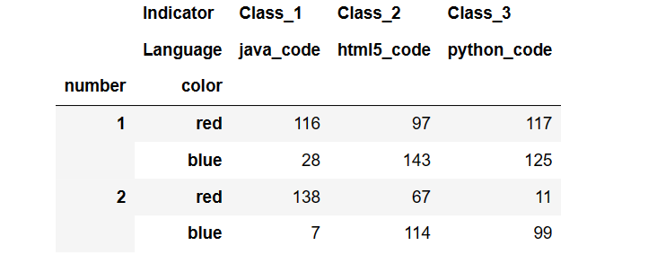

使用 pd.MultiIndex.from_arrays方法的时候，是要求数组中元素的长度是一致的，比如，在输入的时候是这样的则会报错：

```python
array_column = [['Class_1', 'Class_2','Class_3'], ['java_code', 'html5_code']]
# 上述脚本报错
```


## 2.2 pd.MultiIndex.from_frame 

这个方法从DataFrame的列创建多级索引。一般来说，这在你有现成的DataFrame，并且想要使用其某些列作为索引时非常有用。我们来看一个案例：

```python
my_df = pd.DataFrame([['1', 'red'], ['1', 'blue'],
                    ['2', 'red'], ['2', 'blue']],
                  columns=['number', 'color'])

# 生成多级索引
multi_indexs=pd.MultiIndex.from_frame(my_df)
multi_columns = pd.MultiIndex.from_product([['Class_1', 'Class_2'],['java_code', 'html5_code', 'python_code']],names=('Indicator', 'Language'))

pd_test2 = pd.DataFrame(
           np.random.randint(0, 150, size=(4, 6)),
           index=multi_indexs,
           columns=multi_columns   
)
pd_test2

```

注意这次的代码与pd.MultiIndex.from_arrays中的不同之处，比如我们的参数multi_columns使用的是 from_product 产生的，size=(4, 6)更正了大小。

上述输出为：

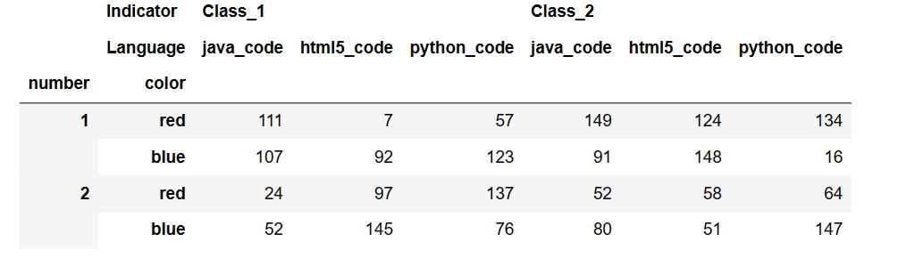


## 2.3 pd.MultiIndex.from_tuples

顾名思义，这个方法是从一个元组tuples中生成相应的多级索引的，比如：

```python
tuples = [('1', 'red'), ('1', 'blue'),
          ('2', 'red'), ('2', 'blue')]

# 使用from_tuples生成多级索引
multi_indexs=pd.MultiIndex.from_tuples(tuples,names=['number', 'color'])
multi_columns = pd.MultiIndex.from_product([['Class_1', 'Class_2'],['java_code', 'html5_code', 'python_code']],names=('Indicator', 'Language'))

pd_test3 = pd.DataFrame(
           np.random.randint(0, 150, size=(4, 6)),
           index=multi_indexs,
           columns=multi_columns   
)
pd_test3
```

这个输出也与之前的一样：

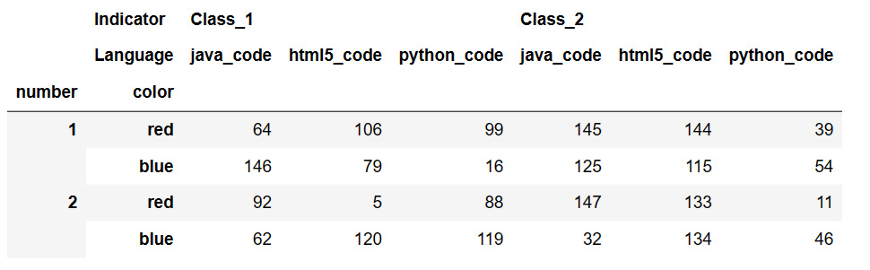


## 2.4 pd.MultiIndex.from_product

最后我们来看看pd.MultiIndex.from_product方法怎么生成索引的，这个方法通过笛卡尔积的方式从多个索引集合创建多级索引。它接受一个序列的序列（例如列表的列表），每个序列代表一个索引级别。

```python
# 使用from_product生成多级索引
multi_indexs=pd.MultiIndex.from_product([['1','2'],['red','blue']],names=['number', 'color'])
multi_columns = pd.MultiIndex.from_product([['Class_1', 'Class_2'],['java_code', 'html5_code', 'python_code']],names=('Indicator', 'Language'))

pd_test4 = pd.DataFrame(
           np.random.randint(0, 150, size=(4, 6)),
           index=multi_indexs,
           columns=multi_columns   
)
pd_test4
```

输出的样式基本同上，这里就不在进行赘述了。

pd.MultiIndex.from_product这个方法的定义如下：

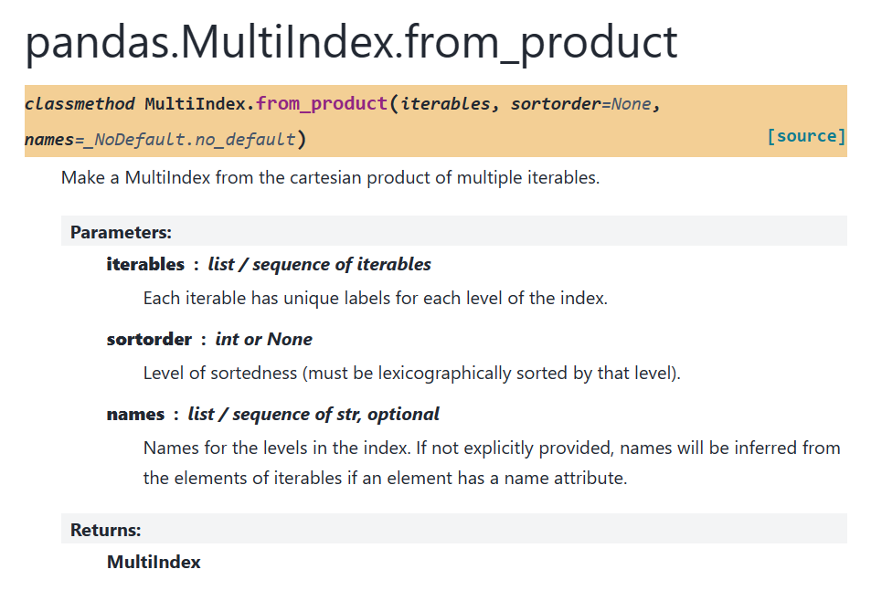

pd.MultiIndex.from_product生成数据是一种笛卡尔积生成数据的方式，也就是说A元素10种可能，B元素26种可能，则笛卡尔积有260种可能，一个典型的笛卡尔积的输出样式可以举例如下：

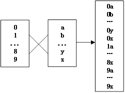

上述我们讲述了怎么生成多级索引，并使用多种方式来创建索引，接下来我们来详细的讲述一下多级索引的结构。


## 三、多级索引及其结构

这个直接参考《joyful pandas》内容。

为了更加清晰地说明具有多级索引的 DataFrame 结构，下面新构造一张表,我们来看一下具有多层索引的DataFrame应该长成什么样子的：

```python
import pandas as pd
import numpy as np

np.random.seed(0)

multi_index = pd.MultiIndex.from_product([list('ABCD'), ['Female','Male']], names=('School', 'Gender'))

multi_column = pd.MultiIndex.from_product([['Height', 'Weight'], ['Freshman','Senior','Sophomore','Junior']], names=('Indicator', 'Grade
                                                                                                                     
df_multi = pd.DataFrame(np.c_[(np.random.randn(8,4)*5 + 163).tolist(), (np.random.randn(8,4)*5 + 65).tolist()],
                        index = multi_index, columns = multi_column).round(1)
```

这里我们不着急直接输出结果df_multi长成什么样，我们想看看我们构造的multi_index和multi_column的样式。

multi_index：

```python
multi_index
# 输出
MultiIndex([('A', 'Female'),
            ('A',   'Male'),
            ('B', 'Female'),
            ('B',   'Male'),
            ('C', 'Female'),
            ('C',   'Male'),
            ('D', 'Female'),
            ('D',   'Male')],
           names=['School', 'Gender'])
```

multi_column：

```python
MultiIndex([('Height',  'Freshman'),
            ('Height',    'Senior'),
            ('Height', 'Sophomore'),
            ('Height',    'Junior'),
            ('Weight',  'Freshman'),
            ('Weight',    'Senior'),
            ('Weight', 'Sophomore'),
            ('Weight',    'Junior')],
           names=['Indicator', 'Grade'])
```

最后我们来看一下df_multi的样子：

```python 
df_multi
#输出
Indicator	Height	Weight
Grade	Freshman	Senior	Sophomore	Junior	Freshman	Senior	Sophomore	Junior
School	Gender								
A	Female	171.8	165.0	167.9	174.2	60.6	55.1	63.3	65.8
Male	172.3	158.1	167.8	162.2	71.2	71.0	63.1	63.5
B	Female	162.5	165.1	163.7	170.3	59.8	57.9	56.5	74.8
Male	166.8	163.6	165.2	164.7	62.5	62.8	58.7	68.9
C	Female	170.5	162.0	164.6	158.7	56.9	63.9	60.5	66.9
Male	150.2	166.3	167.3	159.3	62.4	59.1	64.9	67.1
D	Female	174.3	155.7	163.2	162.1	65.3	66.5	61.8	63.2
Male	170.7	170.3	163.8	164.9	61.6	63.2	60.9	56.4
```

上述样式可以不是很好看，我们来看一下截图：

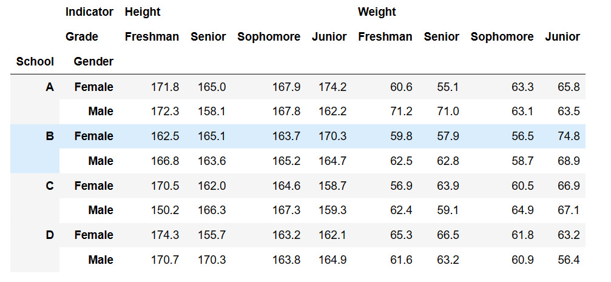


上述生成df_multi的时候我们使用到了np._c_方法，这里简单的解释一下这个函数的作用：np.c_是 numpy 库中的一个连接运算符，它用于方便地水平合并数组或标量：

```python
import numpy as np

a = np.array([1, 2])
b = np.array([3, 4])
result = np.c_[a, b]
result
# 输出
array([[1, 3],
       [2, 4]])
```

如果我们我们使用不同的颜色来标记了 上述生成的DataFrame 的结构，则有：
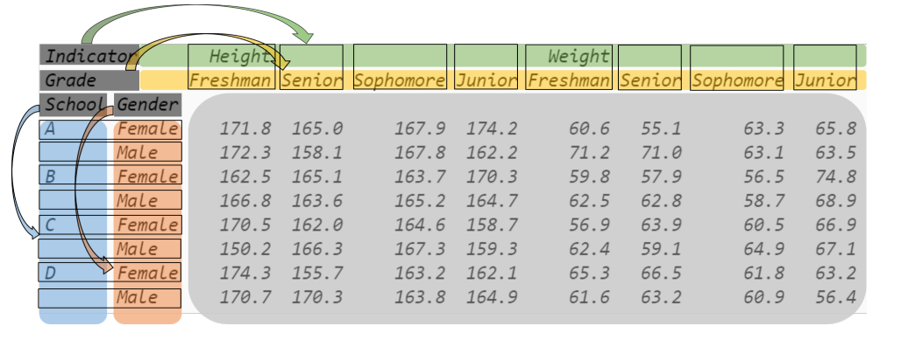

通过上述的图我们可以看出：

- 多层索引与单层索引的表一样，具备元素值、行索引和列索引三个部分。
- 行索引和列索引都是 MultiIndex 类型，只不过 索引中的一个元素是元组而不是单层索引
  中的标量。例如，行索引的第四个元素为 (”B”, ”Male”) ，列索引的第二个元素为 (”Height”, ”Senior”) 。
- 这里需要注意，外层连续出现相同的值时，第一次之后出现的会被隐藏显示，使结果的可读性增强。

单层索引有自己的名字。多级索引也有自己的明细和值，也就是names和values属性:

**(1) names **

```python
df_multi.index
# 则输出
MultiIndex([('A', 'Female'),
            ('A',   'Male'),
            ('B', 'Female'),
            ('B',   'Male'),
            ('C', 'Female'),
            ('C',   'Male'),
            ('D', 'Female'),
            ('D',   'Male')],
           names=['School', 'Gender'])

df_multi.index.names
# 则输出
FrozenList(['School', 'Gender'])


df_multi.index.names[0]
# 则输出
'School'
```

通过index属性我们就可以得到多级索引的index，然后通过names获取具体的多级索引的值。

**(2) values **

```python
df_multi.index.values
# 输出
array([('A', 'Female'), ('A', 'Male'), ('B', 'Female'), ('B', 'Male'),
       ('C', 'Female'), ('C', 'Male'), ('D', 'Female'), ('D', 'Male')],
      dtype=object)

df_multi.index.values[0]
# 输出
('A', 'Female')

df_multi.index.values[0][0]
# 输出
'A'
```

对于columns我们也同样使用相同的方法获取具体的数据：

```python
df_multi.columns.names
```

```python
df_multi.columns.values
```


**(3) 获取某一级的索引 **

pandas提供了如何获取某一层级的索引的方法,该方法的定义如下：

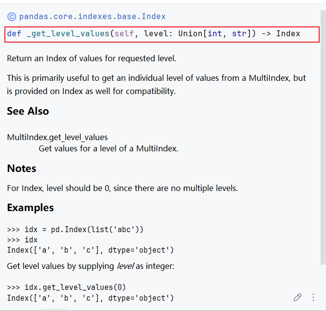

也就是说 df_multi.index.get_level_values() 是一个方法，用于从具有多重索引（MultiIndex）的数据框的索引中提取特定级别的值。`get_level_values()` 需要一个参数，即你要提取的级别（level）的名称或编号，返回的是一个包含该级别所有值的序列,以上面的 df_multi 为例，比如：

```python
df_multi.index.get_level_values(0)
# 输出
Index(['A', 'A', 'B', 'B', 'C', 'C', 'D', 'D'], dtype='object', name='School')

df_multi.index.get_level_values(1)
# 输出
Index(['Female', 'Male', 'Female', 'Male', 'Female', 'Male', 'Female', 'Male'], dtype='object', name='Gender')

df_multi.index.get_level_values(2)
# 输出
IndexError: Too many levels: Index has only 2 levels, not 3
```


## 四、多重索引值获取

在具有多级索引的Dataframe中，我们经常需要对数据中的值进行取值的操作，我们使用的案例DataFrame样例如下：

```python
import pandas as pd
import numpy as np

np.random.seed(0)

multi_index = pd.MultiIndex.from_product([list('ABCD'), ['Female','Male']], names=('School', 'Gender'))
multi_column = pd.MultiIndex.from_product([['Height', 'Weight'], ['Freshman','Senior','Sophomore','Junior']], names=('Indicator', 'Grade'))
df_multi = pd.DataFrame(np.c_[(np.random.randn(8,4)*5 + 163).tolist(), (np.random.randn(8,4)*5 + 65).tolist()],
                        index = multi_index, columns = multi_column).round(1)
```

df_multi与第三章的df是一致的。

## 4.1获取所有行列的索引

```python
print(df_multi.index,'\n')
print(df_multi.index.values,'\n')
print(df_multi.columns.values)

# 输出
MultiIndex([('A', 'Female'),
            ('A',   'Male'),
            ('B', 'Female'),
            ('B',   'Male'),
            ('C', 'Female'),
            ('C',   'Male'),
            ('D', 'Female'),
            ('D',   'Male')],
           names=['School', 'Gender']) 

[('A', 'Female') ('A', 'Male') ('B', 'Female') ('B', 'Male')
 ('C', 'Female') ('C', 'Male') ('D', 'Female') ('D', 'Male')] 

[('Height', 'Freshman') ('Height', 'Senior') ('Height', 'Sophomore')
 ('Height', 'Junior') ('Weight', 'Freshman') ('Weight', 'Senior')
 ('Weight', 'Sophomore') ('Weight', 'Junior')]
```


另外可以通过pandas.MultiIndex.get_level_values(level)方法获取特定级别标签值的向量，这个向量的长度将等于索引的长度。参数level 是级别在MultiIndex中的整数位置，或者是级别的名称：（上述中已经有提到，我们再来看看）：

```python
print(df_multi.index.get_level_values(0),'\n')
print(df_multi.index.get_level_values('School'),'\n')

print(df_multi.index.get_level_values(1),'\n')
print(df_multi.index.get_level_values('Gender'),'\n')

# 输出
Index(['A', 'A', 'B', 'B', 'C', 'C', 'D', 'D'], dtype='object', name='School') 

Index(['A', 'A', 'B', 'B', 'C', 'C', 'D', 'D'], dtype='object', name='School') 

Index(['Female', 'Male', 'Female', 'Male', 'Female', 'Male', 'Female', 'Male'], dtype='object', name='Gender') 

Index(['Female', 'Male', 'Female', 'Male', 'Female', 'Male', 'Female', 'Male'], dtype='object', name='Gender') 
```


## 4.2获取指定的索引

pandas提供了可以获取指定索引的方法：get_loc.该方法解释如下：

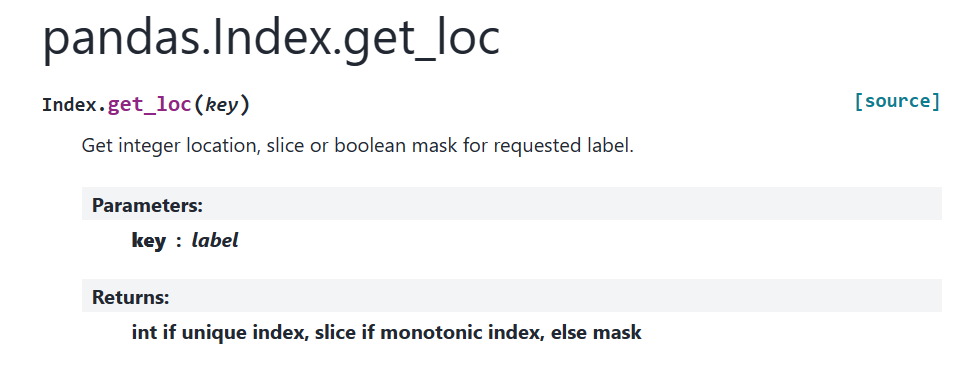


即用于获取指定标签所在的位置，案例：

```python
# 获取标签或标签元组的位置
print(df_multi.index.get_loc('A'),'\n')
# 获取标签序列的位置
print(df_multi.index.get_locs('A'),'\n')
print(df_multi.index.get_locs('B'))

# 输出
slice(0, 2, None) 

[0 1] 

[2 3]
```

我们使用column来获取一个dataframe:

```python
df_multi['Height']
# 输出
	Grade	Freshman	Senior	Sophomore	Junior
School	Gender				
A	Female	171.8	165.0	167.9	174.2
Male	172.3	158.1	167.8	162.2
B	Female	162.5	165.1	163.7	170.3
Male	166.8	163.6	165.2	164.7
C	Female	170.5	162.0	164.6	158.7
Male	150.2	166.3	167.3	159.3
D	Female	174.3	155.7	163.2	162.1
Male	170.7	170.3	163.8	164.9
```

即：

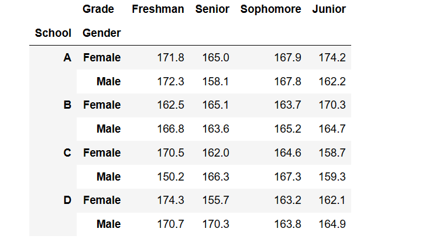


那么我们有：

```python
print(df_multi['Height'].columns.values,'\n')
print(df_multi['Weight'].columns.values,'\n')
print(df_multi['Height'].index.values,'\n')
print(df_multi['Weight'].index.values,'\n')
print(df_multi[['Height','Weight']].index.values)

# 输出
['Freshman' 'Senior' 'Sophomore' 'Junior'] 

['Freshman' 'Senior' 'Sophomore' 'Junior'] 

[('A', 'Female') ('A', 'Male') ('B', 'Female') ('B', 'Male')
 ('C', 'Female') ('C', 'Male') ('D', 'Female') ('D', 'Male')] 

[('A', 'Female') ('A', 'Male') ('B', 'Female') ('B', 'Male')
 ('C', 'Female') ('C', 'Male') ('D', 'Female') ('D', 'Male')] 

[('A', 'Female') ('A', 'Male') ('B', 'Female') ('B', 'Male')
 ('C', 'Female') ('C', 'Male') ('D', 'Female') ('D', 'Male')]
```


这里补充一个方法：pandas.MultiIndex.to_flat_index()，这个方法将MultiIndex转换为包含级别值的元组索引:

```python
index = pd.MultiIndex.from_product(
    [['1', 'bule'], ['3', 'green']],
    names=['number', 'color'])
print(index,'\n')
print(index.to_flat_index())

# 输出
MultiIndex([(   '1',     '3'),
            (   '1', 'green'),
            ('bule',     '3'),
            ('bule', 'green')],
           names=['number', 'color']) 

Index([('1', '3'), ('1', 'green'), ('bule', '3'), ('bule', 'green')], dtype='object')
```

to_flat_index()相当于一种打平的操作。

接下来我们看一下多级索引中的loc和iloc等索引器的使用。

 

## 五、多级索引中的 **loc** 索引器

多级索引中的单个元素以元组为单位，因此我们也可使用loc 和 iloc 方法来进行数据的取值的，假设我们的DataFrame的样子如下：

```python
tuples = [
     ('cobra', 'mark i'), ('cobra', 'mark ii'),
     ('sidewinder', 'mark i'), ('sidewinder', 'mark ii'),
     ('viper', 'mark ii'), ('viper', 'mark iii')
 ]
index = pd.MultiIndex.from_tuples(tuples)
values = [[12, 2], [0, 4], [10, 20],
           [1, 4], [7, 1], [16, 36]]
df = pd.DataFrame(values, columns=['max_speed', 'shield'], index=index)
df
```

输出

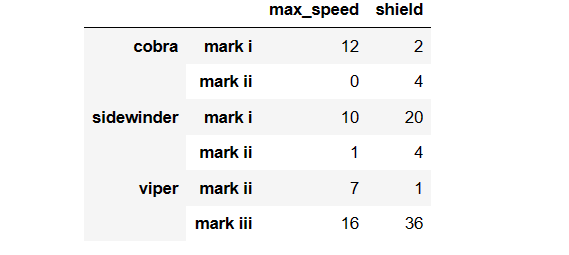


上述的index我们没有命名，我们看一下结果：

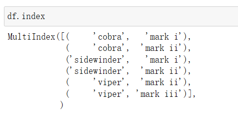

我们可以使用loc来进行数据的获取，如：

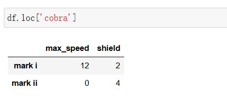


**也可以一次多个索引值：**

```python
df.loc[('cobra', 'mark ii')]
```

**另外使用  lambda函数也进行多级索引数据的获取，这里大家自己研究输出的结果：**

```python 
df.loc[lambda x:('cobra','mark ii')]
```

**索引和单个标签的的结合：**

```python
df.loc[('cobra', 'mark i'), 'shield']
```

**从索引到到单个标签的结合：**

```python
df.loc[('cobra', 'mark i'):'viper']
```

输出：

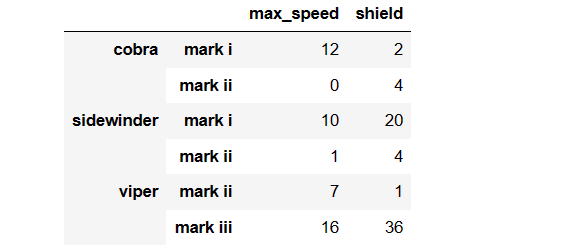


**从索引元组切片到索引元组的切片操作：**

```python
df.loc[('cobra', 'mark i'):('viper', 'mark ii')]
```

输出：

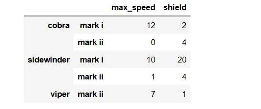


**组合映射输出**

```python
result = df.loc[(['cobra', 'sidewinder'], ['mark i', 'mark ii']), :]
result
```

输出


上述方法的过程输出有点像一种笛卡尔积的数据输出。还是很有意思的，在很多的时候我们需要满足两种索引情况下的输出。


**单独满足条件的输出**

```python 
result = df.loc[[('cobra', 'mark i'), ('sidewinder', 'mark ii')], :]
result 
```

输出


上面两种输出大家一定要对比，这里将他们放在一起：

```python 
result = df.loc[(['cobra', 'sidewinder'], ['mark i', 'mark ii']), :]

result = df.loc[[('cobra', 'mark i'), ('sidewinder', 'mark ii')], :]
```


## 六、**IndexSlice** 对象

前面介绍的方法，即使在索引不重复的时候，也只能对元组整体进行切片，而不能对每层进行切片，也不允许将切片和布尔列表混合使用，引入 IndexSlice 对象就能解决这个问题。

这个方法的定义如下：

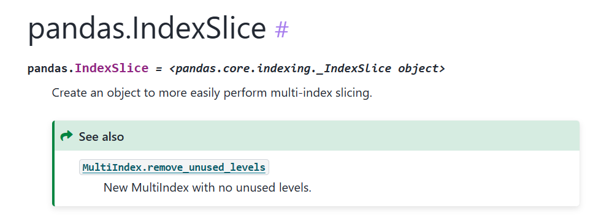

我们来看一个案例,实验的DataFrame的样子如下：

```python
midx = pd.MultiIndex.from_product([['A0','A1'], ['B0','B1','B2','B3']])
columns = ['foo', 'bar']
dfmi = pd.DataFrame(np.arange(16).reshape((len(midx), len(columns))),
                     index=midx, columns=columns)
dfmi
```

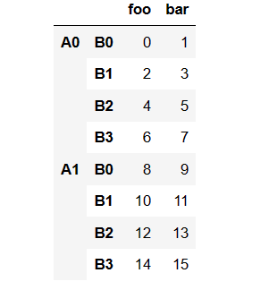

当我们的对第一个索引使用None，对第二个进行slice切片：

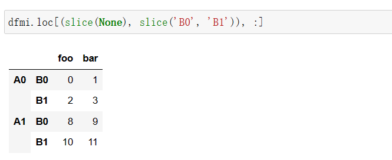

在没有使用**IndexSlice**对象的时候，我们必须很麻烦的使用slice(None)来对第一个索引进行操作，然后才能进行正确的取数。


当我们使用**IndexSlice**对象的时候，则有：

```python 
# 为了使用 silce 对象，先要进行定义
idx = pd.IndexSlice
dfmi.loc[idx[:, 'B0':'B1'], :]
```

输出与上述保持一致，可以看出我们只需简单的考虑第二个索引的相关情况就可以了，还是十分方便的。

- 注意：

  Slice 对象一共有两种形式，第一种为 loc[idx[*,*]] 型，第二种为 loc[idx[*,*],idx[*,*]] 型，第二种我这里不再演示，大家可以参考《joyful pandas》的章节来学习。


## 七、索引的常用方法

索引的常用方法还是很多的，首先我们创建一个多层的索引（也算一个比较复杂的数据样式）：

```python 
np.random.seed(0)
L1,L2,L3 = ['A','B'],['a','b'],['alpha','beta']
mul_index1 = pd.MultiIndex.from_product([L1,L2,L3],names=('Upper', 'Lower','Extra'))

L4,L5,L6 = ['C','D'],['c','d'],['cat','dog']
mul_index2 = pd.MultiIndex.from_product([L4,L5,L6],
                                        
names=('Big', 'Small', 'Other'))

df_ex = pd.DataFrame(np.random.randint(-9,10,(8,8)),index=mul_index1,columns=mul_index2)

df_ex
```

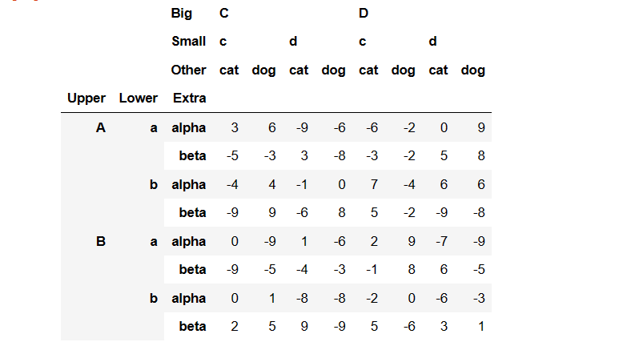

看起来还是很复杂的。

**由于篇幅的原因，索引的常用方法我们放到之后的文章中进行学习。**


## **八、参考文档**

- https://pandas.pydata.org/pandas-docs/stable/reference/indexing.html#multiindex
- 《joyful pandas》
