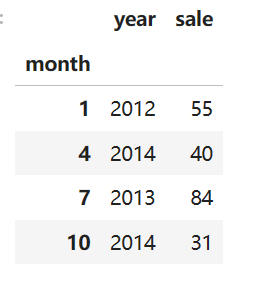
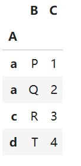
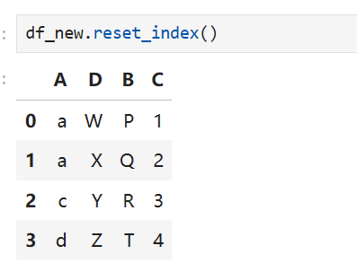

# Pandas数据分析(六)_多级索引的常见方法


上次文章我们了解了什么是分层/多级索引(MultiIndex)，且如何进行多级索引的创建，并使用实例展示了其中的方法，本次我们来看看多级索引中有哪些常见的方法。


## 一、构造数据

在开始之前，我们先构造一个具有多级索引的DataFrame（参考《joyful pandas》）:

```python
import numpy as np
import pandas as pd

np.random.seed(0)

L1,L2,L3 = ['A','B'],['a','b'],['alpha','beta']
mul_index1 = pd.MultiIndex.from_product([L1,L2,L3],
names=('Upper', 'Lower','Extra'))

L4,L5,L6 = ['C','D'],['c','d'],['cat','dog']
mul_index2 = pd.MultiIndex.from_product([L4,L5,L6],
names=('Big', 'Small', 'Other'))

df_ex = pd.DataFrame(np.random.randint(-9,10,(8,8)),index=mul_index1,columns=mul_index2)
df_ex
```

输出如下：


## 二、索引层的交换

我们在实际的编程中需要进行索引层的交换，这算一个比较常见的需求，那么在pandas中该怎么对多级索引的DataFrame进行变换呢，我们可以使用swaplevel 和 reorder_levels方法。先看swaplevel 方法：

### 2.1 swaplevel 方法

swaplevel 方法定义如下：


从该方法的定义可以知道：

- `i` 和 `j` 是你要交换的级别的名称或位置（从0开始计数）。如果你知道它们的位置而不是名称，你也可以直接使用整数。
- `axis` 参数指明要操作的轴，默认值为0，即作用于行（索引）；如果是1，那么会作用于列。


我们先看看数据的索引情况，首先是行数据：

```python
df_ex.index

# 输出
MultiIndex([('A', 'a', 'alpha'),
            ('A', 'a',  'beta'),
            ('A', 'b', 'alpha'),
            ('A', 'b',  'beta'),
            ('B', 'a', 'alpha'),
            ('B', 'a',  'beta'),
            ('B', 'b', 'alpha'),
            ('B', 'b',  'beta')],
           names=['Upper', 'Lower', 'Extra'])
```

再看一下列数据（columns）：

```python
df_ex.columns

# 输出
MultiIndex([('C', 'c', 'cat'),
            ('C', 'c', 'dog'),
            ('C', 'd', 'cat'),
            ('C', 'd', 'dog'),
            ('D', 'c', 'cat'),
            ('D', 'c', 'dog'),
            ('D', 'd', 'cat'),
            ('D', 'd', 'dog')],
           names=['Big', 'Small', 'Other'])
```

可以看出，他们都是多级索引结构的。


这里如果我们想查看多级索引的层级结构，我们可以使用pandas.MultiIndex.levels来获得：

```python
df_ex.index.levels

# 输出
FrozenList([['A', 'B'], ['a', 'b'], ['alpha', 'beta']])
```

对于列columns也是一样的操作：

```python
df_ex.columns.levels

# 输出
FrozenList([['C', 'D'], ['c', 'd'], ['cat', 'dog']])
```


另外我们这里也可以获取索引的序号：

```python 
df_ex.index.get_loc(('B', 'a', 'alpha'))
# 输出
4


df_ex.columns.get_loc(('C', 'c', 'dog'))
#输出
1
```


接下来是重点，我们对索引不同级进行交换：

```python
# 索引的第1层和第3层进行交换
swaplevel_df = df_ex.swaplevel(i=0,j=2,axis=1)
swaplevel_df
```

输出：


可以看出我们将索引层"Other"和索引层“Big”层进行了交换。这里注意索引的级别从0开始编号即可。axis=1作用于列。

如果axis=0的时候则输出：

```python
swaplevel_df = df_ex.swaplevel(i=0,j=2,axis=0)
swaplevel_df
```

输出：


## 2.2 reorder_levels 方法

reorder_levels 方法定义如下：


`reorder_levels`方法用于重新排列`MultiIndex`的级别顺序。这个方法返回一个新的`MultiIndex`对象，其级别顺序按照指定的顺序进行排列。

这个方法的注意点为：

- 它接受一个包含新级别顺序的列表作为参数（int型和str型）。
- 列表中的每个元素对应于原始`MultiIndex`中的一个级别，按照你希望它们在新`MultiIndex`中出现的顺序排列。
- 如果列表中包含不在原始`MultiIndex`中的级别，将会引发`KeyError`。
- 如果列表中的元素顺序与原始`MultiIndex`相同，则返回原始`MultiIndex`的副本。

reorder_levels 方法则是用来重新排列多级索引的顺序，但它保持了级别间的原始关系，只是将各级别的顺序按照指定的新顺序调整。

我们来看一下案例，仍然使用上述的Dataframe进行实验：

```python
# 列表数字指代原来索引中的层
reorder_levels_df = df_ex.reorder_levels(order = [2,0,1],axis=0)
reorder_levels_df
```

输出：


```python 
# 列表中的字符串直接制定索引的顺序
reorder_levels_df_1 = df_ex.reorder_levels(order = ['Lower','Upper','Extra'],axis=0)
reorder_levels_df_1
```

输出为：


**上述不同方向索引之间的交换我们将在后续的文章中进行介绍。**


## 三、删除索引层

有时候我们不想要很多层级额索引的时候，我们可以进行索引层的删除，pandas也提供了比较好用的方法：


`droplevel`方法用于从`MultiIndex`中删除一个或多个级别。这个方法返回一个新的`MultiIndex`对象，其中指定的级别已被删除。

以下是`droplevel`方法的一些关键点：

- 它接受一个级别名称或级别序号的列表作为参数。
- 如果指定的级别不存在，将会引发`KeyError`。
- 如果删除的级别是最后一个级别，那么返回的`MultiIndex`将变为一个普通的`Index`。

```python 
df_drop_1 = df_ex.droplevel(level = 1,axis=1)
df_drop_1
```

输出：


可以看出axis=1的方向上少了一层索引值，如果axis=0,我们有：

```pyth
df_drop_0 = df_ex.droplevel(level = 2,axis=0)
df_drop_0
```

则输出：


**当然我们也可以传入列表：**

```python 
df_drop_0 = df_ex.droplevel(level = ['Extra','Lower'],axis=0)
df_drop_0
```

**也可以删除只剩下一个**：

```python 
df_drop_a = df_ex.droplevel(level = ['Extra','Lower'],axis=0)
df_drop_b = df_drop_a.droplevel(level = ['Big','Small'],axis=1)
df_drop_b
```

输出


但是下面的代码会报错，大家自己想一下：

```python 
# 下述代码会报错
df_drop_a = df_ex.droplevel(level = ['Extra','Lower','Upper'],axis=0)
df_drop_b = df_drop_a.droplevel(level = ['Big','Small','Other'],axis=1)
df_drop_b
```


## 四、获取索引层的序号

有时候想知道不同的索引其序号是多少，也就是想知道level的值，我们该怎么获取呢？也就是说我想知道下面的 索引Upper ，Lower，Extra到底哪个是第1级，哪个是第2级，哪个是第3级。


那怎么去获取呢，我们先写出代码：

```python 
MyMultiIndex = df_ex.index

# 获取每个层级的索引号
level_indices = {level: MyMultiIndex.names.index(level) for level in myMultiIndex.names}
level_indices_list = list(enumerate(MyMultiIndex.names))
print("List of level names and their indices:", level_indices_list)


# 输出为
List of level names and their indices: [(0, 'Upper'), (1, 'Lower'), (2, 'Extra')]
```


这段代码是关于Pandas库中的`MultiIndex`对象的操作，具体步骤和功能如下：

1. `MyMultiIndex = df_ex.index`：这行代码将一个DataFrame（假设名为`df_ex`）的索引赋值给变量`MyMultiIndex`。如果`df_ex`的索引是一个`MultiIndex`，那么`MyMultiIndex`将包含这个多级索引。

2. `level_indices = {level: MyMultiIndex.names.index(level) for level in MyMultiIndex.names}`：这是一个字典推导式，用于创建一个字典`level_indices`，其中包含每个索引级别的名称作为键，以及该名称在`MyMultiIndex.names`列表中的索引位置作为值。`MyMultiIndex.names`是一个包含所有索引级别名称的列表。`index()`方法用于查找列表中元素的索引位置。

3. `level_indices_list = list(enumerate(MyMultiIndex.names))`：这行代码使用`enumerate`函数和列表推导式来创建一个列表`level_indices_list`，其中包含元组。每个元组由`MyMultiIndex.names`列表中的索引级别名称和它的索引号组成。

4. `print("List of level names and their indices:", level_indices_list)`：最后，这行代码打印出所有索引级别名称及其对应的索引号的列表。

这段代码的目的是展示如何从`MultiIndex`中获取每个级别的名称和索引号，并以两种不同的数据结构（字典和列表）存储这些信息。这对于理解`MultiIndex`的结构和操作多级索引非常有用。


对于列索引，同样操作：

```python 
# columns
MyMultiIndex = df_ex.columns

# 获取每个层级的索引号
level_indices = {level: MyMultiIndex.names.index(level) for level in MyMultiIndex.names}
level_indices_list = list(enumerate(MyMultiIndex.names))
print("List of level names and their indices:", level_indices_list)

# 输出为
List of level names and their indices: [(0, 'Big'), (1, 'Small'), (2, 'Other')]
```

通过以上的方法我们就很好的获取到多级索引层的序号。


## 五.索引属性的修改

索引是有很多属性值的，

我们先看看索引层名字的修改，这里实现的数据仍然是df_ex。

## 5.1 索引层名字修改

索引层名字的修改我们可以使用rename_axis方法，该方法的定义如下：


这个函数也有一定的注意事项：

`rename_axis`方法用于重命名`Index`或`MultiIndex`的轴。这个方法在Pandas的DataFrame、Series或Index对象上调用，允许你为索引轴指定新的名字。比如：

```python
df_rename_axis_1 = df_ex.rename_axis(index={'Upper':'Changed_row'},
                  columns={'Other':'Changed_Col'})
df_rename_axis_1
```

输出：


可以看出我们这里使用了字典映射的方式将索引层的名字进行了修改。

另外，我们可以使用相关的函数对columns的名称进行修改，比如大小写（对Index的操作也是如此）：

```python
df_ex_upper = df_ex.rename_axis(columns=str.upper)
df_ex_upper
```

输出：


## 5.2 索引值的修改

上述我们使用了相关的函数对索引层的名称的进行修改，接下来看一下怎么对索引的值进行修改。

这里所指的索引值我这里说明一下，就是上述df_ex中的A，B，a，b ，C，D，c，d，cat，dog值。

对索引值的修改我们使用rename函数来实现，通过 `rename` 可以对索引的值进行修改，如果是多级索引需要指定修改的层号 `level`即可。这个rename函数的定义如下：


我们来看一下案例，先使用键值对的方式：

```python
df_rename_1 = df_ex.rename(columns={'cat':'not_cat'})
df_rename_1
```

上述代码中我们没有使用参数level，这会将Dataframe中的所有符合要求的数据均会进行替换：

```python
df_rename_1 = df_ex.rename(columns={'cat':'not_cat'},level=2)
df_rename_1
```

输出：


上述方式也是使用键值对实现的，我们也可以使用asix来指定需要进行操作的索引，比如：

```python
df_rename_axis_c = df_ex.rename(str.lower, axis='columns')
df_rename_axis_c
```

这个结果我们可以预知：


上述axis='columns'，我们在来看看axis='index'的情况：

```python 
df_rename_axis_i = df_ex.rename(str.upper, axis='index')
df_rename_axis_i
```

结果如下：


在上述进行实验的时候，我们在rename等功函数中使用的是字符串的相关的函数，其实这里面我们还可以使用 lambda 函数：

```python
my_values = iter(list('abcdefgh'))
df_lambda = df_ex.rename(index=lambda x:next(my_values),level=2)
df_lambda
```

输出：


**若想要对某个位置的元素进行修改，在单层索引和多层索引的时候该怎么进行修改呢**


## 六.索引的设置与重置

索引的设置和重置是非常常见的一个问题，尤其是我们在进行抽样数据的时候，与之相关的函数有两个：

```python 
pandas.DataFrame.set_index

pandas.DataFrame.reset_index
```

我们来简单的看一下：

```python 
df = pd.DataFrame({'month': [1, 4, 7, 10],
                    'year': [2012, 2014, 2013, 2014],
                    'sale': [55, 40, 84, 31]})

df.set_index('month')
```

输出：



还可以两个索引：


我们可以使用一个index和一个column来创建多级索引：


也可以使用多个series来创建多级索引：

```python 
df = pd.DataFrame({'month': [1, 4, 7, 10],
                    'year': [2012, 2014, 2013, 2014],
                    'sale': [55, 40, 84, 31]})

s = pd.Series([1, 2, 3, 4])
df.set_index([s, s**2])
```

输出：


reset_index和set_index其实在一定程度上是逆操作的，先创建一个测试数据：

```python 
df_new = pd.DataFrame({'A':list('aacd'),
                       'B':list('PQRT'),
                       'C':[1,2,3,4]})

my_index = pd.Series(list('WXYZ'), name='D')
df_new = df_new.set_index(['A', my_index])
df_new
```

输出：


如果打印出index则有：

```python 
df_new.index

# 输出
MultiIndex([('a', 'W'),
            ('a', 'X'),
            ('c', 'Y'),
            ('d', 'Z')],
           names=['A', 'D'])
```

 作为`set_index` 的逆函数，reset_index函数的主要参数是 `drop` ，表示是否要把去掉的索引层丢弃，而不是添加到列中：

```python 
df_new.reset_index(['D'])
```

输出：


如果这里加上参数drop：

```python
df_new.reset_index(['D'], drop=True)
```

输出：



如果重置了所有的索引，那么 `pandas` 会直接重新生成一个默认索引：

```python 
df_new.reset_index()
```

输出：




## 七.索引的变形

索引的变形也是索引中常见的操作，在某些场合下，需要对索引做一些扩充或者剔除；一起来看一下，假设我们数据为：

```python 
df_reindex = pd.DataFrame({"Weight":[60,70,80],
                           "Height":[176,180,179]},
                           index=['1001','1003','1002'])
df_reindex
```


我们进行重置索引的reindex的操作：

```python
df_reindex_1 = df_reindex.reindex(index=['1001','1002','1003','1004'],
                   columns=['Weight','Gender'])
df_reindex_1
```

输出：


可以看出，在没有进行赋值的列将会赋值为NaN.通过上述方式我们就完成了增加一名员工的同时去掉身高列并增加性别列（虽然我们的性别类没有进行赋值）。


还有一个与 `reindex` 功能类似的函数是 `reindex_like。`

在Pandas 的 `reindex_like` 函数用于根据另一个对象的轴标签对当前对象进行重新索引。这通常是在你需要将一个 DataFrame 或 Series 与另一个具有不同索引的 DataFrame 或 Series 对齐时使用的方法。

以下是 `reindex_like` 函数的一些关键特性：

- 它接受一个 `method` 参数，用于指定如何处理缺失的索引。可选的值包括 `None`（默认）、`'backfill'`、`'bfill'`、`'pad'`、`'ffill'` 等。
- `copy` 参数用于指定是否返回一个新的对象（默认为 `True`）或者在原地修改当前对象（设置为 `False`）。
- `limit` 参数用于限制填充时考虑的缺失值的数量。
- `tolerance` 参数用于指定在进行数值比较时的容忍度。

我们来看一个简单的例子：

```python 
import pandas as pd

# 创建两个DataFrame，其中第二个DataFrame的索引与第一个不同
df1 = pd.DataFrame({
    'A': [1, 2, 3],
    'B': [4, 5, 6]
}, index=[0, 1, 2])

df2 = pd.DataFrame({
    'A': [7, 8],
    'B': [9, 10]
}, index=[1, 2])

# 使用df1的索引对df2进行重新索引
df2_reindexed = df2.reindex_like(df1, method='ffill')

df2_reindexed
```

输出：


当然，上述函数reindex_like也可以用于我们的series函数：

```python 
s1 = pd.Series([1, 2, 3], index=[0, 1, 2])
s2 = pd.Series([4, 5], index=[1, 2])

# 使用s1的索引对s2进行重新索引
s2_reindexed = s2.reindex_like(s1, method='bfill')

s2_reindexed


# 输出
0    4
1    4
2    5
dtype: int64
```

在这个 Series 示例中，`s2` 使用 `s1` 的索引进行重新索引，并且使用 `method='bfill'` 进行后向填充。这意味着索引为 `0` 的值将被填充为 `NaN`，因为 `s2` 中没有对应的值，而索引为 `1` 和 `2` 的值将保持不变。


## 八.索引的运算

索引的运算遵从一定的法则，我们先复习一下集合运算的法则：


也就是常见的并，交等操作。

集合中的元素是不相同的，但是在我们索引中元素中的值是可以重复的。我们构建一些测试数据集：

```python 
df_set_1 = pd.DataFrame([[0,1],[1,2],[3,4]],
                        index = pd.Index(['a','b','a'],name='id1'))


df_set_2 = pd.DataFrame([[4,5],[2,6],[7,1]],
                        index = pd.Index(['b','b','c'],name='id2'))
```

两个测试数据集的样子如下：


```python 
id1, id2 = df_set_1.index.unique(), df_set_2.index.unique()
id1.intersection(id2)

# 输出
Index(['b'], dtype='object')
```

union的操作：

```python 
id1.union(id2)
# 输出
Index(['a', 'b', 'c'], dtype='object')
```

difference操作：

```python 
id1.difference(id2)
# 输出
Index(['a'], dtype='object')
```

symmetric_differencec操作：

```python 
id1.symmetric_difference(id2)
# 输出
Index(['a', 'c'], dtype='object')
```

接下来进行reset_index的操作：

```python 
df_set_in_col_1 = df_set_1.reset_index()
df_set_in_col_2 = df_set_2.reset_index()
```

之后，我们查看一下各个数据的情况：


我们使用 `isin` 函数，来重置索引的第一张表中选出id列交集的所在行：

```python 
df_set_in_col_1[df_set_in_col_1.id1.isin(df_set_in_col_2.id2)]
```

输出：


## 九.参考文献

- 《joyful pandas》

- pandas官方文档
