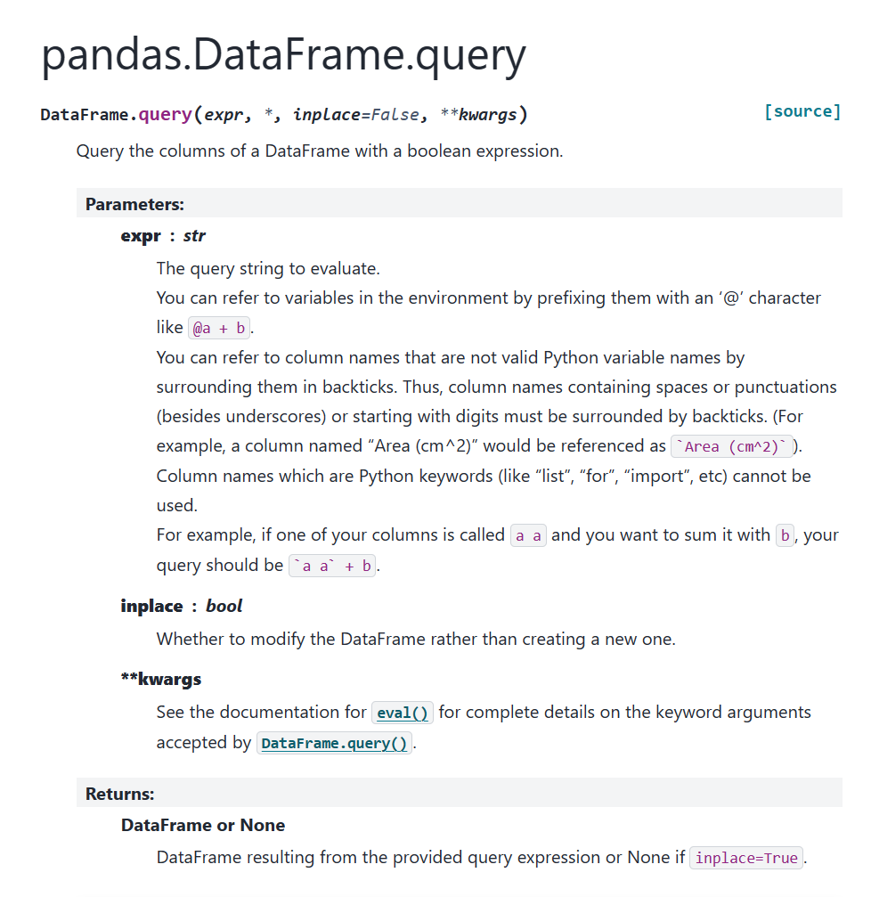
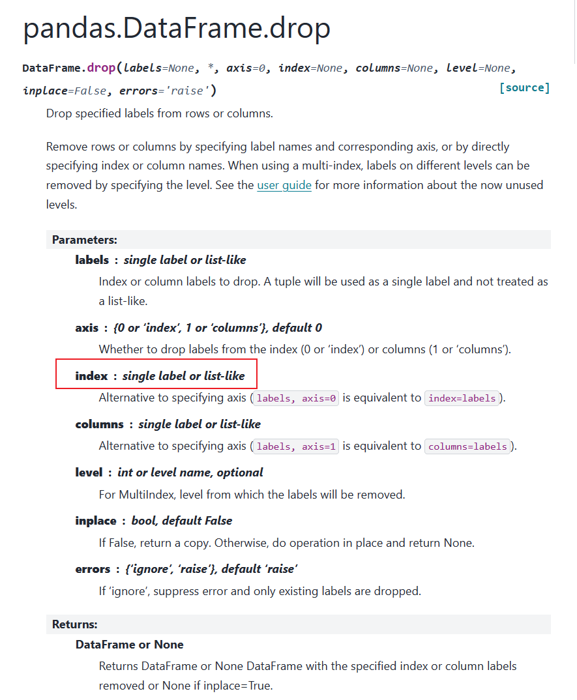
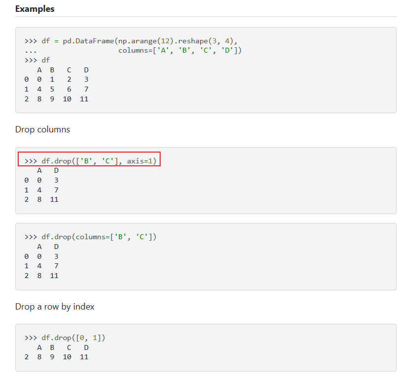

# **Pandas中DataFrame数据过滤的几种技巧**

在平时数据分析的场景中，我们经常会使用到pandas来处理数据，而处理数据中经常会遇见的是基于DataFrame来进行数据的过滤，本次我们就看看在Pandas中如何对DataFrame进行数据过滤，已满足我们再数据分析过程中的需求。

关于在Series中进行数据过滤的方式大家可以参考上篇文章，连接如下：

XXXXXXXXXXXXXXXXXXXXXXXXXXXXXXXXXXXXXXXXXXXXX

在pandas中，DataFrame 是一个非常重要的数据结构，用于处理表格数据。数据过滤是数据分析中的一个基本操作，pandas 提供了多种方法来过滤数据。以下是一些常见的数据过滤方法以及示例：

## **1.条件过滤**

```
import pandas as pd

df = pd.DataFrame({
    'A': [1, 2, 3, 4],
    'B': [5, 6, 7, 8],
    'C': [9, 10, 11, 12]
})

# 过滤出列A中大于2的行
filtered_df = df[df['A'] > 2]
filtered_df

# 输出:
   A  B   C
2  3  7  11
3  4  8  12
```

上述数据的过滤是基于DataFrame的列名进行数据的过滤的，使用的是一些条件表达式，比如我们还亦可以这样进行数据的过滤：

```
import pandas as pd

df = pd.DataFrame({
    'A': [1, 2, 3, 4],
    'B': [5, 6, 7, 8],
    'C': [9, 10, 11, 12]}
)

# 过滤出列A中大于2的行
filtered_df = df[df['A'] % 3 ==0]
filtered_df
# 输出:
   A   B   C
2  3  7   11
```

## **2.query()方法**

我们这里也可以使用query()的方法来进行数据的过滤，该方法的定义我们可以查询文档：



在使用query配合字符串表达式来过滤数据，这使得条件表达式更加直观，比如基于上述的样例数据，我们有：

```
filtered_df = df.query('A > 2')
filtered_df
# 输出
 A B C
2 3 7 11
3 4 8 12

# 在比如我们进行数据的过滤：
filtered_df = df.query('A % 2 == 0')
filtered_df
# 输出为
 A B C
1 2 6 10
3 4 8 12
```

在使用query方法的时候，我们需要写出正确的表达式，否则过滤出的结果很大可能不是我们所期望的。

## **3.drop()方法**

在实际的数据分析的过程中，我们常使用drop方法来山删除我们不需要的数据，保留需要的数据从而达到数据过滤的目的，在DataFrame中我们也可以使用**drop()** 方法来进行数据的过滤，比如说：

```
# 删除列A中小于等于2的行
df_dropped = df.drop(df[df['A'] <= 2].index)
df_dropped
# 输出为

  A B C
2 3 7 11
3 4 8 12
```

上述过滤的过程实际上是先使用：

```
df[df['A'] <= 2].index
```

获取小于2的列的index,其值为Index([0, 1]),实际上一步到位即为：

```
# 删除列A中小于等于2的行
df_dropped = df.drop([0,1])
df_dropped
```

这也是可以的，即我们知道drop()方法我们需要传入一个list型的数据，我们可以查看一下相关函数：

 

官网的相关例子进一步说明了另外一个参数axis的作用，这里我不在解释了大家直接看官网的例子：

 

这里大家自己研究一下，这里就不在进行赘述了。

## **4.loc[] 方法**

在pandas中使用loc[]方法是非常常见的，它允许你通过行标签和列标签来精确地选择DataFrame中的行和列。loc[] 主要用于基于标签的索引，而不是基于整数的位置索引。比如：

```
# 使用loc[]过滤列A中大于2的行
filtered_df = df.loc[df['A'] > 2]
filtered_df
# 输出
 A B C
2 3 7 11
3 4 8 12
```

我们再看一个例子：

```
# 选择列'A'大于2且列'B'小于8的所有行
filtered_df = df.loc[(df['A'] > 2) & (df['B'] < 8)]
filtered_df
# 输出
  A B C
2 3 7 11
```

其他人关于loc的方法，大家可以参考官网的文档进行学习了。

## **5.iloc[] 方法**

上述介绍的是loc[]方法，接下来我们来学习一下iloc[]的方法。在pandas中，iloc[] 方法是一种基于整数位置的索引器，用于选择数据。与 loc[] 不同，iloc[] 不依赖于标签索引，而是使用整数索引来选择行和列。这使得 iloc[] 非常适合于进行切片操作和基于整数位置的索引，那怎么进行数据的过滤呢？我们一起来看一下：

```
# 选择前两行数据
first_two_rows = df.iloc[:2]
first_two_rows
# 输出
 A B C
0 1 5 9
1 2 6 10
```

再如：

```
# 选择除了列'A'之外的所有列
all_but_a = df.iloc[:, 1:]
all_but_a
# 输出
  B C
0 5 9
1 6 10
2 7 11
3 8 12
```

loc[]和iloc[]方法具有一定的相似度，可以好好体会即可。

## **6.isin() 方法**

isin()方法也是非常常见的，看这个名字就知道这个方法的用途了。我们来看一下这个方法：

```
# 过滤出列B中值为5或7的行
filtered_df = df[df['B'].isin([5, 7])]
filtered_df
# 输出
 A B C
0 1 5 9
2 3 7 11
```

可以发现，这个函数用起来还是比较方便的，如果我们单独使用这个命令，那么输出是什么呢？

```
df.isin([5, 7])
# 输出
      A       B       C
0 False True False
1 False False False
2 False True False
3 False False False
```

也就是说，单独使用isin()方法输出的结果就是一些bool值，这点在Pandas中还是非常常见的。这点还是非常重要的。

## **7.notna() 或 isna() 方法**

notna() 或 isna() 方法主要就是用于过滤相关空值的函数，在数据分析的过程中还是非常常见的。我们来看一个例子：

```
import pandas as pd
import numpy as np

df = pd.DataFrame({
    'A': [1, 2, 3, 4],
    'B': [5, 6, np.nan, 8],
    'C': [9, np.nan, 11, 12]}
)

# 过滤出列C中非空的行
filtered_df = df[df['C'].notna()]
filtered_df
# 输出
 A B C
0 1 5.0 9.0
2 3 NaN 11.0
3 4 8.0 12.0
```

notna()的相关用法还是比较简单的，如果要使用isna()也是一样的用法，当然了如果使用"非"条件来进行数据的操作，则notna()和isna()就可以相互的进行变换，比如：

```
filtered_df = df[~df['C'].notna()]
filtered_df
# 输出
    A B C
1 2 6.0 NaN
```

在进行数据过滤的时候，大家可以参考上述的代码进行数据的过滤，尤其是遇到一些None值的时候。

## **8.between() 方法**

在Pandas中，between方法用于选择位于两个值之间的数据。这个方法通常与Series或DataFrame列一起使用。具体来说：

```
import pandas as pd
# 示例DataFrame
df = pd.DataFrame({
    'column_name': [1, 2, 3, 4, 5, 6, 7, 8, 9, 10]
})
# 使用between方法
filtered_df = df['column_name'].between(value1, value2)
```

value1和value2是两个你想要过滤的边界值。between方法返回一个布尔Series，其中True表示对应的值位于value1和value2之间（包括边界值）。

如果我们想要过滤DataFrame中的多个列，我们可以传递一个列表或元组给between方法：

```
# 过滤多个列
filtered_df = df[df[['column1', 'column2']].between(lower=(value1, value2), upper=(value3, value4))]
```

我们来看一下例子：

```
import pandas as pd

df = pd.DataFrame({
    'A': [1, 2, 3, 4],
    'B': [5, 6, 7, 8],
    'C': [9, 10, 11, 12]}
)
# 过滤出列A中值在2和4之间的行
filtered_df = df[df['A'].between(2, 4)]
filtered_df
# 输出
   A B C
1 2 6 10
2 3 7 11
3 4 8 12
```

可以发现，默认的数据是包含边界值的。其实，这个方法中还有一个参数inclusive，inclusive参数可以是'both'（默认，包括两个边界值），'left'（只包括左边的边界值），'right'（只包括右边的边界值），或者'neither'（不包括任何边界值）。

对于边界值的方法，我们看一个例子：

```
import pandas as pd

df = pd.DataFrame({
    'A': [1, 2, 3, 4],
    'B': [5, 6, 7, 8],
    'C': [9, 10, 11, 12]}
)

# 过滤出列A中值在2和4之间的行,只包含左边界值
filtered_df = df[df['A'].between(2, 4, inclusive='left')]
filtered_df
# 输出
  A B C
1 2 6 10
2 3 7 11
```

使用inclusive参数就能很好的进行边界数据的控制和输出。

## **9.filter() 方法**

最后我们来看看filter()这个方法，filter() 方法用于根据条件筛选出DataFrame或Series中的元素。这个方法可以对行或列进行筛选，并且可以指定筛选的方向（是筛选行还是列，参数axis来控制）。

```
# 筛选出A列和B列
filtered_df = df.filter(['A', 'B'])
filtered_df
# 输出
  A B
0 1 5
1 2 6
2 3 7
3 4 8
```

另外，filter()函数进行数据过滤的时候，还可以使用正则表达式，用于筛选列名匹配该模式的列。如：

```
# 使用正则表达式筛选出列名包含'A'的列
filtered_df = df.filter(regex='A')
filtered_df
# 输出
  A
0 1
1 2
2 3
3 4
```

使用正则表达式可以很便捷的进行数据的匹配和过滤。

## **10.组合过滤的方法**

这个方法比较简单一些了，我们直接看一个简单的例子：

```
# 过滤出列A大于2且列B等于6的行
filtered_df = df[(df['A'] > 2) & (df['B'] == 7)]
filtered_df
# 输出
  A B C
2 3 7 11
```

## **11.基于index的数据过滤**

最后我们来看一个基于index的方法，我们一起来看一下，比较简单的：

```
import pandas as pd
df = pd.DataFrame({
    'A': [1, 2, 3, 4],
    'B': [5, 6, 7, 8],
    'C': [9, 10, 11, 12]},
    index=list('abcd')
)

filtered_df = df['b':]
filtered_df
# 输出
  A B C
b 2 6 10
c 3 7 11
d 4 8 12
```

上述数据过滤方式是基于index来实现的，实际上基于index可以实现更为赋复杂的数据过滤，这里就先不进行赘述了，后面有机会再整理出推文和大家一起学习。

## **12.总结**

本次文章我们学习了如何在pandas的Dataframe中进行数据过滤的方法，总的来说方法还是很多的，以后进行数据分析的时候就比较方便了。