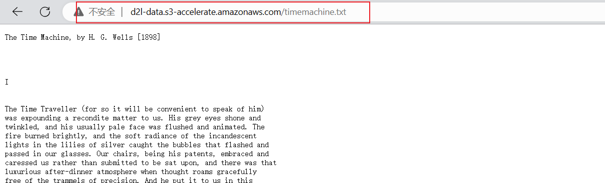
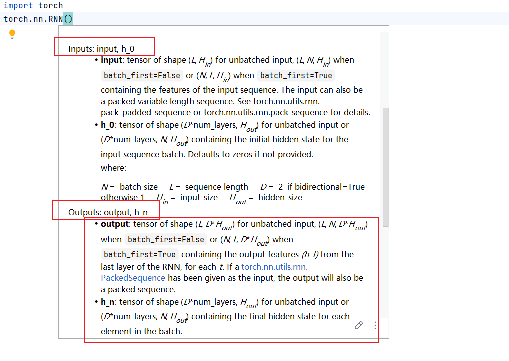
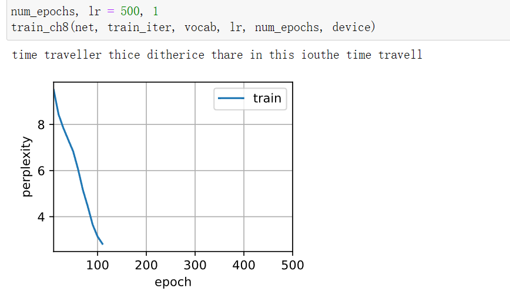
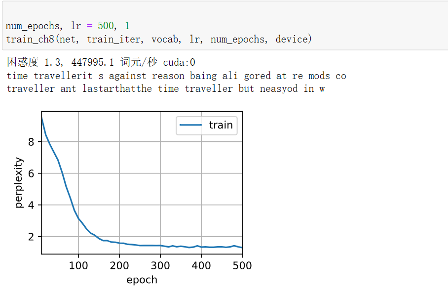

# 24.PyTorch简单的实现循环神经网络


在上次的文章中我们一步一步实现了循环神经网络，当然了上次实现的过程中我们基本上是一步一步来实现的，从一定的角度上来说还是非常详细的，有时候我自己都需要仔仔细细的再复习一遍。上次的文章大家可以从以下的链接进行学习：

(https://mp.weixin.qq.com/s?__biz=MzU1MzEzOTc4Nw==&mid=2247500713&idx=1&sn=1c97dcbedd5efce90786278e1ad63653&chksm=fbf5e88dcc82619bd109326952985b07fe7ce2a48cd66341ceb10f9526475662d13a0b5b8e43#rd)

这次我们不写那边复杂的过程，本节将展示如何使用深度学习框架的高级API提供的函数更有效地实现相同的语言模型，直接使用PyTorch中相关的函数来实现的最大的好处就是简洁，且可以可快速帮助我们快速进行深度学习想法的实现。


## 一、加载文本数据
与之前一样，我们先进行数据集的加载，我们的数据是以下网站的文本，即《时间机器》这本书数据集，其是一个英文数据即：



数据集的访问链接如下：

d2l-data.s3-accelerate.amazonaws.com/timemachine.txt
我们可以编写以下的代码完成上述《时间机器》数据的下载，这与之前的步骤是一样的：

```python
import os
import re
import hashlib
import requests

DATA_HUB = dict()
DATA_URL = 'http://d2l-data.s3-accelerate.amazonaws.com/'
DATA_HUB['time_machine'] = (DATA_URL + 'timemachine.txt','090b5e7e70c295757f55df93cb0a180b9691891a')

def download(name, cache_dir):
    # 判断
    assert name in DATA_HUB, f"{name} does not exist in {DATA_HUB}."
    url, sha1_hash = DATA_HUB[name]
    os.makedirs(cache_dir, exist_ok=True)
    fname = os.path.join(cache_dir, url.split('/')[-1])
    if os.path.exists(fname):
        sha1 = hashlib.sha1()
        with open(fname, 'rb') as f:
            while True:
                # 1048576表示读取1M的数据
                data = f.read(1048576)
                if not data:
                    break
                sha1.update(data)
        if sha1.hexdigest() == sha1_hash:
            return fname  # Hit cache
    print(f'Downloading {fname} from {url}...')
    r = requests.get(url, stream=True, verify=True)
    with open(fname, 'wb') as f:
        f.write(r.content)
    return fname

def read_time_machine(name,cache_dir):
    fname = download('time_machine',cache_dir=cache_dir)
    with open(fname, 'r') as f:
        lines = f.readlines()
    # 稍微清洗并返回列表形式的数据
    return [re.sub('[^A-Za-z]+', ' ', line).strip().lower() for line in lines]

# 调用
filename = 'timemachine'
cache_dir = os.path.join('.', 'data')
time_machine= read_time_machine(name=filename,cache_dir=cache_dir)
```

## 二、文本数据处理
与之前一致，我们都需要进行数据的加载和处理的操作，也就是将数据处理为相应的词汇预料，我们先写出公共的函数和类：
```python
import collections
def count_corpus(tokens):
    """Count token frequencies.
    Defined in :numref:`sec_text_preprocessing`"""
    # Here `tokens` is a 1D list or 2D list
    if len(tokens) == 0 or isinstance(tokens[0], list):
        # Flatten a list of token lists into a list of tokens
        tokens = [token for line in tokens for token in line]
    return collections.Counter(tokens)        
```
上述函数用于计算tokens中每个词汇的出现频率。

接着我们进行tokenize化，我们的代码如下（上次的文章中可能少了这下面的这串代码，大家可以参考这里的）：
```python
# tokenize化
def tokenize(lines, token='word'):
    if token == 'word':
        return [line.split() for line in lines]
    elif token == 'char':
        return [list(line) for line in lines]
    else:
        print('ERROR: unknown token type: ' + token)
```

接下来，创建一个Vacab类用于处理文本数据中的词汇，它将文本中的每个唯一词汇映射到一个唯一的索引：
```python
class Vocab:
    """Vocabulary for text."""
    def __init__(self, tokens=None, min_freq=0, reserved_tokens=None):
        """Defined in :numref:`sec_text_preprocessing`"""
        if tokens is None:
            tokens = []
        if reserved_tokens is None:
            reserved_tokens = []
        # 计算 tokens 中每个词汇的出现频率
        counter = count_corpus(tokens)
        # 对词汇及其频率进行排序，按照频率降序排列
        self._token_freqs = sorted(counter.items(), key=lambda x: x[1],reverse=True)
        # 创建一个列表，包含一个未知词汇标记 <unk> 和所有保留词汇
        self.idx_to_token = ['<unk>'] + reserved_tokens
        # 创建一个字典，将每个词汇映射到它在 idx_to_token 列表中的索引
        self.token_to_idx = {token: idx for idx, token in enumerate(self.idx_to_token)}
        for token, freq in self._token_freqs:
            if freq < min_freq:
                break
            if token not in self.token_to_idx:
                self.idx_to_token.append(token)
                self.token_to_idx[token] = len(self.idx_to_token) - 1

    def __len__(self):
        return len(self.idx_to_token)

    def __getitem__(self, tokens):
        if not isinstance(tokens, (list, tuple)):
            return self.token_to_idx.get(tokens, self.unk)
        return [self.__getitem__(token) for token in tokens]
    # 用于将索引转换为对应的词汇
    def to_tokens(self, indices):
        if not isinstance(indices, (list, tuple)):
            return self.idx_to_token[indices]
        return [self.idx_to_token[index] for index in indices]

    @property
    def unk(self):  # Index for the unknown token
        return 0

    @property
    def token_freqs(self):  # Index for the unknown token
        return self._token_freqs
```
第三个函数加载我们的数据集，并返回相应的corpus和vocab：
```python
def load_corpus_time_machine(max_tokens=-1):
    # 加载预料
    lines = read_time_machine(name=filename,cache_dir=cache_dir)
    tokens = tokenize(lines, 'char')
    vocab = Vocab(tokens)
    # Since each text line in the time machine dataset is not necessarily a
    # sentence or a paragraph, flatten all the text lines into a single list
    corpus = [vocab[token] for line in tokens for token in line]
    if max_tokens > 0:
        corpus = corpus[:max_tokens]
    return corpus, vocab
```

接下里我们进行序列的数据的加载，加载数据的时候有随机加载和顺序抽样的加载两种方式，他们的目的都是通过随机采样生成minibatch的子序列：
```python
def seq_data_iter_random(corpus, batch_size, num_steps):
    corpus = corpus[random.randint(0, num_steps - 1):]
    num_subseqs = (len(corpus) - 1) // num_steps
    initial_indices = list(range(0, num_subseqs * num_steps, num_steps))
    random.shuffle(initial_indices)
    
    def data(pos):
        return corpus[pos: pos + num_steps]

    num_batches = num_subseqs // batch_size
    for i in range(0, batch_size * num_batches, batch_size):
        initial_indices_per_batch = initial_indices[i: i + batch_size]
        X = [data(j) for j in initial_indices_per_batch]
        Y = [data(j + 1) for j in initial_indices_per_batch]
        yield torch.tensor(X),torch.tensor(Y)  
```
上述加载数据的方式为随机加载，接下来我们创建一个顺序加载数据的函数：
```python
def seq_data_iter_sequential(corpus, batch_size, num_steps):
    offset = random.randint(0, num_steps)
    num_tokens = ((len(corpus) - offset - 1) // batch_size) * batch_size
    Xs = torch.tensor(corpus[offset: offset + num_tokens])
    Ys = torch.tensor(corpus[offset + 1: offset + 1 + num_tokens])
    Xs, Ys = Xs.reshape(batch_size, -1), Ys.reshape(batch_size, -1)
    num_batches = Xs.shape[1] // num_steps
    for i in range(0, num_steps * num_batches, num_steps):
        X = Xs[:, i: i + num_steps]
        Y = Ys[:, i: i + num_steps]
        yield X, Y
```
上述代码的解释可以参考上一篇的推文。

之后我们来创建一个SeqDataLoader类：
```python
class SeqDataLoader:
    def __init__(self, batch_size, num_steps, use_random_iter, max_tokens):
        """两种加载数据的形式`"""
        if use_random_iter:
            self.data_iter_fn = seq_data_iter_random
        else:
            self.data_iter_fn = seq_data_iter_sequential
        self.corpus, self.vocab = load_corpus_time_machine(max_tokens)
        self.batch_size, self.num_steps = batch_size, num_steps

    def __iter__(self):
        return self.data_iter_fn(self.corpus, self.batch_size, self.num_steps)
```
这个类的主要用途是提供一个统一的接口来加载序列数据，无论数据是随机采样还是顺序划分。用户只需要创建 SeqDataLoader 的一个实例并指定加载方式，然后就可以通过迭代器协议来访问数据。

最后我们创建一个函数来加载最终的数据：
```python
def load_data_time_machine(batch_size, num_steps, use_random_iter=False, max_tokens=10000):
    data_iter = SeqDataLoader(batch_size, num_steps, use_random_iter, max_tokens)
    return data_iter, data_iter.vocab
# 定义加载的batch和时间步骤
batch_size, num_steps = 32, 35
# 之前定义的函数
train_iter, vocab = load_data_time_machine(batch_size, num_steps)
for X, Y in train_iter:
    print(X,'\n')
    print(Y)
    break
```
上述使用for循环加载了一次就进行break了。


## 三、定义模型
接下来我们使用高级API来实现模型，这里直接参考《动手学》系列，先构造一个具有256个隐藏单元的单隐藏层的循环神经网络层 rnn_layer：
```python
num_hiddens = 256
rnn_layer = nn.RNN(len(vocab), num_hiddens)
```
之后，我们使用全0的张量来初始化隐状态，它的形状是（隐藏层数，批量大小，隐藏单元数）:
```python
batch_size, num_steps = 32, 35
state = torch.zeros((1, batch_size, num_hiddens))
print(state.shape,'\n')
print(state)

# 输出为：
torch.Size([1, 32, 256]) 

tensor([[[0., 0., 0.,  ..., 0., 0., 0.],
         [0., 0., 0.,  ..., 0., 0., 0.],
         [0., 0., 0.,  ..., 0., 0., 0.],
         ...,
         [0., 0., 0.,  ..., 0., 0., 0.],
         [0., 0., 0.,  ..., 0., 0., 0.],
         [0., 0., 0.,  ..., 0., 0., 0.]]])
```
大家可能比较好奇这个单隐藏层的循环神经网络层rnn_layer的输出是什么，因为其为RNN网络，因此我们可以直接看一下这个函数的接口：


在我们调用 rnn_layer(X, state) 后，rnn_layer 会返回两个值：

（1）输出序列 (output)：这是 RNN 在每个时间步产生的输出序列，是一个三维张量，其形状为 (seq_len, batch_size, num_directions * hidden_size)。

（2）新的隐藏状态 (new_state)：这是 RNN 在处理完输入序列后的新隐藏状态，它是一个二维张量，其形状为 (num_layers * num_directions, batch_size, hidden_size)。

我们可以尝试写代码来看一下这个函数的输出：
```python
X = torch.rand(size=(num_steps, batch_size, len(vocab)))
Y, state_new = rnn_layer(X, state)
Y.shape, state_new.shape

# 输出：
(torch.Size([35, 32, 256]), torch.Size([1, 32, 256]))
```
输出序列和新的隐藏状态如上所示。可知，新的隐藏状态的shape是不变的，这点还是很重要的。

## 四、构建RNNModel类
接下来为一个完整的循环神经网络模型定义了一个RNNModel类，参考《动手学》系列，我们的定义如下：
```python
class RNNModel(nn.Module):
    """循环神经网络模型"""
    def __init__(self, rnn_layer, vocab_size, **kwargs):
        super(RNNModel, self).__init__(**kwargs)
        self.rnn = rnn_layer
        self.vocab_size = vocab_size
        self.num_hiddens = self.rnn.hidden_size
        # 如果RNN是双向的（之后将介绍），num_directions应该是2，否则应该是1
        if not self.rnn.bidirectional:
            self.num_directions = 1
            self.linear = nn.Linear(self.num_hiddens, self.vocab_size)
        else:
            self.num_directions = 2
            self.linear = nn.Linear(self.num_hiddens * 2, self.vocab_size)

    def forward(self, inputs, state):
        X = F.one_hot(inputs.T.long(), self.vocab_size)
        X = X.to(torch.float32)
        Y, state = self.rnn(X, state)
        # 全连接层首先将Y的形状改为(时间步数*批量大小,隐藏单元数)
        # 它的输出形状是(时间步数*批量大小,词表大小)。
        output = self.linear(Y.reshape((-1, Y.shape[-1])))
        return output, state

    def begin_state(self, device, batch_size=1):
        if not isinstance(self.rnn, nn.LSTM):
            # nn.GRU以张量作为隐状态
            return  torch.zeros((self.num_directions * self.rnn.num_layers,
                                 batch_size, self.num_hiddens),
                                device=device)
        else:
            # nn.LSTM以元组作为隐状态
            return (torch.zeros((
                self.num_directions * self.rnn.num_layers,
                batch_size, self.num_hiddens), device=device),
                    torch.zeros((
                        self.num_directions * self.rnn.num_layers,
                        batch_size, self.num_hiddens), device=device))
```
我们来解释一下上述的代码，总的来说，上述代码定义了一个名为 RNNModel 的类，它是一个继承自 nn.Module 的神经网络模型，用于构建循环神经网络（RNN），nn.Module，这是所有神经网络模块的基类。

**（一）我们先来看一下init方法里面的一些内容：**

（1）rnn_layer:RNN层的实例，可以是nn.RNN, nn.LSTM 或 nn.GRU。

（2）vocab_size:词汇表的大小，即模型输出层的维度。

（3）self.rnn:存储传入的 RNN 层。

（4）self.vocab_size:存储词汇表大小。

（5）self.num_hiddens:从RNN 层获取隐藏层的大小。

（6）self.num_directions:根据RNN是否是双向的，设置为1或 2。

（7）self.linear: 一个线性层（全连接层），用于将RNN的输出映射到词汇表大小的空间。


**（二）我们先来看一下forward方法里面的一些内容：**

（1）inputs:输入数据，通常是整数序列，表示文本数据。

（2）state:RNN的初始状态。

（3）F.one_hot: 将整数序列转换为one-hot编码形式。

（4）X.to(torch.float32):确保输入数据类型为浮点数。

（5）Y, state=self.rnn(X, state): 将one-hot编码的输入X和状态state传递给 RNN 层，获取输出 Y 和新的状态 state。

（6）output=self.linear(Y.reshape((-1,Y.shape[-1]))): 将RNN的输出Y通过线性层，转换为词汇表大小的输出。

**（三）我们先来看一下begin_state方法里面的一些内容：**

（1）device:指定设备（CPU或GPU）。

（2）batch_size:批次大小，默认为1。

（3）如果RNN是nn.GRU类型，返回一个全零张量作为初始隐藏状态。

（4）如果RNN是nn.LSTM类型，返回一个包含两个全零张量的元组，分别代表用于初始化隐藏状态（hidden state）和初始化单元状态（cell state）两个cell状态。

rnn_layer只包含隐藏的循环层，所以在我们的代码里又单独的加了一个linear输出层。

之后我们就开始进行训练与预测了。

## 五、训练与预测
接下来我们开始进行训练和预测的代码编写，与之前一样，我们基于一个具有随机权重的模型进行预测，先写一些基本的函数：
```python
def try_gpu(i=0):
    if torch.cuda.device_count() >= i + 1:
        return torch.device(f'cuda:{i}')
    return torch.device('cpu')
```

预测的函数:
```python
def predict_ch8(prefix, num_preds, net, vocab, device):
    '''函数目的是在给定的前缀 prefix 后面生成新的字符序列'''
    state = net.begin_state(batch_size=1, device=device)
    outputs= [vocab[prefix[0]]]
    get_input = lambda: torch.tensor([outputs[-1]], device=device).reshape((1,1))
    for y in prefix[1:]:
        _, state = net(get_input(), state)
        outputs.append(vocab[y])
    for _ in range(num_preds):
        y, state = net(get_input(), state)
        # y是一个 1 x vocab 的tensor，取最大值的下标进行后续输出
        outputs.append(int(y.argmax(dim=1).reshape(1)))
    return ''.join([vocab.idx_to_token[i] for i in outputs])
```
我们基于一个具有随机权重的模型进行预测:
```python
device = try_gpu()
net = RNNModel(rnn_layer, vocab_size=len(vocab))
net = net.to(device)
predict_ch8('time traveller', 10, net, vocab, device)
# 输出为
'time travellerqzaq qtqv '
```

**上述随机权重理解：**

因为：
rnn_layer = nn.RNN(len(vocab), num_hiddens)调用RNN的时候没有指明权重就进行随机的初始化。

根据输出可以发现，这种随机的方式的数据是不理想的，甚至比随机还差，因此我们进行以下的训练,在进行训练直线，我们写一些需要用到的函数，也是来自《动手学》系列：
```python 
class SeqDataLoader:
    """An iterator to load sequence data."""
    def __init__(self, batch_size, num_steps, use_random_iter, max_tokens):
        """两种加载数据的形式`"""
        if use_random_iter:
            self.data_iter_fn = seq_data_iter_random
        else:
            self.data_iter_fn = seq_data_iter_sequential
        self.corpus, self.vocab = load_corpus_time_machine(max_tokens)
        self.batch_size, self.num_steps = batch_size, num_steps

    def __iter__(self):
        return self.data_iter_fn(self.corpus, self.batch_size, self.num_steps)

from matplotlib_inline import backend_inline
def use_svg_display():
    backend_inline.set_matplotlib_formats('svg')

def set_axes(axes, xlabel, ylabel, xlim, ylim, xscale, yscale, legend):
    axes.set_xlabel(xlabel)
    axes.set_ylabel(ylabel)
    axes.set_xscale(xscale)
    axes.set_yscale(yscale)
    axes.set_xlim(xlim)
    axes.set_ylim(ylim)
    if legend:
        axes.legend(legend)
    axes.grid()


from IPython import display
from matplotlib import pyplot as plt

class Animator:
    """For plotting data in animation."""
    def __init__(self, xlabel=None, ylabel=None, legend=None, xlim=None,
                 ylim=None, xscale='linear', yscale='linear',
                 fmts=('-', 'm--', 'g-.', 'r:'), nrows=1, ncols=1,
                 figsize=(3.5, 2.5)):
        """Defined in :numref:`sec_softmax_scratch`"""
        # Incrementally plot multiple lines
        if legend is None:
            legend = []
        use_svg_display()
        self.fig, self.axes = plt.subplots(nrows, ncols, figsize=figsize)
        if nrows * ncols == 1:
            self.axes = [self.axes, ]
        # Use a lambda function to capture arguments
        self.config_axes = lambda: set_axes(
            self.axes[0], xlabel, ylabel, xlim, ylim, xscale, yscale, legend)
        self.X, self.Y, self.fmts = None, None, fmts

    def add(self, x, y):
        # Add multiple data points into the figure
        if not hasattr(y, "__len__"):
            y = [y]
        n = len(y)
        if not hasattr(x, "__len__"):
            x = [x] * n
        if not self.X:
            self.X = [[] for _ in range(n)]
        if not self.Y:
            self.Y = [[] for _ in range(n)]
        for i, (a, b) in enumerate(zip(x, y)):
            if a is not None and b is not None:
                self.X[i].append(a)
                self.Y[i].append(b)
        self.axes[0].cla()
        for x, y, fmt in zip(self.X, self.Y, self.fmts):
            self.axes[0].plot(x, y, fmt)
        self.config_axes()
        display.display(self.fig)
        display.clear_output(wait=True)

import time
import numpy as np

class Accumulator:
    def __init__(self, n):
        self.data = [0.0] * n

    # 进行累加
    def add(self, *args):
        self.data = [a + float(b) for a, b in zip(self.data, args)]

    def reset(self):
        self.data = [0.0] * len(self.data)

    def __getitem__(self, idx):
        return self.data[idx]


class Timer:
    """Record multiple running times."""
    def __init__(self):
        """Defined in :numref:`subsec_linear_model`"""
        self.times = []
        self.start()

    def start(self):
        """Start the timer."""
        self.tik = time.time()

    def stop(self):
        """Stop the timer and record the time in a list."""
        self.times.append(time.time() - self.tik)
        return self.times[-1]

    def avg(self):
        """Return the average time."""
        return sum(self.times) / len(self.times)

    def sum(self):
        """Return the sum of time."""
        return sum(self.times)

    def cumsum(self):
        """Return the accumulated time."""
        return np.array(self.times).cumsum().tolist()

import math
def train_epoch_ch8(net, train_iter, loss, updater, device, use_random_iter):
    """训练网络一个迭代周期"""
    state, timer = None, Timer()
    metric = Accumulator(2)
    for X, Y in train_iter:
        if state is None or use_random_iter:
            # 在第一次迭代或使用随机抽样时初始化state
            state = net.begin_state(batch_size=X.shape[0], device=device)
        # 如果是连续抽样的，就不用重新做初始化
        else:
            if isinstance(net, nn.Module) and not isinstance(state, tuple):
                # state对于nn.GRU是个张量
                state.detach_()
            else:
                # state对于nn.LSTM或对于我们从零开始实现的模型是个张量
                for s in state:
                    s.detach_()
        # 转置，时间维度放在最前
        y = Y.T.reshape(-1)
        X, y = X.to(device), y.to(device)
        y_hat, state = net(X, state)
        # 计算损失
        l = loss(y_hat, y.long()).mean()
        # 如果使用的是torch.optim.Optimizer
        if isinstance(updater, torch.optim.Optimizer):
            updater.zero_grad()
            l.backward()
            # 梯度剪裁
            grad_clipping(net, 1)
            updater.step()
        # 自定义的
        else:
            l.backward()
            grad_clipping(net, 1)
            updater(batch_size=1)
        metric.add(l * y.numel(), y.numel())
    return math.exp(metric[0] / metric[1]), metric[1] / timer.stop()
    
def predict_ch8(prefix, num_preds, net, vocab, device):
    '''函数目的是在给定的前缀 prefix 后面生成新的字符序列'''
    state = net.begin_state(batch_size=1, device=device)
    outputs= [vocab[prefix[0]]]
    get_input = lambda: torch.tensor([outputs[-1]], device=device).reshape((1,1))
    for y in prefix[1:]:
        _, state = net(get_input(), state)
        outputs.append(vocab[y])
    for _ in range(num_preds):
        y, state = net(get_input(), state)
        # y是一个 1 x vocab 的tensor，取最大值的下标进行后续输出
        outputs.append(int(y.argmax(dim=1).reshape(1)))
    return ''.join([vocab.idx_to_token[i] for i in outputs])
    
def train_ch8(net, train_iter, vocab, lr, num_epochs, device,use_random_iter=False):
    """训练模型"""
    # 虽说是语言模型，但实际上是多分类问题，预测下一个字符的可能性是最大的
    loss = nn.CrossEntropyLoss()
    animator = Animator(xlabel='epoch', ylabel='perplexity',legend=['train'], xlim=[10, num_epochs])
    if isinstance(net, nn.Module):
        updater = torch.optim.SGD(net.parameters(), lr)
    else:
        # 不然就调用咱自己之前搞的
        updater = lambda batch_size: sgd(net.params, lr, batch_size)
    # 输出50个字符
    predict = lambda prefix: predict_ch8(prefix, 50, net, vocab, device)
    # 训练和预测
    for epoch in range(num_epochs):
        # 困惑度和每秒计算样本个数
        ppl, speed = train_epoch_ch8(net, train_iter, loss, updater, device, use_random_iter)
        # 每10个epoch看一看效果~
        if (epoch + 1) % 10 == 0:
            print(predict('time traveller'))
            animator.add(epoch + 1, [ppl])
    print(f'困惑度 {ppl:.1f}, {speed:.1f} 词元/秒 {str(device)}')
    print(predict('time traveller'))
    print(predict('traveller'))
    

def grad_clipping(net, theta):
    """裁剪梯度"""
    if isinstance(net, nn.Module):
        params = [p for p in net.parameters() if p.requires_grad]
    else:
        params = net.params
    norm = torch.sqrt(sum(torch.sum((p.grad ** 2)) for p in params))
    if norm > theta:
        for param in params:
            # print(param)
            param.grad[:] *= theta / norm

def try_gpu(i=0):
    if torch.cuda.device_count() >= i + 1:
        return torch.device(f'cuda:{i}')
    return torch.device('cpu')
    
def load_data_time_machine(batch_size, num_steps, use_random_iter=False, max_tokens=10000):
    data_iter = SeqDataLoader(batch_size, num_steps, use_random_iter, max_tokens)
    return data_iter, data_iter.vocab
    
```
我们调用的函数就可以写成以下的方式：
```python

num_epochs, lr = 500, 1
batch_size, num_steps = 32, 35
train_iter, vocab = load_data_time_machine(batch_size, num_steps)

device = try_gpu()
net = RNNModel(rnn_layer, vocab_size=len(vocab))
net = net.to(device)
train_ch8(net, train_iter, vocab, lr, num_epochs, device)
```
训练的过程中我们打印中间的结果图和运行完成的结图：

训练过程中：


训练完成：



可以看出本次在使用API来实现RNN的时候，模型的训练时间更短，这很大可能与API中相关的算法进行了优化的结果。

至此我们就完成了使用API来实现RNN的过程，可以看出数据处理加载写的代码是最多的，也是最为耗时的。


## 六、参考文献
（1）PyTorch官方文档：

https://pytorch.org/docs/stable/index.html

（2）《动手学深度学习》-李沐

（3）torchtext官方文档：

https://torchtext.readthedocs.io/en/latest/

（4）IMDB电影评论数据集：

https://ai.stanford.edu/~amaas/data/sentiment/

（5）老饼讲解机器学习 (www.bbbdata.com)