# 狗也能看懂的机器学习ROC和AUC指标详解和代码实现.md


## 1.引言

在数据科学和机器学习领域，评估分类模型的性能是一个至关重要的步骤，这能保证模型在上线之后有一个较长的“稳定期”其中。而在评估模型效果的时候，ROC（Receiver Operating Characteristic）曲线和AUC（Area Under the Curve）指标是衡量模型性能的两个常用工具。本文将深入探讨ROC和AUC的概念、计算方法、绘制方法、代码实现以及它们在实际应用中的意义。

这个知识点在面试中也很频繁的出现，在面试官提出这个问题的时候，我们有时候真的回答得不好，因此有必要来详细探讨一下。


## 2. 常用指标介绍

在机器学习中有好很多的用于评价分类器(假设是分类任务)性能的指标，比如我们常见的：

**（1）准确性（Accuracy）**： 准确性是最常见的分类任务评价指标，表示模型正确预测的样本数占总样本数的比例。但在某些不平衡类别的情况下，准确性作为一个衡量指标的效果并不是很好。比如在类别不平衡的情况下正负样本比例为9999:1，假设一个模型为“所有样本”都是正例，则accuracy=9999/10000 = 99.99%，而实际上这个模型啥也没有学会。

**（2）精确度（Precision）**：精确度是指在所有被模型预测为正例的样本中，实际为正例的比例。精确度关注的是模型预测为正例的准确性，并不关心模型预测为负例的程度。

**（3）召回率（Recall）**：召回率是指在所有实际为正例的样本中，被模型正确预测为正例的比例。召回率关注的是模型对正例的覆盖程度。比如说你喜欢大学里的10个女生（可怕），然后我构建一个“渣男”模型，这个模型找出了其中的2个，那么这个模型的召回率就是0.2。另外重大疾病和风险的判断更加注重召回率。

**（4）F1分数（F1- Score）** ：F1分数是精确度和召回率的调和平均值，综合考虑了模型的准确性和覆盖率。F1分数在不同类别不平衡的情况下比准确性更具意义。

**（5）AUC **：ROC曲线下面积（Area Under the Receiver Operating Characteristic Curve）（AUC-ROC）： 适用于二分类问题，ROC曲线是以真正例率（True Positive Rate，召回率）为纵轴Y、假正例率（False Positive Rate）为横轴X的曲线，**AUC-ROC是ROC曲线下的面积。一般来说，AUC 值范围从 0 到 1，值越大表示模型性能越好。**

首先F1，accuracy这类的评价指标是单点评价，但它更关注模型在不同阈值下的精确率和召回率。而AUC考虑到了全部阈值下的性能，因此在样本不平衡的情况下，也能进行较为合理的评价，所以AUC被发明出来了。AUC衡量的是模型的排序能力，我们越好地分离我们的样本（我们的模型训练得越好），AUC 就会越高。


## 3. ROC的重要性

我们知道，AUC-ROC是ROC曲线下的面积。一般来说，AUC 值范围从 0 到 1，值越大表示模型性能越好。那具体是怎样的呢，我们来使用一个实验说明一下，也就是有着较高的准确度Accuracy其AUC却比较低：

```python
import numpy as np
from sklearn.datasets import make_classification
from sklearn.model_selection import train_test_split
from sklearn.linear_model import LogisticRegression
from sklearn.metrics import roc_auc_score, confusion_matrix, accuracy_score
import matplotlib.pyplot as plt
import seaborn as sns

# 生成一个二分类数据集
X, y = make_classification(n_samples=1000, n_features=20, n_classes=2, weights=[0.95, 0.05], random_state=42)

# 划分训练集和测试集
X_train, X_test, y_train, y_test = train_test_split(X, y, test_size=0.2, random_state=42)

# 创建一个逻辑回归模型
model = LogisticRegression()

# 训练模型
model.fit(X_train, y_train)

# 预测测试集的概率
y_pred_proba = model.predict_proba(X_test)[:, 1]

# 计算AUC
auc = roc_auc_score(y_test, y_pred_proba)
print(f"AUC: {auc:.2f}")

# 预测测试集的类别
y_pred = model.predict(X_test)

# 计算准确率
accuracy = accuracy_score(y_test, y_pred)
print(f"Accuracy: {accuracy:.2f}")

# 计算混淆矩阵
cm = confusion_matrix(y_test, y_pred)

# 绘制混淆矩阵图
plt.figure(figsize=(8, 6))
sns.heatmap(cm, annot=True, fmt='d', cmap='Blues', xticklabels=['Class 0', 'Class 1'], yticklabels=['Class 0', 'Class 1'])
plt.xlabel('Predicted Label')
plt.ylabel('True Label')
plt.title('Confusion Matrix')
plt.show()
```

输出如下：

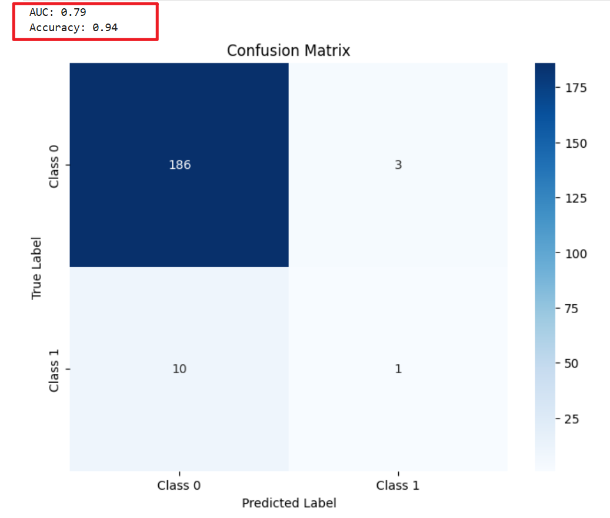


test_size=0.2即测试样本的数据量为200个。从上图可以看出来，这里的精确度是比较高的，但是AUC还是0.8不到。此时如果我们单纯依赖准确率（Accuracy）可能会造成一定的误导，觉得模型就可以很好的将两种样本给区分开。因此我们有必要使用ROC曲线显示的实际意义来判定分类器的泛化能力。


## 4. 查准率和查全率

要谈论ROC曲线，我们有必要先研究一下TPR(True Positive Rate)真正例率和FPR(False Positive rate)假正例率。参考周志华老师的《机器学习》图书：

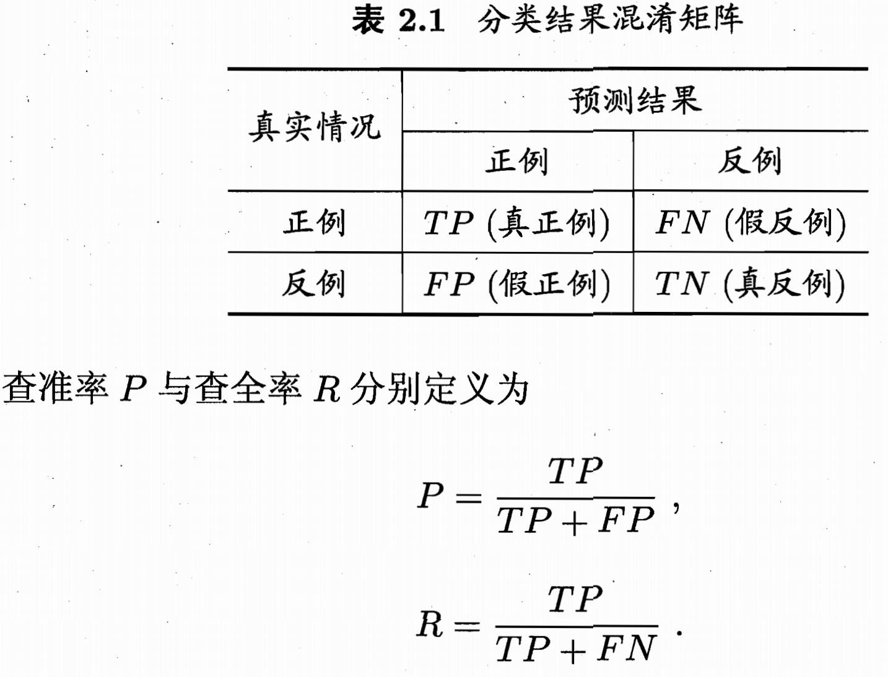

其中上述字母的含义为：
T: True
P: Positive
F: False
N: Negative

对于一个二分类的分类器预测结果有2种，样本的真实标签有2种，所以最后的结果总共有4种，用两个字母表示：

1. 第一个字母T（True）或者F（False），表示预测结果是否正确。

2. 第二个字母P（positive）或者N（negative），表示分类器的预测结果，P就是预测为正例，N就是预测为负例；

例如，TP：就是预测为正例，并且预测对了。（样本为正例实际分类器也预测为正例）

**上图中的P和R即为精确度/查准率（Precision）和查全率/召回率（Recall）**

- 查准率：表示所有被预测为正类的样本（TP+FP）是真正类（TP）的比例。可以理解为挑出来的瓜中好瓜所占的比例。
- 查全率：表示所有真正类的样本（TP+FN）中被预测为真正类（TP）的比例。可以理解为所有好瓜中被挑出来的瓜所占的比例。

很显然，查准率和查全率是一对矛盾的度量，查准率高的时候，查全率就相对底；查准率底的时候，查全率就相对高，因为计算公式中的TP是不变的。


## 5.P-R曲线及其绘制

在介绍之前，我们需要理解的一个事情为，这也是引用周老师《机器学习》的中的内容：
很多学习器是为测试样本产生一个实值或概率预测，然后将这个预测值与分类阈值（threshold）进行比较，如果大于阈值则判定为正类，小于阈值则判定为负样本类。实际上，根据这个实值或者概率预测结果我们可以将测试样本进行排序，“最可能”是正例的排在最前面，“最不可能”为正例的排在最后面，**分类过程就相当于在这个排序中以某一个“截断点”将样本分为两部分，前一部分为正例，后一部分则为负例**

P_R曲线的绘制相对来说简单一些，只要就是计算出查准率和查全率就可以。一般步骤为：

（1）依次将分类器分类结果按照预测为正类的概率值进行排序；
（2）将概率阈值由1开始逐渐降低，按此顺序逐个把样本作为正例进行预测，则每次可以计算当前的查准率P和查全率R。
（3）以查准率为纵轴，查全率为横轴作图，就能够得到查准率-查全率曲线，即P-R曲线。

我们来举例进行说明，假设我们有5个西瓜样本预测结果集：

| 样本瓜真实标签 | 预测为好瓜的概率 |
| :------------: | :--------------: |
|      好瓜      |       0.7        |
|      好瓜      |       0.9        |
|      坏瓜      |       0.8        |
|      坏瓜      |       0.5        |
|      好瓜      |       0.6        |

首先对预测结果按照概率进行排序：

（好瓜，0.9）
（好瓜，0.8）
（坏瓜，0.7）
（好瓜，0.6）
（坏瓜，0.5）

（1）**我们将截断点设置为每一个样例的预测值。**首先我们将截断点设置为最大值0.9,5个样本中的预测概率有≥0.9的，只有第一个瓜会被预测成为好瓜，此时的confusion_matrix如下：

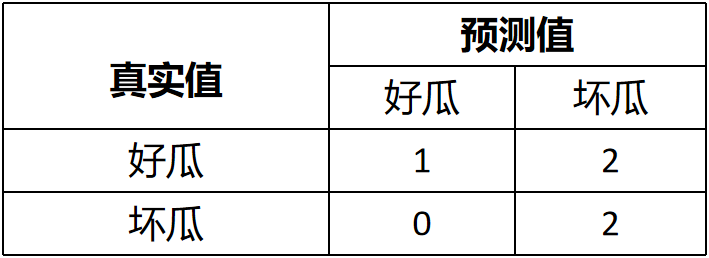

此时，**对应的查准率P=1/(1+0)=1，查全率R=1/(1+2)=1/3。**

（2）接着我们将截断点设置为最大值0.8,5个样本中的预测概率有≥0.8的，第一、二个瓜都会被预测成为好瓜，此时的confusion_matrix如下：

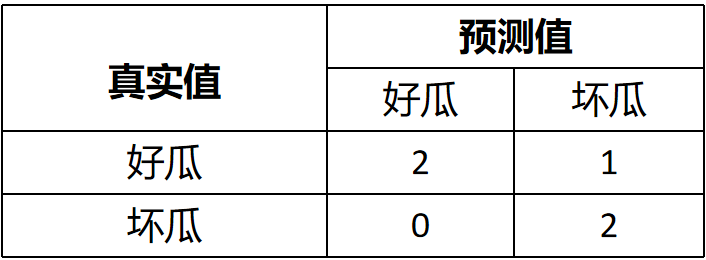

此时，**对应的查准率P=2/(2+0)=1，查全率R=2/(2+1)=2/3。**

（3）接着我们将截断点设置为最大值0.7,5个样本中的预测概率有≥0.7的，第一、二、三个瓜都会被预测成为好瓜，此时的confusion_matrix如下：

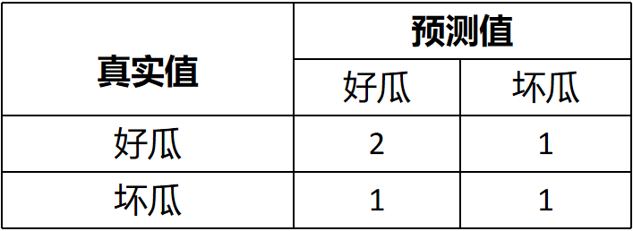

此时，**对应的查准率P=2/(2+1)=2/3，查全率R=2/(2+1)=2/3。**

（4）接着我们将截断点设置为最大值0.6,5个样本中的预测概率有≥0.6的，第一、二、三、四个瓜预测为好瓜，此时的confusion_matrix如下：

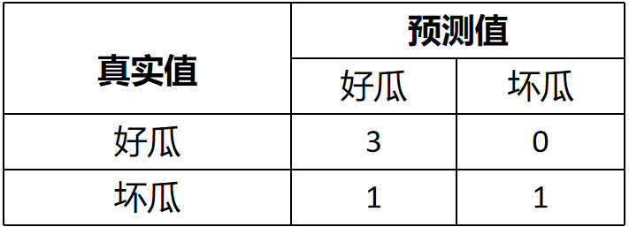

此时，**对应的查准率P=3/(3+1)=3/4，查全率R=3/(3+0)=1。**

（5）接着我们将截断点设置为最大值0.5,5个样本中的预测概率有≥0.6的，全部瓜都会被预测成为好瓜都会被预测成为好瓜，此时的confusion_matrix如下：

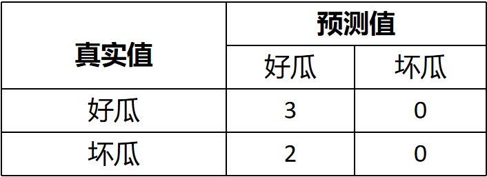

此时，**对应的查准率P=3/(3+2)=3/5，查全率R=3/(3+0)=1。**

我们将上述的（P,R）点对进行绘图，然后用直线段相连，得到如下图：

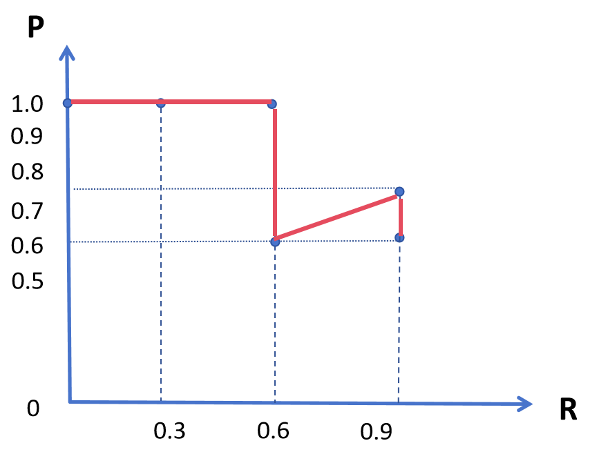

这样我们就完成了PR图的绘制。一般来说，P-R曲线的整体呈下降趋势，一般来说，如果一个学习器的P-R曲线被另一个学习器的P-R曲线完全包住了，那么就意味着后者的性能优于前者，毕竟查准率还是在查全率都优于前者，效果上肯定更好。

可以看出P-R曲线从左上角（0,1）到右下角（1,0）：

- 一开始的第一个样本，其最有可能是正例（排序后概率值最大），其他样本均预测为负例，此时查准率最高接近1；查全率很低，很多正例没有预测到。
- 快结束时所有的样本都预测为正例，此时查准率很低，大量的负例被预测为正例；查全率很高接近1，正例都被查询到。

我们也可以基于sklearn的方法来画出PR曲线，我们的代码可以写成如下所示的样子：

```python
import numpy as np
from sklearn.metrics import precision_recall_curve,average_precision_score
import matplotlib.pylab as plt

y_test = np.array([1, 1, 0, 1, 0])
y_pred_proba = np.array([0.9, 0.8, 0.7, 0.6, 0.5])

# 计算Precision 和Recall
precision,recall,thresholds = precision_recall_curve(y_test,y_pred_proba)

print(precision)
print(recall)
print(thresholds)

# 计算平均精确率
average_precision = average_precision_score(y_test,y_pred_proba)
print(f"Average precision:{average_precision:.2f}")

# 绘制P-R曲线
plt.figure()
plt.plot(recall, precision, marker='o', color='blue',label=f'PR = {average_precision:.3f}')
# plt.plot([0, 1], [0, 1], linestyle='--', color='gray')  # 随机猜测的对角线
plt.xlabel('recall')
plt.ylabel('precision')
plt.title('Precision-Recall Curve')
plt.legend()
plt.show()
```

使用sklearn绘制的P-R曲线与我们手动绘制的结果是一致的。

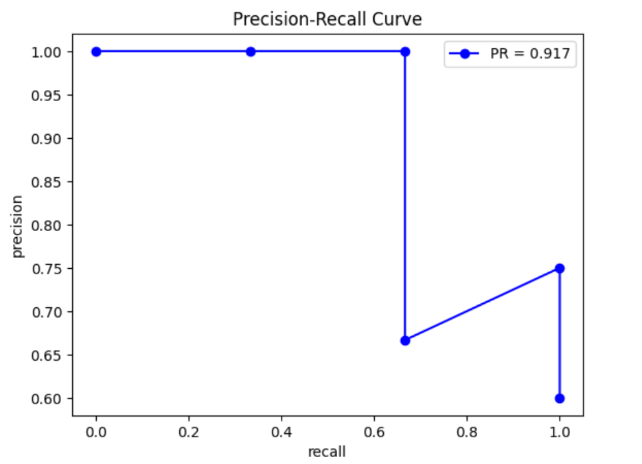

另外，比如下述的模型构建的之后的P-R曲线的结果如下：

```python
import numpy as np
from sklearn.datasets import make_classification
from sklearn.model_selection import train_test_split
from sklearn.linear_model import LogisticRegression
from sklearn.metrics import precision_recall_curve, average_precision_score
import matplotlib.pyplot as plt

# 生成一个二分类数据集
X, y = make_classification(n_samples=1000, n_features=20, n_classes=2, weights=[0.9, 0.1], random_state=42)

# 划分训练集和测试集
X_train, X_test, y_train, y_test = train_test_split(X, y, test_size=0.2, random_state=42)

# 创建一个逻辑回归模型
model = LogisticRegression()

# 训练模型
model.fit(X_train, y_train)

# 预测测试集的概率
y_pred_proba = model.predict_proba(X_test)[:, 1]

# 计算Precision和Recall
precision, recall, _ = precision_recall_curve(y_test, y_pred_proba)

# 计算平均精确率
average_precision = average_precision_score(y_test, y_pred_proba)
print(f"Average Precision: {average_precision:.2f}")

# 绘制PR曲线
plt.figure(figsize=(8, 6))
plt.plot(recall, precision, label=f'PR curve (AP = {average_precision:.2f})')
plt.xlabel('Recall')
plt.ylabel('Precision')
plt.title('Precision-Recall Curve')
plt.legend(loc='best')
plt.show()
```

输出为：

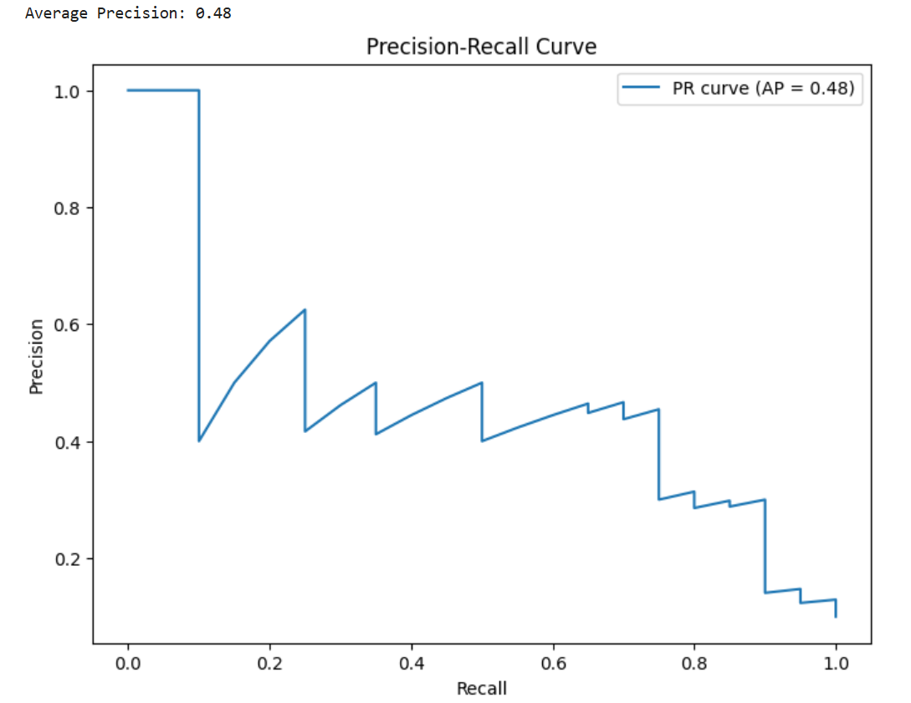

PR曲线的整体呈下降趋势的，对于有限样本来说是一种折线形式的下降。


## 6. P-R曲线如何判断算法的优劣

直观的来使用P-R曲线来判断模型算法的优劣还是比较简单的，如下所示（周老师《机器学习》）：

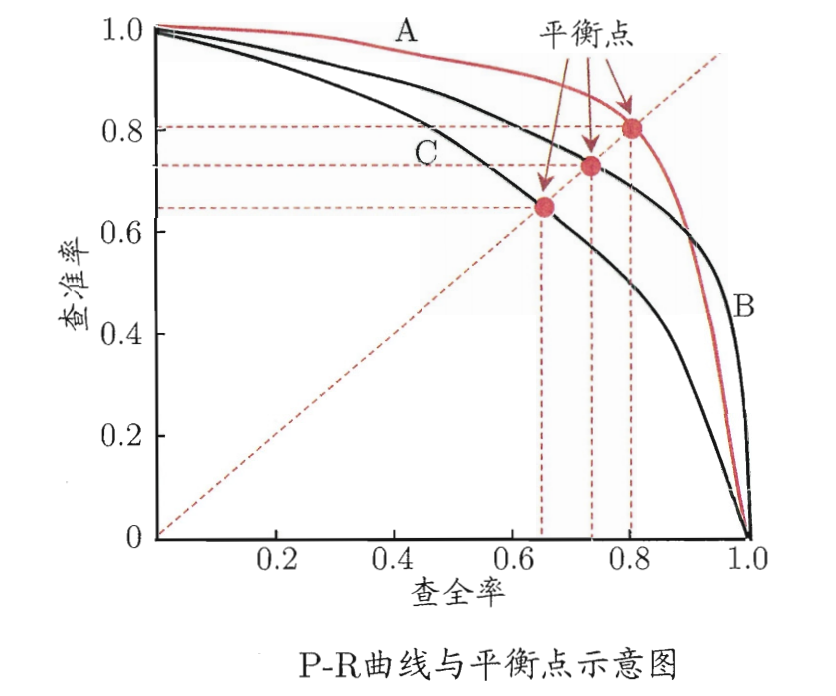

（1）如果一条曲线完全“包住”另一条曲线，则前者性能优于另一条曲线，如A优于C。

（2）P-R曲线发生了**交叉**时：以PR曲线下的面积作为衡量指标，但这个指标通常难以计算得出

（3）使用 **“BEP平衡点”（Break-Even Point）**，他是查准率**=**查全率时的取值，值越大代表效果越优，如学习器C的平衡点值小于A.

（4）有时候BEP过于简化，更常用的是F1度量来进行判断：

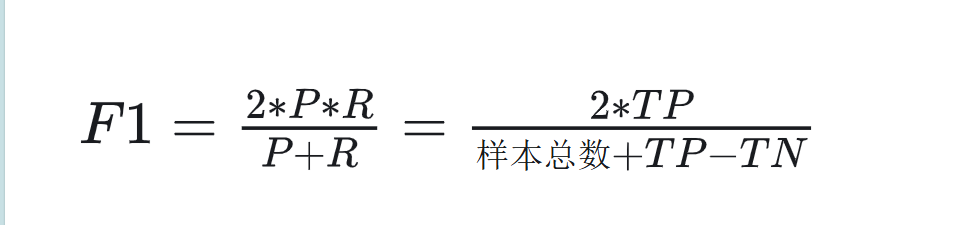
$$
F1 = \frac{2 *P*R}{P+ R}=\frac{2*TP}{样本总数+TP-TN}
$$
总结一下就是P-R 曲线（Precision-Recall Curve）是一种评估二分类模型的方法，特别适用于不平衡数据集。它通过展示查准率（Precision）和召回率（Recall）之间的关系来评估模型性能。


## 7. TPR和FPR的定义和计算

基于上述章节，我们就可以来看一下TPR和FPR了，首先计算公式如下：


$$
TPR = \frac{TP}{TP+FN}
$$

$$
FPR = \frac{FP}{FP+TN}
$$

（1）TPR（True Positive Rate）-真阳性率。实际的计算公式与召回率（Recall）的计算公式一致，表示的是在所有真实为正的样本中，被正确预测为正的比例。
（2）FPR（False Positive Rate）-假阳性率。表示的是在所有真实为负的样本中，被错误预测为正的比例。

ROC曲线的横坐标为假阳性率FPR；纵坐标为真阳性率TPR。

这里简单的介绍概念还是 比较难理解的，我们来看一个例子：
假设有10位疑似糖尿病患者，其中有3位确实是糖尿病患者，7位不是糖尿病患者。某一医院对10位患者进行了诊断，诊断出有3位糖尿病患者，而在这3位中确实有2位是真正的患者。那么我们得到下述图示：

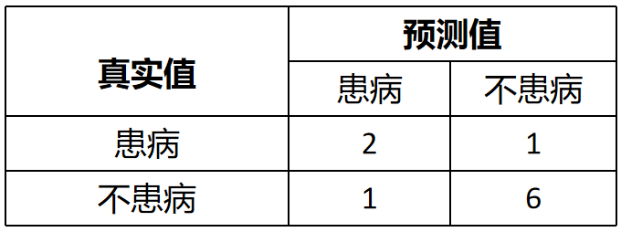

此时有：
$$TPR = 2/(2 +1) = 2/3$$
$$FPR = 1/(1+6) = 1/7$$
对于该医院这个“分类器”来说，这组分类结果对应在ROC曲线上的一点（1/7,2/3）。

**在这里很多人就有一个疑问了，为什么选择TPR和FPR这两个来作为横纵坐标呢？**

首先对于TPR来说，其分母为TP+FN，即全部的真实正例；FPR的分母为TN+FP，加起来就是全部的真实负例。使用TPR和FPR都是相对指标，它们只关注模型对正负样本的识别能力，而不直接依赖于正负样本的具体数量。这一特性使得ROC曲线在面对类别不平衡问题时具有很好的稳定性，能够更准确地评估模型的性能

另外一点，ROC曲线通过将TPR作为纵坐标、FPR作为横坐标，能够直观地展示出模型在不同阈值下的性能表现。TPR越高，表示模型正确识别正样本的能力越强；FPR越低，表示模型错误识别负样本为正样本的情况越少。因此，ROC曲线能够清晰地反映出模型的敏感性（Sensitivity）和特异性（Specificity），即模型对正负样本的区分能力。


## 8. 绘制 ROC 曲线

接下来我们研究一下怎么绘制ROC图像（手动绘制）。

事实上，ROC曲线是通过不断移动分类器的“截断点”来生成曲线上的关键点的。这里我们参考论文《An introduction to ROC analysis》，假设测试数据集有20个样本，下图是模型的输出结果，样本按照预测概率从高到低排序：

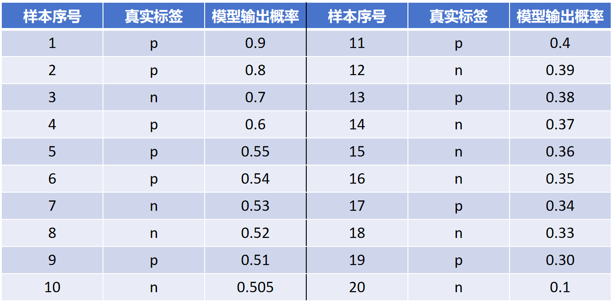

在输出最终的正例、负例之前，我们需要指定一个阈值，预测概率大于该阈值的样本会被判为正例，小于该阈值的样本则会被判为负例。比如，指定阈值为0.9，那么只有第一个样本会被预测为正例，其他全部都是负例。“截断点”指的就是区分正负预测结果的阈值。**大于这个值的样本划归为正样本，小于这个值的样本则划到负样中**

通过动态地调整截断点，从最高的得分开始（实际上是从正无穷开始，对应着ROC曲线的零点），即将分类阈值设置为最大，这将使得所有样例预测为负例逐渐调整到最低得分，每一个截断点都会对应一个FPR和TPR，在ROC图上绘制出每个截断点对应的位置，再连接所有点就得到最终的ROC曲线，我们具体来看一下：

（1）当截断点选择为正无穷时，模型把全部样本预测为负例，此时FP和TP都为0FPR和TPR也都为0，因此曲线的第一个点的坐标就是(x,y)=(0,0)。

（2）接着设置截断点为每一个样例的预测值（注意是排序之后的），先选择截断点为0.9，模型预测1号样本为正样本，并且该样本确实是正样本，因此TP=1，这里没有预测错的正样本，即FP=0。20个样本中正样本总数（TP+FN）为10，负样本总数（FP+TN）也为10。因此，TPR = 1/10=0.1，FPR = 0/10=0, 因此曲线的下一个点的坐标就是(x,y)=(0,0.1)。

（3）接着设置截断点为0.8，模型预测1号、2号样本为正样本，因此TP=2，FP=0。因此，TPR = 2/10=0.2，FPR = 0/10=0,因此曲线的下一个点的坐标就是(x,y)=(0.2)。

（4）接着设置截断点为0.7，模型预测1、2、3号样本为正样本，比对前3个样本的标签，发现预测对了2个因此TP=2，3号样本预测错了，因此FP=1。因此，TPR = 2/10=0.2，FPR = 1/10=0.1,因此曲线的下第一个点的坐标就是(x,y)=(0.1,0.2)。

（5）接着设置截断点为0.6，模型预测前4个样本为正样本，比对前4个样本的标签，发现预测对了3个因此TP=3，3号样本预测错了，因此FP=1。因此，TPR = 3/10=0.3，FPR = 1/10=0.1,因此曲线的下一个点的坐标就是(x,y)=(0.1,0.3)。

以此类推遍历所有的样本，画出的 ROC 曲线如下：

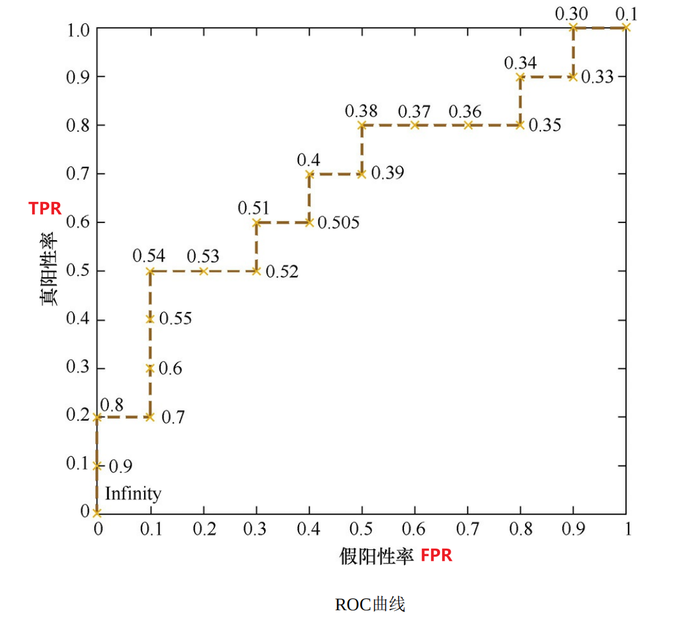

**从上述过程可以看出，如果不断减小截断点值，模型就能识别出更多的正类，也就是提高了识别出的正例占所有正例的比类，即TPR增大，但同时也将更多的负实例当作了正实例，即提高了FPR。**

其实，还有一种更直观地绘制ROC曲线的方法。首先，根据样本标签统计出正负样本的数量，假设有m个正例和n个负例，将分类器的预测结果按照预测值从大到小排序，接着将分类阈值设置为最大，即将所有样例预测为负例。然后将分类阈值依次设置为每一个样例的预测值，即依次将每一个样例划分为正例。设前一个标记点的坐标为（x,y）,当前若为真正例，则对应的标记点的坐标为（x，y+1/m）

当前若为假正例，则对应的标记的坐标为（x-1/n,y），依次遍历样本，同时从零点开始绘制ROC曲线，每遇到一个正样本就沿纵轴方向绘制一个刻度间隔的曲线，每遇到一个负样本就沿横轴方向绘制一个刻度间隔的曲线，直到遍历完所有样本，曲线最终停在（1,1）这个点，ROC曲线绘制完成。【周志华机器学习】


## 9. ROC曲线如何判断算法的优劣

在实际的工程中我们希望分类器达到的效果是：对于真实类别为1的样本，分类器预测为1的概率（即TPRate），要大于真实类别为0而预测类别为1的概率（即FPRate）。

ROC曲线来判断算法的好坏就很简单了，直接看ROC曲线下的面积（AUC的大小）的大小就可以判定模型的好坏。

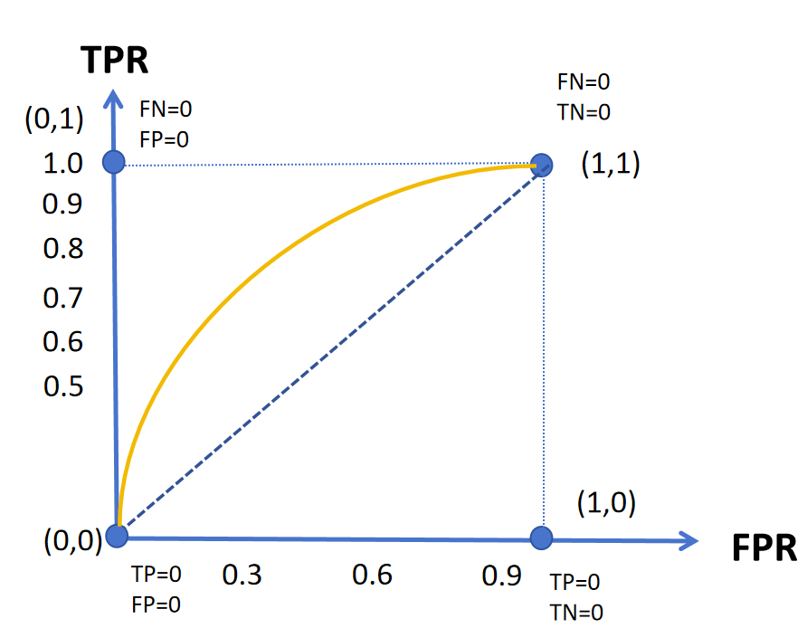


从上图以及TPR和FPR的定义看出：

（1）(0,1)点时，FN=0，FP=0，即所有的正样本均被正确预测，所有的负样本都没有预测成正样本。
（2）(1,0)点时，TP=0，TN=0，所有的正样本和负样本均预测错误。
（3）上述两点之间的连线为**TPR=TPR**这条线，即为正样本被预测成正样本的概率与负样本被预测成正样本的概率相同，如果模型分类器的ROC曲线为**TPR=TPR**这条线，跟掷硬币一样，出现正面和反面的概率一样，这样的模型与随机猜测的结果一样，没有任何的使用的价值；在实际工程中需要尽可能的让模型的ROC曲线位于TPR=TPR这条线上方，**即让正样本被预测成正样本的概率大于负样本被预测成正样本的概率**

所以说，观察ROC曲线下的面积（AUC的大小）的大小就可以判定模型的好坏。


## 10. 如何计算AUC

**首先AUC值是一个概率值，当你随机挑选一个正样本以及负样本，当前的分类算法根据计算得到的score值将这个正样本排在负样本前面的概率就是AUC值，AUC值越大，当前分类算法越有可能将正样本排在负样本前面，从而能够更好地分类。**
ROC曲线下的面积即为AUC的大小，这里有几种方法：

### **10.1 构建ROC曲线，计算曲线下的面积；**

这种方法就是上述第8章节讲述的那样，因为样本有限，我们得到的ROC曲线是一个折线（并不平滑），我们通过计算矩形的面积得出AUC=0.68。这种方式显然是不方便的，因为我们需要不断改变“截断点”来画出很多的点。而且如果出现多个样本的预测概率值相等的时候，ROC曲线就会出现一定的“斜度”增长，也就是会出现梯形面积区域，梯形区域面积的计算更为复杂一些。

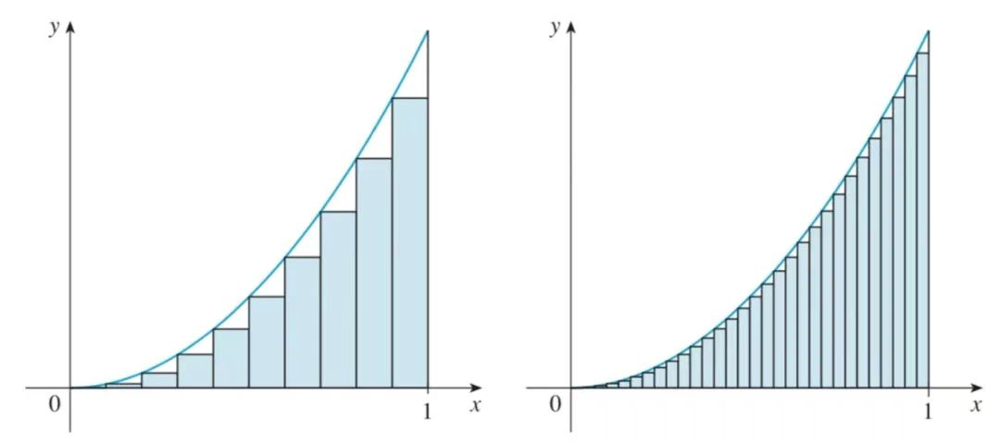

### **10.2 第二种方式：转换成排序问题**

从其他资料了解到，AUC的很有趣的性质是，它和Wilcoxon-Mann-Witney Test是等价的。也就是说AUC的物理意义是：给定任意一个正类样本和一个负类样本，正样本预测值大于负样本预测值的概率，也即正样本概率排在负样本概率前面的概率。进一步解释就是：随机选择一个正样本和一个负样本，分类器（模型）输出该正样本为正的概率值比分类器（模型）输出该负样本为正的那个概率值要大的可能性。

假设我们有4个样本A, B , C, D，其中A和B为正样本，C和D是负样本。那正负样本组合有4种：(A,C), (A,D), (B,C)和(B,D)，对于每一种组合我们都需要判断正概率值>负概率值，还是正概率<负概率值，还是正概率值=负概率值，统计其中的情况，即：

- $ P_{正} > P_{负},I(P_{正样本},P_{负样本})=1,即得分score= 1$
- $$P_{正} = P_{负},I(P_{正样本},P_{负样本})=0.5,即得分score= 0.5$$
- $$P_{正} < P_{负},I(P_{正样本},P_{负样本})=0,即得分score= 0$$

那么 AUC的值 可以使用下述公式表示：
$$
AUC = \frac{\sum{I(P_{正样本},P_{负样本})}}{M*N}
$$
其中$$M$$是正样本个数,$$N$$是负样本个数。

我们来举一个例子，在有M个正样本,N个负样本的数据集里。一共有MN对样本（一对样本即，一个正样本与一个负样本）。**我们需要统计这 M*N对样本里，正样本的预测概率大于负样本的预测概率的个数即可。** 

对于上述的样例，我们就得到一个排序问题，假设我们的数据如下：

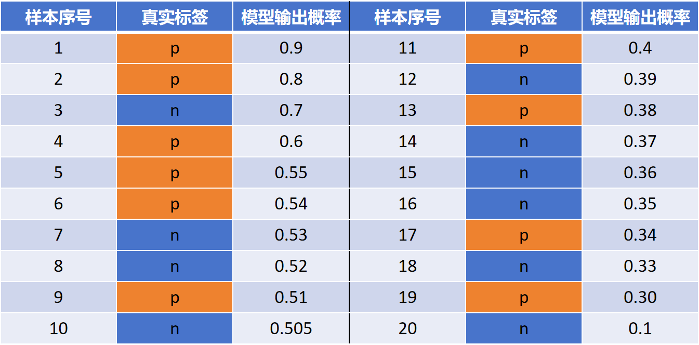

上图中橙色为正例，蓝色为负例。接下来我们计算一个概率问题：**随机从样本中取出正样本和负样本，正样本的概率排在负样本概率前面的概率。**

（1）首先，正样本和负样本各自样本的数量为10，因此整个假设空间为10*10 = 100，**如果正样本和负样本概率相同时，则正样本概率排在负样本概率前面的概率为0.5，上述案例中模型的数据概率没有出现0.5的情况**。

（2）当正样本概率为0.9时，负样本概率可以取0.7,0.53,0.52,...,0.33和0.1共计10种可能，且0.9均大于他们，共计10种。

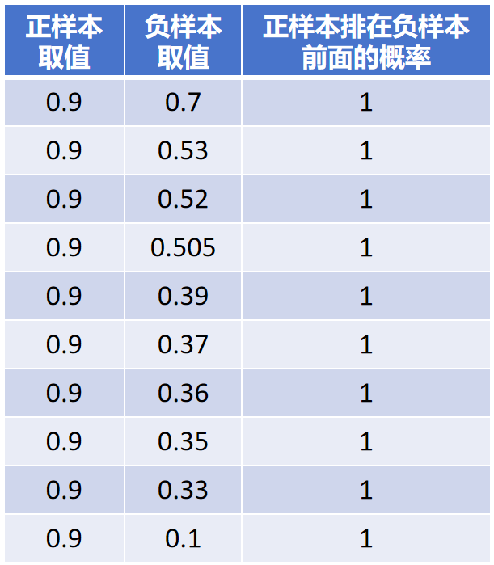

（3）当正样本概率为0.8时，负样本概率可以取0.7,0.53,0.52,...,0.33和0.1共计10种可能，且0.8均大于他们，共计10种。

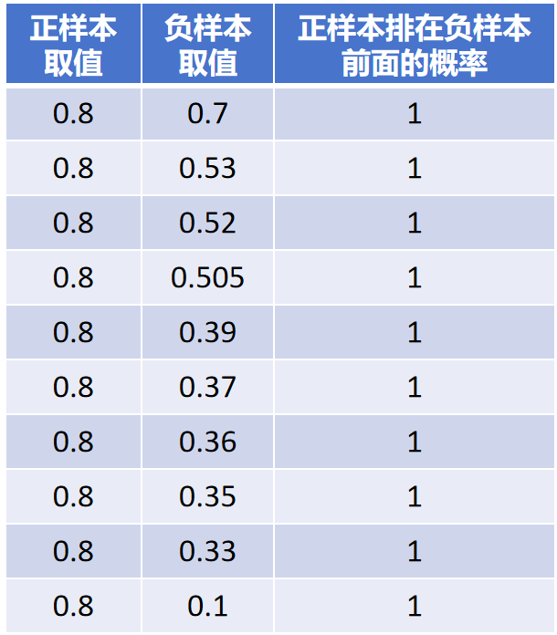

（4）当正样本概率为0.6时，负样本概率可以取0.7,0.53,0.52,...,0.33和0.1共计10种可能，且0.6大约除0.7之外的9个数，共计9种。

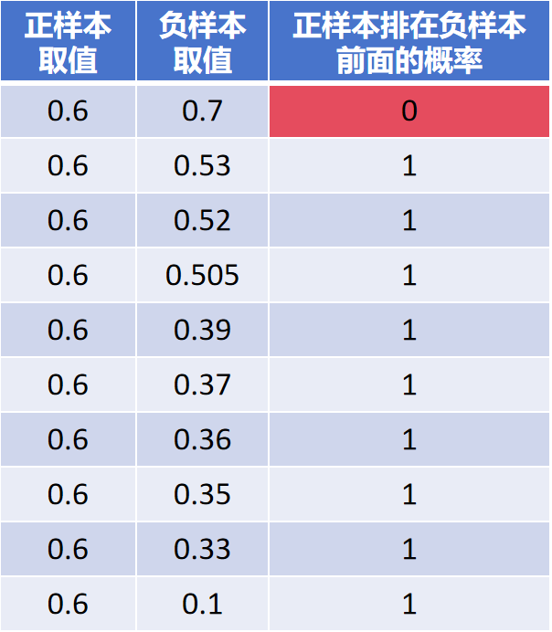

（5）以此类推，遍历所有的正例来进行判定（针对整个数据集），正样本概率排在负样本前面的概率为：

​				                                         $$(10 +10 + 9 + 9 + 9 + 7 + 6 + 5 + 2 + 1) / 100 = 68/100 = 0.68$$

其实上述方法的一个理论基础就是：在有限样本中我们常用的得到概率的办法就是通过频率来估计之。这种估计随着样本规模的扩大而逐渐逼近真实值。（大数定理），可以发现上述方法的复杂度为$$O(n^2)$$，n为样本的数量。因为我们需要将每一个正样本与负样本进行比较，在数据量很多的时候这个双层循环的效率是比较慢的。


### **10.3 第三种方式：转公式法**

这个方法实际上是 上个方法的增强版，我们先给出公式，计算公式如下：

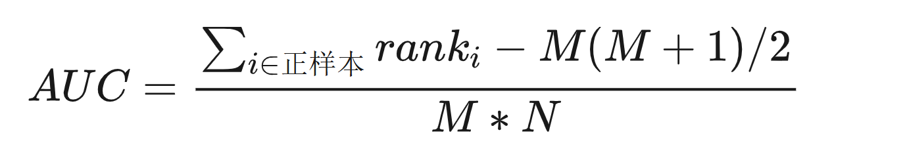
$$
AUC = \frac{\sum_{i\in正样本}^{M}{rank_{i}-M(M+1)/2}}{M*N}
$$
其中：

M是正样本的个数，N是负样本的个数，分子的第一项对rank的求和为属于正样本的序号之和；
具体怎么得到这个公式呢，我们来看一下计算的过程：
（1）M是正样本的个数，N是负样本的个数，因此正负样本对的个数为：M*N
（2）首先将测试样本的模型评分（预测的概率）从小到大排序，注意排序的方式。
（3）对于第 $$i$$个正样本，其排名为 $$rank_{i}$$，那么该正样本之前有 $$rank_{i}- 1$$ 样本，其中正样本的个数为 $$ i-1$$，负样本的个数为$$rank_{i}-1-(i-1)=rank_{i}-i$$。
（4）综上分析得出，对于第$$i$$个正样本，有$$rank_{i}-i$$个负样本得分小于正样本得分。
（5）因此对于M个正样本来说，共计$$ \sum_{i}^{M}{rank_{i}-i}$$
（6）那么我们的目标：
$$
AUC = \frac{\sum_{i}^{M}{rank_{i}-i}}{M*N} = \frac{\sum_{i\in正样本}^{M}{rank_{i}-M(M+1)/2}}{M*N}
$$
至此，证毕。

接下来我们举一个例子，使用上面的案例，共计10个样本。这里我们改变一下6,7,8号样本的预测概率均为0.54：

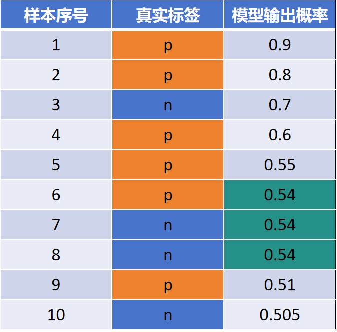


如果我们使用“第二种方式：转换成排序问题”这种方式来求解AUC，则为：

​											$$AUC = (4 + 4 + 3 + 3 + 0.5 + 0.5 + 1 + 1)/ 24 = 17/24 = 0.708333 $$

比如第一个4为：当正样本的概率为0.9的时候，小于该值的负样本的个数（序号有3,7,810共计4个）

这里的两个0.5是当正样本序号为6时，其与7号负样本的预测概率一致，与8号样本也一致，因此均为0.5，6号样本与10号样本比对为1.

如果我们使用“第三种方式：转公式法”这种方式来求解AUC，则为：
$$
AUC= \frac{(10 + 9 + 7 + 6 + 5 + 2) - 6 *7/2}{6*4} = 18 / 24 = 0.75
$$
可以看出这个计算结果与上述的计算结果是不一致的，这是为什么呢？主要是因为**当正负样本概率相等时，可能排在前面也可能在后面，我们不能直接认为正样本在负样本前面，这是一个特殊的地方。**

再存在score（或者预测概率）相等的情况时，对相等score（预测概率）的样本，需要赋予相同的rank(无论这个相等的score是出现在同类样本还是不同类的样本之间，都需要这样处理)。具体操作就是再把所有这些score相等的样本的rank取平均。然后再使用上述公式。**注意这里的取平均是先按照正常顺序排序，之后对相邻的分数相同的样本排名取平均。**如下绿色部分所示：

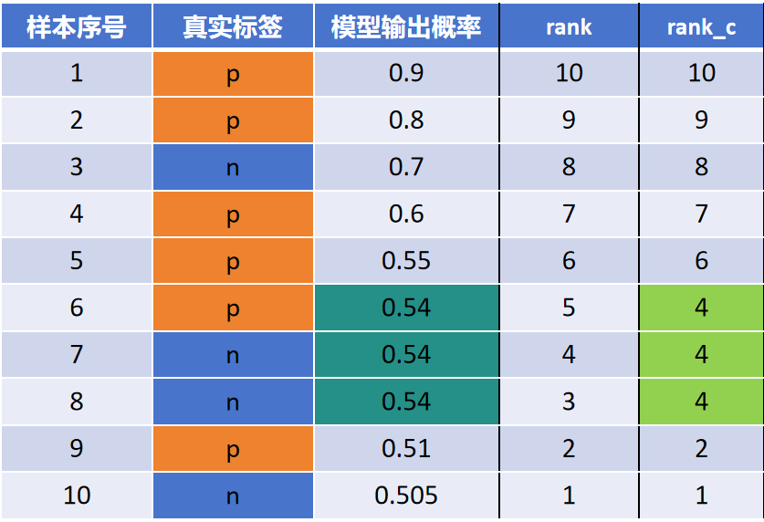


基于上述概率相同的时候的做法我们进行重排，得到rank_c，rank_c中序号为重新排序后的编号，样本编号为6,7,8的rank_c是这样得到的，将对应的rank值取平均：

​										                                           	$$ (5 + 4 + 3)/ 3 = 4  $$

那么按照新的rank_c我们得到的auc的值为：
$$
AUC= \frac{(10 + 9 + 7 + 6 + 4 + 2) - 6 *7/2}{6*4} = 17 / 24 = 0.708333
$$
再如：

| 序号 | 样本 | label | score | rank |   rank_c    |
| :--: | :--: | :---: | :---: | :--: | :---------: |
|  1   |  A   |   1   |  0.9  |  7   |      7      |
|  2   |  B   |   1   |  0.8  |  6   |      6      |
|  3   |  C   |   0   |  0.6  |  5   | (5+4+3+2)/4 |
|  4   |  D   |   0   |  0.6  |  4   | (5+4+3+2)/4 |
|  5   |  E   |   1   |  0.6  |  3   | (5+4+3+2)/4 |
|  6   |  F   |   1   |  0.6  |  2   | (5+4+3+2)/4 |
|  7   |  G   |   0   |  0.5  |  1   |      1      |

所以此时的AUC为：
$$
AUC= \frac{(7 + 6 + \frac{5+4+3+2}{4} + \frac{5+4+3+2}{4}) - \frac{4*(4+1)}{2}}{4*3} = 0.8333
$$
我们借助Python的scikit-learn来看看AUC的计算结果：

```python
from sklearn import metrics
y = np.array([1, 1, 0, 1, 1, 1, 0, 0, 1, 0])
pred = np.array([0.9, 0.8, 0.7, 0.6, 0.55, 0.54, 0.54, 0.54, 0.51, 0.505])
fpr, tpr, thresholds = metrics.roc_curve(y, pred, pos_label=1)
print(metrics.auc(fpr, tpr))

# 输出
0.7083333333333334
```

这也正好验证了我们的算法的三种AUC计算的方式大家可以参考。


## 11. AUC的性质

### 11.1 性质一：概率分布

假设我们有一个分类器，输入预测样本，输出为样本预测为正样本的概率，所有的样本组成的概率类似如下所示：

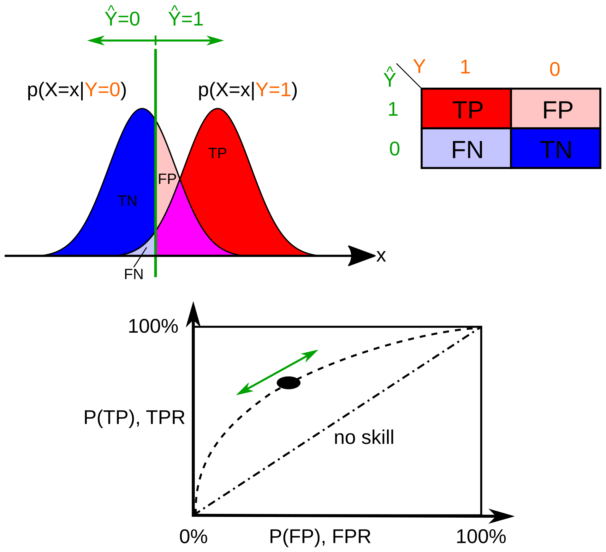

在二元分类中，每个实例的类预测通常是基于连续随机变量$$X$$进行的 ，这是不同样本计算的“分数”（例如，逻辑回归中的估计概率）。给定阈值参数 $$T$$，则实例被归类为 “positive” ，如果 $$X>T$$，否则为 “negative”。

在上图的坐标图中，横坐标为置信度值（截断值）（绿色的竖线画出来为选择一个具体的），纵坐标为样本的个数。通过动态地调整截断点且将截断值从大到小来排序，就可以获得不同的TP/FP/FN/TN，基于这些数据计算TPR/FPR得到不同的值，获得曲线图如下图所示：

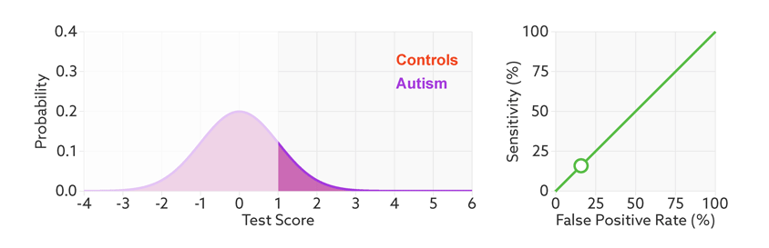

可以看出，两个概率分布重叠越少，误差就越少，ROC 曲线向上和向左移动的距离就越远，实际模型的性能也就越好。

从上面的图像变化我们可以得出，我们想要模型的FPR（模型的假阳率）越小越好，TPR（模型的真阳率）越大越好，这样对应的FP和FN就应该越小越好，即**正样本的概率分布与负样本的概率分布的重叠区域越小越好，模型越容易区分它们**。


当模型预测正负样本的概率是一样的时候（概率分布曲线重合）的时候，此时AUC = 0.5，即我们的模型没有任何的区分能力：


我们想我们的模型的效果比随机猜测还要差的话，从图像表现来说就是正样本的预测概率（紫色）图更加偏左分布。


### 11.2 性质二：AUC对正负样本比例不敏感

利用概率解释，还可以得到AUC另外一个性质，对正负样本比例不敏感。

当正负样本数量发生变化的时候，ROC曲线不变化，AUC不变：

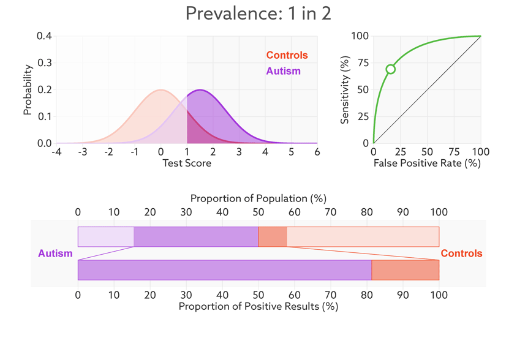

首先这里的不敏感，并不是说我们在训练模型的时候改变正负样本的比例，训练后的模型在测试集上的AUC是不变的。而是说是在样本正负比例不均衡的时候，当我们使用下采样对负样本进行数据采样来训练模型之后，如果在Test 数据集上的负样本也作相应的负采样，那么基于负样本采样的数据集计算出来的AUC和未进行采样的测试集计算出来的AUC基本一致，AUC是不敏感的。

这该怎么理解呢？参考资料【6】给出了解释： 如果采样是随机的，对于给定的正样本，假定得分为 s+，那么得分小于s+的负样本比例不会因为采样而改变！ 例如，假设采样前负样本里面得分小于s+的样本占比为70%，如果采样是均匀的，即大于s+的负样本和小于s+的负样本留下的概率是相同的，那么显然采样后这个比例仍然是70%！ 也就是采样前大于s+的负样本和小于s+的负样本的比例是不发生变化的**这表明，该正样本得分大于选取的负样本的概率不会因为采样而改变，因此，AUC也不变！**


**笔者这里的想法也和大家分享一下：**

AUC 的核心思想是评估 **正样本的预测概率排在负样本概率前面的概率**。

- ROC 曲线不依赖具体样本数量，而是基于样本的排序关系来绘制。
- 因此，只要正负样本的概率分布（分数排序）保持不变，无论正负样本的绝对数量如何变化，AUC 的值都会保持不变。
- **如果定向移除高分正样本（或者低样本）正样本的高分部分减少，排序关系被破坏，AUC 可能显著下降。**


举一个例子，假设模型给出的预测分数如下：

- 正样本（实际值为1）：0.9, 0.8, 0.7
- 负样本（实际值为0）：0.6, 0.5,0.4,0.3

AUC 的计算只看正样本的分数是否高于负样本：

- 0.9 > 0.6，0.9 > 0.5，0.9 > 0.4, 0.9 > 0.3
- 0.8 > 0.6，0.8 > 0.5，0.8 > 0.4, 0.8 > 0.3
- 0.7 > 0.6，0.7 > 0.5，0.7 > 0.4, 0.7 > 0.3

所有正样本都排在负样本之前，因此 AUC = 1.0, 即使将负样本采样为：0.6, 0.5（减少负样本比例），正样本与负样本之间的排序关系仍然未改变，AUC值依然是1.0。

这对于AUC是不变的，而对于其他评估指标，例如准确率、召回率和F1值，负样本下采样相当于只将一部分真实的负例排除掉了，然而模型并不能准确地识别出这些负例，所以用下采样后的样本来评估会高估准确率；因为采样只对负样本采样，正样本都在，所以采样对召回率并没什么影响。

这里也有一个实现（from《百面机器学习》）也说明了其不敏感性：

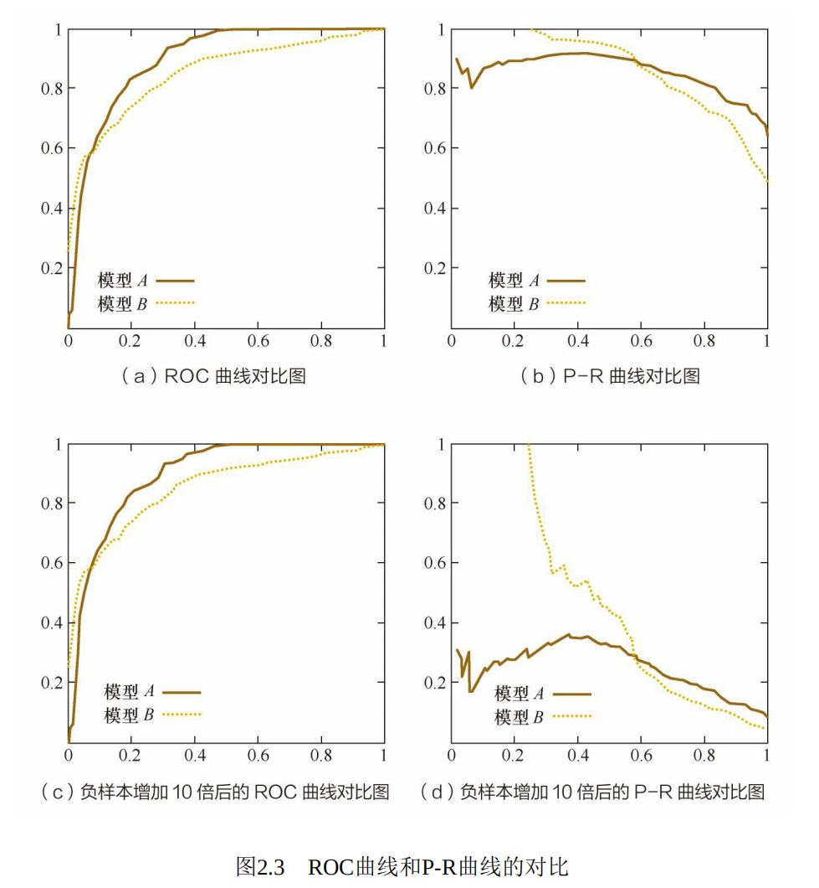

当正负样本的分布发生变化时，ROC曲线的形状，能够基本保持不变，而P-R曲线的形状一般会发生较剧烈的变化。

(a)和(b)展示的是分类其在原始测试集(正负样本分布平衡)的结果。

(c)和(d)是将测试集中负样本的数量增加到原来的10倍后，分类器的结果。

可以明显的看出，ROC曲线基本保持原貌，而Precision-Recall曲线变化较大。


## 12. AUC统计意义的推导

AUC 等于 随机选择一对正负样本，分类器对正样本的打分高于负样本的概率，即：
$$
AUC = P(X_1>X_0)
$$
其中:
(1) $$X_1$$ 和 $$X_0$$分别代表正样本和负样本对应的模型预测得分。

(2) $$P(X_1>X_0)$$ 表示随机选择一个正样本和一个负样本，正样本得分高于负样本得分的概率。

接下来我们开始证明，假设：

- **正样本预测得分的概率密度函数为 $$f(s)$$**。
- **负样本预测得分的概率密度函数为 $$g(s)$$**。
- **$$TPR(t)$$ 和 $$FPR(t)$$ 是 ROC 曲线的两个坐标点，分别是真正率和假正率，都是阈值 t 的函数。**

TPR 是纵轴，FPR 是横轴，AUC 的定义为 ROC 曲线下的面积, 因此：
$$
AUC=\int_{0}^{1}TPR(FPR(t))dFPR(t)
$$
**逻辑解释**

- $$TPR(FPR(t)) $$ 是在某个阈值 t 下，TPR 对应的值（纵轴值），表示捕获正样本的能力。
- $$dFPR(t) $$是对应的 FPR 的变化量，表示模型对负样本错误分类的微小增量，也就是横轴变化（可参考周志华老师的增量法描述）。
- 积分通过累加 $$TPR×dFPR$$计算 ROC 曲线的面积。

上述公式中，$$TPR(t)$$ 为真正率，因此有：
$$
TPR(t)= \int_{t}^{+∞}f(s)ds
$$
上述公式中，$$FPR(t)$$ 为假正率，因此有：
$$
FPR(t)= \int_{t}^{+∞}g(s)ds
$$
显然，$$FPR(t) $$对 $$t$$ 的微分为：
$$
dFPR(t)=−g(t)dt
$$
带入AUC的计算公式得：
$$
AUC=\int_{−∞}^{+∞}TPR(t)⋅g(t)dt
$$
将$$ TPR(t)=\int_{t}^{+\infty}f(s)ds$$代入：


$$
AUC=\int_{−∞}^{+∞}(\int_{t}^{+∞}f(s)ds)⋅g(t)dt
$$
将双重积分的顺序交换（注意积分范围）：
$$
AUC=\int_{−∞}^{+∞}\int_{−∞}^{s}g(t)⋅f(s)dtds
$$
外层积分 $$\int_{−∞}^{+∞}f(s)ds$$ 遍历正样本的得分 $$s$$。

内层积分 $$\int_{−∞}^{s}g(t)dt $$ 遍历负样本的得分 $$t$$，且 $$t < s$$。

在内部积分中，$$f(s)$$ 是与 $$t$$ 无关的常数，可以提到外部：
$$
AUC=\int_{−∞}^{+∞}f(s)(\int_{−∞}^{s}g(t)dt)ds
$$


内层积分$$\int_{−∞}^{s}g(t)dt $$ 表示负样本得分 $$t$$ 小于正样本得分 $$ s$$ 的概率：
$$
\int_{-\infty}^{s} g(t) dt = P(X_0 < s)
$$
于是，AUC 可以表示为：
$$
AUC=\int_{-\infty}^{+\infty} P(X_0 < s) \cdot f(s) ds
$$
进一步等价于：
$$
AUC=P(X1>X0)
$$
也就是说随机取一对正负样本，正样本得分大于负样本的概率。


## 13. AUC的代码实现

根据AUC的实现方法，我们对应的有多种实现方法，一个个来看一下。

### 13.1 ROC曲线法

就这方法就是求ROC曲线的面积，我们在计算的过程中也同时与scikit-learn中的实现代码进行对比，实现如下：

1. 计算所有可能的阈值：这些阈值是`pred`数组中的唯一值。
2. 对每个阈值计算真正率（TPR）和假正率（FPR）。
3. 根据阈值对TPR和FPR进行排序：得到ROC曲线上的点。
4. 绘制ROC曲线：使用matplotlib绘制FPR对TPR的曲线。
5. 使用梯形法则计算ROC曲线下的面积：这就是AUC值

```python
import numpy as np
import matplotlib.pyplot as plt


# 重新计算AUC，并准备绘制ROC曲线
def auc_calculate_area(y,pred):
    # 初始化ROC曲线上的点（0，0）
    tpr_list = [0]
    fpr_list = [0]
    
    # 预测值pred的降序排序
    thresholds = np.unique(pred)[::-1]

    # 计算每个阈值的TPR和FPR
    for threshold in thresholds:
        # 预测标签,统计每一个截断点下,正样本的标签。如：
        # 当threshold=0.9的，只有第1个样本预测为正.
        # 当threshold=0.8的，只有第1,2个样本预测为正。
        # 当threshold=0.7的，只有第1,2,3个样本预测为正。
        # 当threshold=0.505的，所有的样本预测为正。
        pred_label = (pred >= threshold).astype(int)
        
        # 计算TP, FP, TN, FN
        TP = np.sum((pred_label == 1) & (y == 1))
        FP = np.sum((pred_label == 1) & (y == 0))
        TN = np.sum((pred_label == 0) & (y == 0))
        FN = np.sum((pred_label == 0) & (y == 1))
    
        # 计算TPR和FPR,防止分母为0
        TPR = TP / (TP + FN) if (TP + FN) != 0 else 0
        FPR = FP / (FP + TN) if (FP + TN) != 0 else 0
        
        # 添加到列表中
        tpr_list.append(TPR)
        fpr_list.append(FPR)

    # 添加ROC曲线的终点
    tpr_list.append(1)
    fpr_list.append(1)
    
    # 使用梯形法则计算AUC
    auc = 0
    for i in range(1, len(fpr_list)):
        auc += 0.5 * (fpr_list[i] - fpr_list[i-1]) * (tpr_list[i] + tpr_list[i-1])
    
    # 绘制ROC曲线
    plt.figure(figsize=(8, 6))
    plt.plot(fpr_list, tpr_list, marker = 'o',color='blue', label=f'AUC = {auc:.6f}')
    plt.plot([0, 1], [0, 1], color='gray', linestyle='--')
    plt.xlabel('False Positive Rate')
    plt.ylabel('True Positive Rate')
    plt.title('ROC Curve')
    plt.legend(loc='lower right')
    plt.grid(True)
    plt.show()
    
    return auc

y    = np.array([1, 1, 0, 1, 1, 1, 0, 0, 1, 0])
pred = np.array([0.9, 0.8, 0.7, 0.6, 0.55, 0.54, 0.54, 0.54, 0.51, 0.505])
auc =  auc_calculate_area(y,pred)
print(auc)
```

相应的ROC曲线如下：

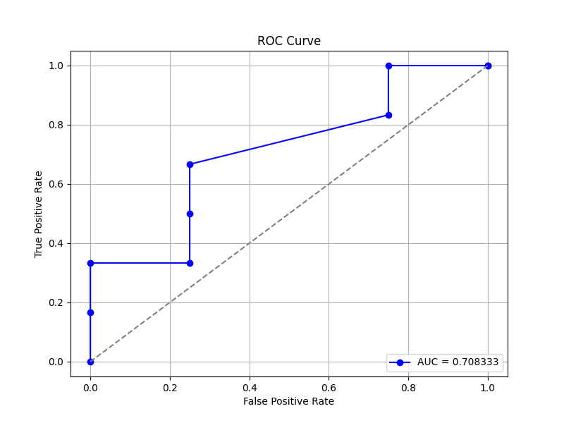

**从ROC曲线可以看出，当出现正负样本概率score值相同的时候，ROC曲线片段为斜线。**

这里解释一下代码：

```python
pred_label = (pred >= threshold).astype(int)
```

上述代码是用来预测标签,统计每一个截断点下,正样本的标签。如：
当threshold=0.9的，只有第1个样本预测为正。
当threshold=0.8的，只有第1,2个样本预测为正。
当threshold=0.7的，只有第1,2,3个样本预测为正。
........

当threshold=0.505的，所有的样本预测为正。

这与第8节《绘制 ROC 曲线》的理论想契合，大家可以参考。

整个循环过程中 pred_label的输出为：

```python
[1 0 0 0 0 0 0 0 0 0]
[1 1 0 0 0 0 0 0 0 0]
[1 1 1 0 0 0 0 0 0 0]
[1 1 1 1 0 0 0 0 0 0]
[1 1 1 1 1 0 0 0 0 0]
[1 1 1 1 1 1 1 1 0 0]
[1 1 1 1 1 1 1 1 1 0]
[1 1 1 1 1 1 1 1 1 1]
```

另外，我们的代码，计算AUC的梯形面积：

```python
# 使用梯形法则计算AUC
auc = 0
for i in range(1, len(fpr_list)):
    auc += 0.5 * (fpr_list[i] - fpr_list[i-1]) * (tpr_list[i] + tpr_list[i-1])
```

可以直接替换为：

```python
# 计算AUC
auc = np.trapz(tpr_list, fpr_list)
```

以上即为基于ROC面积法来求解AUC。


### 13.2 排序法

这种方法我们牢记AUC的意义：随机选择一个正样本和一个负样本，分类器（模型）输出该正样本为正的概率值比分类器（模型）输出该负样本为正的那个概率值要大的可能性。

据排序法的规则，我们写出代码如下，理解为什么变量pos_gt_neg_num累加0.5的情况就行了。

```python
import numpy as np
import matplotlib.pyplot as plt


def cal_auc_sort(label,preds):
    # 获取正负样本的标签序号，从0开始
    pos_indices= [i for i in range(len(label)) if label[i] == 1]
    neg_indices= [i for i in range(len(label)) if label[i] == 0]

    total_num = len(pos_indices) * len(neg_indices)

    # 初始化为0
    pos_gt_neg_num = 0

    # 循环判断
    for i in pos_indices:
        for j in neg_indices:
            # 值比较，小于的情况就不用累加了
            if preds[i] > preds[j]:
                pos_gt_neg_num += 1
            elif preds[i] == preds[j]:
                pos_gt_neg_num += 0.5
    if not pos_indices or not neg_indices:
        return None
    return f"{(pos_gt_neg_num / (total_num)):.3f}"
    
lable    = np.array([1, 1, 0, 1, 1, 1, 0, 0, 1, 0])
preds = np.array([0.9, 0.8, 0.7, 0.6, 0.55, 0.54, 0.54, 0.54, 0.51, 0.505])
auc =  cal_auc_sort(lable,preds)
print(auc)
# 输出 0.708
```

这样就使用排序法完成了AUC的计算。

网上有其他的作者给出一种称为“直方图”方法来近似计算AUC值【参考7】，这种方法可以有效地减少计算量，尤其是在数据集非常大的情况下。通过将预测概率划分为多个区间并统计每个区间内的正负例数量，然后利用这些统计数据来估计AUC值。这种方式避免了直接比较每一对正负样本的预测概率，从而提高了效率，这个给出代码供大家参考：

```python
import numpy as np
from sklearn.metrics import roc_curve
from sklearn.metrics import auc

# n_bins 一种分桶策略，后面进行说明
def auc_roc_calculate(labels,preds,n_bins=100):
    #正样本数量，预测标签为1的
    postive_len = sum(labels)   
    #负样本数量，预测标签为0的
    negative_len = len(labels) - postive_len 
    #正负样本对
    total_case = postive_len * negative_len 
    pos_histogram = [0 for _ in range(n_bins)] 
    neg_histogram = [0 for _ in range(n_bins)]
    bin_width = 1.0 / n_bins
    for i in range(len(labels)):
        nth_bin = int(preds[i]/bin_width)
        if labels[i]==1:
            pos_histogram[nth_bin] += 1
        else:
            neg_histogram[nth_bin] += 1
    accumulated_neg = 0
    satisfied_pair = 0
    for i in range(n_bins):
        satisfied_pair += (pos_histogram[i]*accumulated_neg + pos_histogram[i]*neg_histogram[i]*0.5)
        accumulated_neg += neg_histogram[i]
    return satisfied_pair / float(total_case)
```

上述代码的思想即为：计算诶一个正样本前有几个负样本，**对于score值相等的正样本对，权重记为0.5**


### 13.3 公式法

最后我们看一下公式法怎么计算AUC的。这种方法有些文章定义为Rank法，这里我们来看一下代码实现：

```python
import numpy as np

def cal_auc_by_rk(labels,predictions):
    """
    label:list,二元标签
    predictions:list,模型的预测得分
    auc_value:float，AUC值
    """

    # 结合预测值和标签，按预测值排序
    combined_data = sorted(zip(predictions,labels),key=lambda x:x[0])
    # 构建一个字典，存储相同预测值的所有样本的位置索引
    score_indices = {prediction: [] for prediction, _ in combined_data}
    for index,(prediction, _) in enumerate(combined_data):
        score_indices[prediction].append(index + 1)

    # 计算正例的平均排名
    positive_rank_sum = 0.0
    for index, (_, label) in enumerate(combined_data):
        if label == 1: # 正例
            prediction = combined_data[index][0]
            average_position = sum(score_indices[prediction]) / len(score_indices[prediction])
            positive_rank_sum += average_position
            
    # 统计正例和负例的个数
    num_positives = sum(labels)
    num_negatives = len(labels) - num_positives

    # 检查是否同时存在正例和负例，数据集中不存在两种类型的数据的时候，无法计算AUC
    if num_positives == 0 or num_negatives == 0:
        return None
        
    # 使用公式法计算AUC
    auc_value = (positive_rank_sum-(num_positives * (num_positives + 1) *0.5)) / (num_positives * num_negatives)
    return auc_value

labels    = np.array([1, 1, 0, 1, 1, 1, 0, 0, 1, 0])
predictions = np.array([0.9, 0.8, 0.7, 0.6, 0.55, 0.54, 0.54, 0.54, 0.51, 0.505])
auc =  cal_auc_by_rk(labels,predictions)
print(auc)    
```

这里稍微解释一下，使用了字典推导式，首先构建一个列表 combined_data，其数据形式为：

```python
[(0.505, 0), (0.51, 1), (0.54, 1), (0.54, 0), (0.54, 0), (0.55, 1), (0.6, 1), (0.7, 0), (0.8, 1), (0.9, 1)]
```

接着构建一个字典，存储相同预测值的所有样本的rank，score_indices的数据形式为：

```python
{0.505: [], 0.51: [], 0.54: [], 0.55: [], 0.6: [], 0.7: [], 0.8: [], 0.9: []}
```

经过for循环之后score_indices的数据形式为：

```python
{0.505: [1], 0.51: [2], 0.54: [3, 4, 5], 0.55: [6], 0.6: [7], 0.7: [8], 0.8: [9], 0.9: [10]}
```

可以看出，score_indices以key-value的形式存储着预测值和对应的rank位置。接着使用for循环计算正例的平均排名即可，如果在for循环中打印average_position的值：

```python
print('average_position:',average_position)
# 输出
average_position: 2.0
average_position: 4.0
average_position: 6.0
average_position: 7.0
average_position: 9.0
average_position: 10.0
```

最后AUC的结果正好与我们手动计算的结果一致。最后使用公式来计算AUC即可。至此，我们使用公式完成了AUC的计算。


## 14. ROC最佳阈值

我们在绘制ROC曲线的时候，会不断改变阈值来进行绘制。实际情况是我们会依次选择模型的评分score作为阈值来进行计算TPR和FPR的。显然通过ROC曲线我们知道，我们是希望TPR越大，对应的FPR越小的，这样围成的面积就越大。

也就是 $$max(TPR-FPR)$$的时候，对应的score值即为最佳的值。写出代码就不难了，直接借助我们的slearn里实现：

```python
from sklearn import metrics
import numpy as np

labels    = np.array([1, 1, 0, 1, 1, 1, 0, 0, 1, 0])
predictions = np.array([0.9, 0.8, 0.7, 0.6, 0.55, 0.54, 0.54, 0.54, 0.51, 0.505])

fpr,tpr,thresholds = metrics.roc_curve(labels,predictions)
auc = metrics.auc(fpr,tpr)

# 最优的阈值
good_threshold = thresholds[np.argmax(tpr-fpr)]

# 坐标值
x_fpr = fpr[np.argmax(tpr-fpr)]
y_tpr = tpr[np.argmax(tpr-fpr)]

print(fpr)
print(tpr)
print(thresholds)
print(auc)
print([x_fpr,y_tpr])
print(good_threshold)

# 输出
[0.   0.   0.   0.25 0.25 0.75 0.75 1.  ]
[0.   0.16666667 0.33333333 0.33333333 0.66666667 0.83333333  1. 1. ]
[  inf 0.9   0.8   0.7   0.55  0.54  0.51  0.505]
0.7083333333333333
[0.25, 0.6666666666666666]
0.55
```

也就是说最优的thresshold的值为0.55，对比tpr和fpr的值，也验证了这一点。


## 15. ROC-AUC 优缺点

### 15.1 优点

- 阈值无关：AUC考虑到了全部阈值下的性能，衡量的是模型在所有可能的分类阈值下的表现，因此不受单一阈值的影响。
- 敏感性：AUC计算主要与排序有关，所以他对排序是敏感的，而对预测分数绝对值没那么敏感。也就是说AUC只关注正负样本之间的排序，并不关心正样本内部，或者负样本内部的排序。
- 综合性：AUC 综合了 TPR 和 FPR 的信息，能够全面评估模型的性能。

### 15.2 缺点

- 没有考虑模型预测的绝对值，而只考虑预测值的相对大小（衡量排序能力，而不是预测精度）。

- 可能不适用于极度不平衡的数据：在极度不平衡的数据集上，AUC 可能无法准确反映模型的性能，需要结合其他评估指标使用。

- 当正负样本的分布发生变化时，ROC曲线的形状能够基本保持不变，这个时候从曲线上就察觉不出这种变化。

  

## 16. 什么样的AUC最好

虽然 AUC 值高表示模型性能好，但在某些应用场景下，其他指标如查准率（Precision）和召回率（Recall）可能更加重要。例如，在医疗诊断中，召回率（即灵敏度）通常比 AUC 更加关键，因为漏诊的代价非常高。

AUC=1最好？这是理想的，在实际的工程中我们的样本数据就存在很多的噪音，或者很多lable分歧的数据，比如对于特征集合一样样本存在大于两种情况的标签。

在真实的工程中，我们希望有更多的好的特征来扩大特征集合，这样我们就可以在很大的可能性上来提升模型的AUC，更多好的特征提升的就是特征的区分能力。


## 17. Group-AUC

AUC计算是基于模型对全集样本的的排序能力，而真实线上场景，比如说我们常见的推荐场景，往往只考虑一个用户一个session下的排序关系，也就是同一个用户下模型对item的排序能力。主要是因为模型上线以后在线上会出现新样本，在线下没有训练学习过，造成AUC不足。这里本文不进行扩展了，大家可以参考阿里的DIN的文章：

**《Deep Interest Network for Click-Through Rate Prediction》**

这篇文章中提出了group auc来处理上述问题。


**以上就是本次文章的全部内容，文章比较长，就做一个非常完整的总结，提升对ROC和AUC的理解。**

**文章中有什么不对之处，还请大家指正，谢谢！**


**最后觉得文章有用的，还行点赞转发进行支持一下，感谢各位老铁**


##  参考

（1）https://ccrma.stanford.edu/workshops/mir2009/references/ROCintro.pdf

（2）https://www.datascienceblog.net/post/machine-learning/interpreting-roc-curves-auc/

（3）https://www.zhihu.com/question/39840928?from=profile_question_card

（4）https://laurenoakdenrayner.com/2018/01/07/the-philosophical-argument-for-using-roc-curves

（5）https://en.wikipedia.org/wiki/Receiver_operating_characteristic

（6）https://tracholar.github.io/machine-learning/2018/01/26/auc.html

（7）https://zhuanlan.zhihu.com/p/468262386?utm_psn=1842506910206672897

（8）西瓜书《机器学习》

（9）《百面机器学习》
